# OpenCode Python SDK - Architecture Diagrams

This document contains comprehensive mermaid diagrams for the OpenCode Python SDK architecture, workflows, and data flows.

---

## Table of Contents

1. [High-Level Architecture](#high-level-architecture)
2. [Component Relationships](#component-relationships)
3. [Agent Lifecycle](#agent-lifecycle)
4. [Tool Execution Flow](#tool-execution-flow)
5. [Session Message Flow](#session-message-flow)
6. [PR Review Workflow](#pr-review-workflow)
7. [Storage Hierarchy](#storage-hierarchy)
8. [Event-Driven Architecture](#event-driven-architecture)
9. [Permission System](#permission-system)
10. [Multi-Agent Orchestration](#multi-agent-orchestration)

---

## High-Level Architecture

### Overall System Architecture


---

## Component Relationships

### Entity-Relationship Diagram


---

## Agent Lifecycle

### State Machine


### Agent Execution Sequence

```mermaid
sequenceDiagram
    participant User
    participant AgentExecutor
    participant AgentManager
    participant ToolManager
    participant SessionManager
    participant AISession
    participant EventBus

    User->>AgentExecutor: execute_agent(agent_name, user_message, session_id)
    AgentExecutor->>AgentManager: get_agent_by_name(agent_name)
    AgentManager-->>AgentExecutor: Agent object
    
    AgentExecutor->>SessionManager: get_session(session_id)
    SessionManager-->>AgentExecutor: Session object
    
    AgentExecutor->>AgentManager: initialize_agent(agent, session)
    AgentManager->>EventBus: publish(AGENT_INITIALIZED)
    
    AgentExecutor->>AgentManager: set_agent_ready(session_id)
    AgentManager->>EventBus: publish(AGENT_READY)
    
    AgentExecutor->>AgentManager: set_agent_executing(session_id)
    AgentManager->>EventBus: publish(AGENT_EXECUTING)
    
    AgentExecutor->>ToolManager: get_allowed_tools(agent.permission)
    ToolManager-->>AgentExecutor: List of tool names
    
    AgentExecutor->>AISession: process_message(user_message, tools, options)
    
    loop Tool Execution
        AISession->>ToolManager: execute(tool_name, args)
        ToolManager-->>AISession: ToolResult
    end
    
    AISession-->>AgentExecutor: Response with parts and metadata
    
    alt Success
        AgentExecutor->>AgentManager: cleanup_agent(session_id)
        AgentManager->>EventBus: publish(AGENT_CLEANUP)
        AgentExecutor-->>User: {response, parts, status: "completed"}
    else Error
        AgentExecutor->>AgentManager: set_agent_error(session_id, error)
        AgentManager->>EventBus: publish(AGENT_ERROR)
        AgentExecutor-->>User: {response, status: "error"}
    end
```



---

## Tool Execution Flow

### Tool Execution Sequence Diagram

```mermaid
sequenceDiagram
    participant Agent
    participant AgentExecutor
    participant ToolRegistry
    participant PermissionFilter
    participant Tool
    participant EventBus
    participant Context

    Agent->>AgentExecutor: execute_agent(agent_name, user_message)
    AgentExecutor->>ToolRegistry: get_all_tools()
    ToolRegistry-->>AgentExecutor: {bash: BashTool, read: ReadTool, ...}
    
    AgentExecutor->>PermissionFilter: filter_tools(agent.permission)
    
    Note over PermissionFilter
        Agent permission rules:
        - allow/deny patterns
        - tool name matching
    end Note
    
    PermissionFilter-->>AgentExecutor: [bash, read, glob, ...] (allowed tools)
    
    loop For each tool in execution
        AgentExecutor->>Tool: execute(args, ctx)
        
        Note over Context
            ToolContext:
            - session_id
            - message_id
            - agent
            - abort signal
        end Note
        
        Tool->>Tool: validate(args)
        Tool->>Tool: perform operation
        Tool->>EventBus: publish(TOOL_EXECUTED)
        
        alt Success
            Tool-->>AgentExecutor: ToolResult(output, metadata)
        else Error
            Tool->>EventBus: publish(TOOL_ERROR, error)
            Tool-->>AgentExecutor: ToolResult(error: "...")
        end
    end
    
    AgentExecutor-->>Agent: Final response with all tool results
```

---

## Session Message Flow

### Message Creation and Retrieval


---

## PR Review Workflow

### Multi-Subagent PR Review


### PR Review Sequence Diagram

```mermaid
sequenceDiagram
    participant User
    participant Orchestrator
    participant BaseReviewAgent
    participant ArchitectureAgent
    participant SecurityAgent
    participant DocumentationAgent
    participant LintingAgent
    participant UnitTestsAgent

    User->>Orchestrator: review_pr(changed_files, diff, repo_root, refs)
    
    Orchestrator->>Orchestrator: parse_diff()
    Orchestrator->>Orchestrator: identify_change_intent()
    Orchestrator->>Orchestrator: assess_risk_level()
    
    Orchestrator->>ArchitectureAgent: review()
    ArchitectureAgent->>ArchitectureAgent: scope_review()
    ArchitectureAgent->>ArchitectureAgent: run_checks()
    ArchitectureAgent->>ArchitectureAgent: generate_findings()
    ArchitectureAgent->>ArchitectureAgent: make_merge_gate_decision()
    ArchitectureAgent-->>Orchestrator: ReviewOutput
    
    Orchestrator->>SecurityAgent: review()
    SecurityAgent-->>Orchestrator: ReviewOutput
    
    Orchestrator->>DocumentationAgent: review()
    DocumentationAgent-->>Orchestrator: ReviewOutput
    
    Orchestrator->>LintingAgent: review()
    LintingAgent-->>Orchestrator: ReviewOutput
    
    Orchestrator->>UnitTestsAgent: review()
    UnitTestsAgent-->>Orchestrator: ReviewOutput
    
    Orchestrator->>Orchestrator: aggregate_results()
    Orchestrator->>Orchestrator: dedupe_findings()
    Orchestrator->>Orchestrator: generate_tool_plan()
    Orchestrator->>Orchestrator: apply_merge_gate_policy()
    
    Orchestrator-->>User: OrchestratorOutput
    Note right of User
        Contains:
        - Summary
        - Tool Plan
        - Rollup
        - Findings
        - Merge Gate
    end Note
```

---

## Storage Hierarchy

### File System Structure


### Data Flow


---

## Event-Driven Architecture

### Event Flow

```mermaid
graph TB
    subgraph "Event Emitters"
        AgentManager[Agent Manager]
        SessionManager[Session Manager]
        ToolExecutor[Tool Executor]
        TaskManager[Task Manager]
    end
    
    subgraph "Event Bus"
        EventBus[Event Bus]
    end
    
    subgraph "Event Subscribers"
        Logger[Logger]
        Metrics[Metrics Collector]
        UI[UI Components]
        Notifications[Notifications]
        Analytics[Analytics]
    end
    
    AgentManager -->|publish| EventBus
    SessionManager -->|publish| EventBus
    ToolExecutor -->|publish| EventBus
    TaskManager -->|publish| EventBus
    
    EventBus -->|subscribe| Logger
    EventBus -->|subscribe| Metrics
    EventBus -->|subscribe| UI
    EventBus -->|subscribe| Notifications
    EventBus -->|subscribe| Analytics
    
    style EventBus fill:#f3e5f5
    stroke-width 4px
```

### Event Types and Flow


### Event Lifecycle


---

## Permission System

### Permission Evaluation Flow


### Agent-Tool Permission Matrix


---

## Multi-Agent Orchestration

### Agent Delegation Flow

```mermaid
sequenceDiagram
    participant User
    participant PrimaryAgent[Primary Agent<br/>build/plan]
    participant AgentExecutor
    participant TaskTool[Task Tool]
    participant Subagent1[Subagent 1<br/>explore]
    participant Subagent2[Subagent 2<br/>general]
    participant EventBus

    User->>PrimaryAgent: User request
    PrimaryAgent->>TaskTool: Task(delegate_task(...))
    
    TaskTool->>AgentExecutor: execute_agent("explore", ...)
    
    par Parallel Execution
        AgentExecutor->>Subagent1: execute()
        Subagent1->>EventBus: publish(AGENT_EXECUTING)
        Subagent1->>Subagent1: perform task
        Subagent1->>EventBus: publish(AGENT_CLEANUP)
        Subagent1-->>AgentExecutor: result1
    and
        AgentExecutor->>Subagent2: execute()
        Subagent2->>EventBus: publish(AGENT_EXECUTING)
        Subagent2->>Subagent2: perform task
        Subagent2->>EventBus: publish(AGENT_CLEANUP)
        Subagent2-->>AgentExecutor: result2
    end
    
    AgentExecutor->>TaskTool: return results
    TaskTool->>PrimaryAgent: return results
    PrimaryAgent->>PrimaryAgent: aggregate and process
    PrimaryAgent-->>User: Final response
```

### Agent Interaction Patterns


---

## Data Models

### Message Part Types


---

## Summary

The OpenCode Python SDK follows a modular, event-driven architecture with clear separation of concerns:

- **Application Layer**: User-facing applications and orchestrators
- **Agent Layer**: Built-in and custom agents for different tasks
- **Tool Layer**: Extensible tool system with permission-based access
- **Core Layer**: Session management, event bus, and agent lifecycle
- **Storage Layer**: JSON-based persistence for all data
- **Models**: Type-safe Pydantic models for all data structures

Key features:
- **Async-first design** for concurrent operations
- **Event-driven communication** for loose coupling
- **Permission-based access control** for security
- **Multi-agent orchestration** for complex tasks
- **Modular tool system** with 23 built-in tools
- **PR Review system** with specialized subagents
