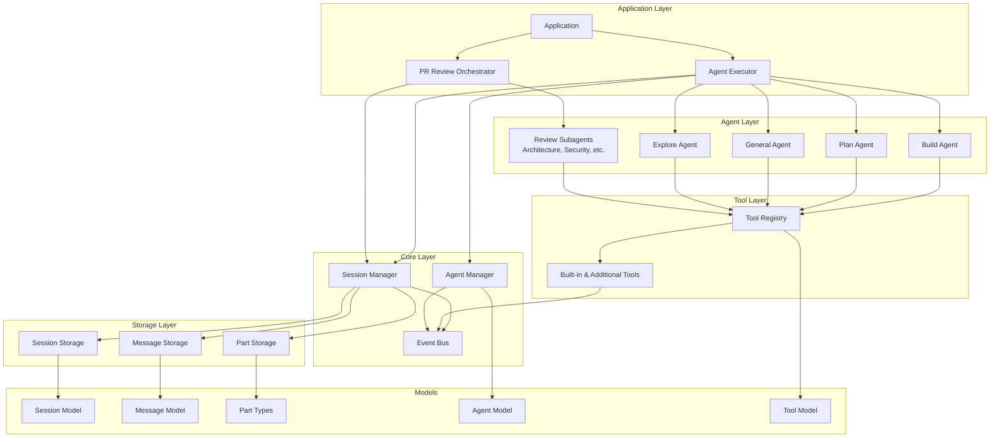
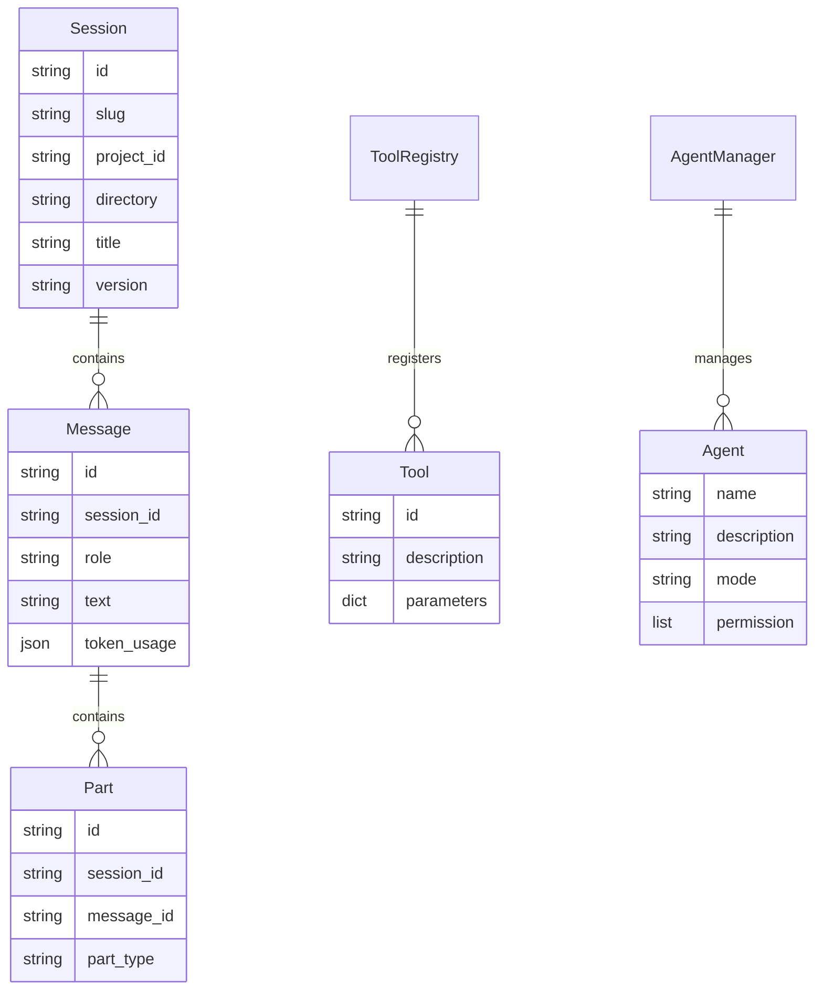
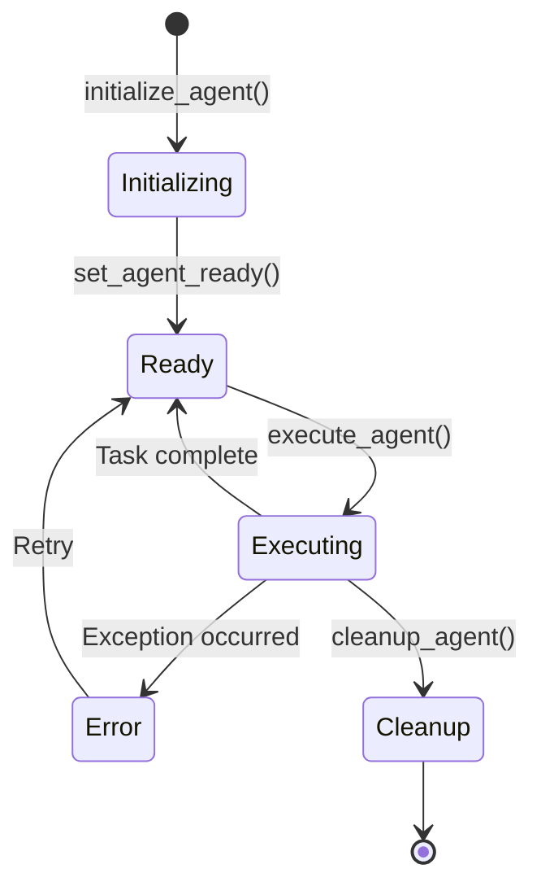
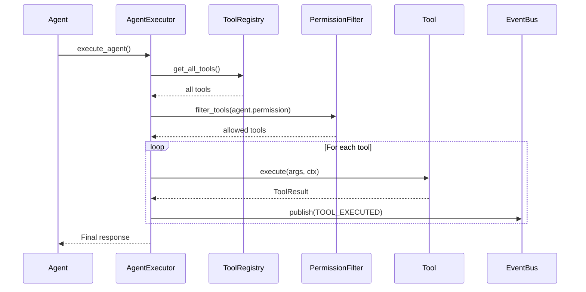
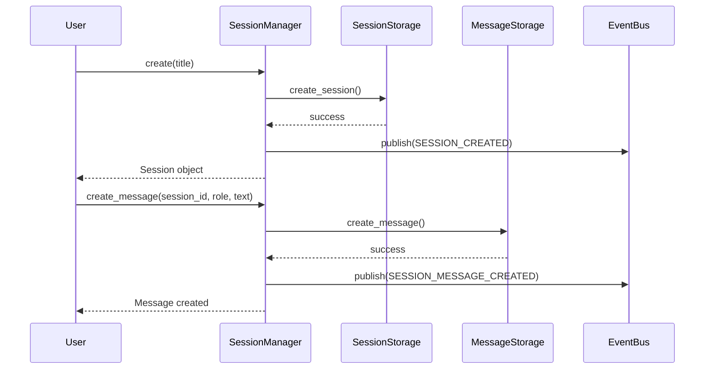
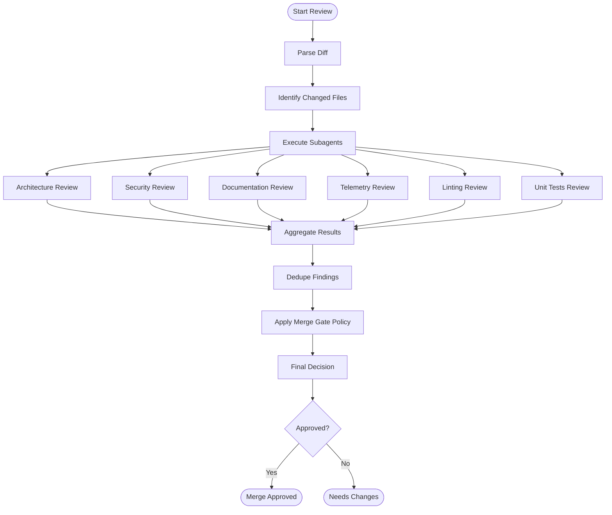
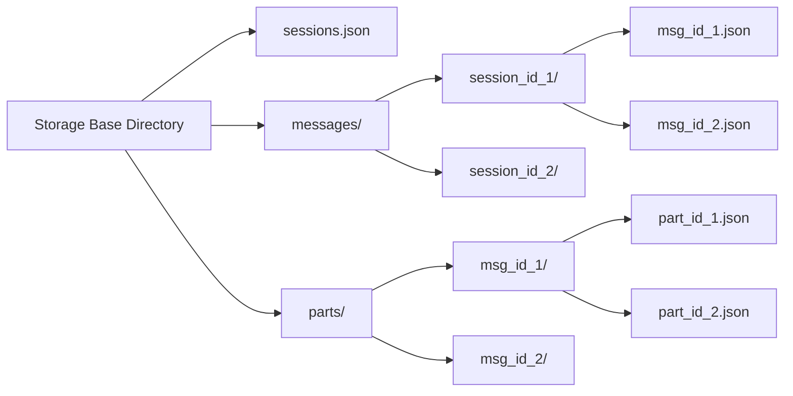

# OpenCode Python SDK Documentation

## Table of Contents

1. [Overview](#overview)
2. [Architecture](#architecture)
3. [Core Components](#core-components)
   - [Models](#models)
   - [Event Bus](#event-bus)
   - [Session Management](#session-management)
   - [Storage](#storage)
   - [Agents](#agents)
   - [Tools](#tools)
   - [PR Review System](#pr-review-system)
   - [LLM Client](#llm-client)
4. [Usage Examples](#usage-examples)
5. [API Reference](#api-reference)

---

## Overview

OpenCode Python SDK is a comprehensive framework for building AI-powered agents with tool execution, session management, and PR review capabilities. It provides:

- **Type-safe models** using Pydantic
- **Async-first architecture** with event-driven communication
- **Modular tool system** with permission-based access control
- **Multi-agent orchestration** with built-in agents
- **PR Review system** with specialized subagents
- **JSON-based storage** for sessions, messages, and parts

---

## Architecture

### High-Level Architecture



### Component Relationships



---

## Core Components

### Models

#### Session Model

Represents a conversation session with metadata.

```python
from opencode_python.core.models import Session

session = Session(
    id="uuid-here",
    slug="my-session",
    project_id="my-project",
    directory="/path/to/project",
    title="My Session",
    version="1.0.0"
)
```

**Fields:**
- `id`: Unique session identifier
- `slug`: URL-friendly slug from title
- `project_id`: Project identifier
- `directory`: Project directory path
- `title`: Session title
- `version`: Session version
- `parent_id`: Optional parent session ID
- `summary`: Optional message summary
- `permission`: Optional permission rules
- `message_count`: Total messages in session
- `total_cost`: Total cost in USD

#### Message Model

Represents a message in a session with parts.

```python
from opencode_python.core.models import Message, TextPart

message = Message(
    id="msg-id",
    session_id="session-id",
    role="user",
    text="Hello!",
    time={"created": timestamp}
)
```

**Message Parts:**
- `TextPart`: Text content
- `FilePart`: File attachments
- `ToolPart`: Tool execution results
- `ReasoningPart`: LLM reasoning
- `SnapshotPart`: Git snapshot
- `PatchPart`: File patch summary
- `AgentPart`: Agent delegation
- `SubtaskPart`: Subtask invocation
- `RetryPart`: Retry attempt
- `CompactionPart`: Session compaction marker

---

### Event Bus

Async event-driven communication system.

```python
from opencode_python.core.event_bus import bus, Events

# Subscribe to events
async def on_agent_ready(event):
    print(f"Agent {event.data['agent_name']} is ready")

await bus.subscribe(Events.AGENT_READY, on_agent_ready)

# Publish events
await bus.publish(Events.AGENT_READY, {
    "session_id": "session-123",
    "agent_name": "build"
})
```

**Available Events:**
- `AGENT_INITIALIZED`, `AGENT_READY`, `AGENT_EXECUTING`, `AGENT_ERROR`, `AGENT_CLEANUP`
- `SESSION_CREATED`, `SESSION_UPDATED`, `SESSION_DELETED`, `SESSION_MESSAGE_CREATED`
- `TOOL_EXECUTED`, `TOOL_ERROR`
- `TASK_CREATED`, `TASK_COMPLETED`, `TASK_FAILED`

---

### Session Management

Manages session lifecycle with thread-safe operations.

```python
from pathlib import Path
from opencode_python.storage.store import SessionStorage
from opencode_python.core.session import SessionManager

# Initialize
storage = SessionStorage(Path("/path/to/storage"))
manager = SessionManager(storage, Path("/path/to/project"))

# Create session
session = await manager.create(title="My Session")

# Get session
session = await manager.get_session(session_id)

# Create messages
await manager.create_message(
    session_id,
    role="user",
    text="Hello!"
)

# List messages
messages = await manager.list_messages(session_id)
```

**Key Methods:**
- `create(title, parent_id, version, summary)` - Create new session
- `get_session(session_id)` - Get session by ID
- `update_session(session_id, **kwargs)` - Update session metadata
- `delete_session(session_id)` - Delete session
- `create_message(session_id, role, text)` - Create message
- `list_messages(session_id)` - List all messages
- `add_message(message)` - Add existing message
- `add_part(part)` - Add part to message

---

### Storage

JSON file-based storage for sessions, messages, and parts.

```python
from pathlib import Path
from opencode_python.storage.store import (
    SessionStorage,
    MessageStorage,
    PartStorage
)

# Initialize storage
base_dir = Path("/path/to/storage")
session_storage = SessionStorage(base_dir)
message_storage = MessageStorage(base_dir)
part_storage = PartStorage(base_dir)

# Session operations
await session_storage.create_session(session)
await session_storage.get_session(session_id)
await session_storage.update_session(session)
await session_storage.delete_session(session_id, project_id)
await session_storage.list_sessions(project_id)

# Message operations
await message_storage.create_message(session_id, message)
await message_storage.get_message(session_id, message_id)
await message_storage.list_messages(session_id)
await message_storage.delete_message(session_id, message_id)

# Part operations
await part_storage.create_part(message_id, part)
await part_storage.get_part(message_id, part_id)
await part_storage.list_parts(message_id)
```

---

### Agents

Built-in agents with different modes and permissions.

#### Available Agents

| Agent | Description | Mode | Permissions |
|-------|-------------|------|-------------|
| `build` | Default agent with full access | primary | All tools allowed |
| `plan` | Plan mode - no edit tools | primary | Edit/write denied |
| `general` | Multi-step parallel execution | subagent | Todo tools denied |
| `explore` | Codebase exploration specialist | subagent | Read-only tools only |

```python
from opencode_python.agents import get_all_agents, get_agent_by_name

# List all agents
agents = get_all_agents()

# Get specific agent
build_agent = get_agent_by_name("build")

# Agent structure
print(f"Name: {agent.name}")
print(f"Description: {agent.description}")
print(f"Mode: {agent.mode}")
print(f"Permissions: {agent.permission}")
```

#### Agent Manager

Manages agent lifecycle and execution.

```python
from opencode_python.agents import AgentManager, AgentExecutor
from opencode_python.tools import create_complete_registry

# Initialize
agent_manager = AgentManager()
tool_manager = create_complete_registry()

# Execute agent
executor = AgentExecutor(
    agent_manager=agent_manager,
    tool_manager=tool_manager,
    session_manager=session_manager
)

result = await executor.execute_agent(
    agent_name="build",
    user_message="Write a Python function",
    session_id=session_id
)
```

---

### Tools

Tool framework with 23 built-in and additional tools.

#### Tool Registry

```python
from opencode_python.tools import create_complete_registry, get_all_tools

# Create registry with all tools
registry = await create_complete_registry()

# Get all tools
tools = await get_all_tools()

# Get specific tool
bash_tool = registry.get("bash")
```

#### Available Tools

| Tool | Description |
|------|-------------|
| `bash` | Execute bash commands |
| `read` | Read file contents |
| `write` | Write/create files |
| `grep` | Search file contents |
| `glob` | Pattern-based file search |
| `edit` | Edit files with exact string replacement |
| `list` | List directory contents |
| `task` | Delegate tasks to subagents |
| `question` | Ask user questions |
| `todoread` | Read todo list |
| `todowrite` | Write todo list |
| `webfetch` | Fetch web content |
| `websearch` | Search the web |
| `multiedit` | Multiple file edits |
| `codesearch` | Code pattern search |
| `lsp` | Language Server Protocol operations |
| `skill` | Load and use skills |
| `externaldirectory` | Work with external directories |
| `compact` | Session compaction |

#### Creating Custom Tools

```python
from opencode_python.tools import Tool, ToolContext, ToolResult

class MyTool(Tool):
    id = "my_tool"
    description = "My custom tool"

    def parameters(self):
        return {
            "type": "object",
            "properties": {
                "param1": {"type": "string", "description": "First parameter"},
                "param2": {"type": "integer", "description": "Second parameter"}
            },
            "required": ["param1"]
        }

    async def execute(self, args: dict, ctx: ToolContext) -> ToolResult:
        # Tool implementation
        result = f"Processed: {args['param1']}"
        return ToolResult(
            title="My Tool Result",
            output=result,
            metadata={"status": "success"}
        )

# Register tool
await registry.register(MyTool(), "my_tool")
```

#### Permission Filtering

Tools are filtered based on agent permissions.

```python
# Agent permission rules
permission = [
    {"permission": "*", "pattern": "*", "action": "allow"},  # Allow all
    {"permission": "write", "pattern": "*.py", "action": "deny"},  # Deny Python writes
    {"permission": "bash", "pattern": "rm -rf *", "action": "deny"}  # Deny destructive commands
]

# Tool filtering
def _is_tool_allowed(tool_name: str, permissions: List[Dict]) -> bool:
    for rule in permissions:
        action = rule.get("action", "")
        pattern = rule.get("pattern", "")

        if action == "deny" and fnmatch.fnmatch(tool_name, pattern):
            return False
        if action == "allow" and fnmatch.fnmatch(tool_name, pattern):
            return True

    return True
```

---

### PR Review System

Multi-subagent PR review system with specialized review agents.

#### Orchestrator

Coordinates multiple review subagents and aggregates results.

```python
from opencode_python.agents.review import PRReviewOrchestrator
from opencode_python.llm.client import LLMClient

# Initialize with LLM client
llm_client = LLMClient(
    provider_id="anthropic",
    api_key="your-api-key",
    model="claude-sonnet-4-20250514"
)

orchestrator = PRReviewOrchestrator(llm_client=llm_client)

# Review PR
result = await orchestrator.review_pr(
    changed_files=["src/agent.py", "tests/test_agent.py"],
    diff="diff --git a/src/agent.py ...",
    repo_root="/path/to/repo",
    base_ref="main",
    head_ref="feature-branch"
)
```

#### Review Subagents

| Subagent | Focus |
|----------|-------|
| `architecture` | Architecture review |
| `security` | Security vulnerabilities |
| `documentation` | Documentation coverage |
| `telemetry_metrics` | Telemetry and metrics |
| `linting` | Code linting |
| `unit_tests` | Unit test coverage |

#### Review Output Structure

```python
from opencode_python.models.review import OrchestratorOutput, Finding

# Access results
print(f"Change Intent: {result.summary.change_intent}")
print(f"Risk Level: {result.summary.risk_level}")
print(f"Final Decision: {result.rollup.final_decision}")
print(f"Severity: {result.rollup.final_severity}")

# Access findings
for finding in result.findings:
    print(f"[{finding.id}] {finding.title}")
    print(f"  Severity: {finding.severity}")
    print(f"  Confidence: {finding.confidence}")
    print(f"  Owner: {finding.owner}")
    print(f"  Estimate: {finding.estimate}")
    print(f"  Risk: {finding.risk}")
    print(f"  Recommendation: {finding.recommendation}")

# Access merge gate
if result.merge_gate.must_fix:
    print("Must fix before merge:", result.merge_gate.must_fix)
```

---

### LLM Client

Client for interacting with LLM providers.

```python
from opencode_python.llm.client import LLMClient

# Initialize
llm_client = LLMClient(
    provider_id="anthropic",
    api_key="your-api-key",
    base_url="https://api.anthropic.com",
    model="claude-sonnet-4-20250514"
)

# Make completion request
response = await llm_client.complete(
    messages=[
        {"role": "user", "content": "Hello!"}
    ],
    temperature=0.7,
    max_tokens=1024
)
```

---

## Usage Examples

### Example 1: Basic Session Management

```python
import asyncio
from pathlib import Path
from opencode_python.storage.store import SessionStorage
from opencode_python.core.session import SessionManager

async def main():
    # Setup
    storage = SessionStorage(Path("/tmp/opencode_storage"))
    manager = SessionManager(storage, Path("/tmp/my_project"))

    # Create session
    session = await manager.create(title="Code Review Session")
    print(f"Created session: {session.id}")

    # Create messages
    await manager.create_message(
        session.id,
        role="user",
        text="Review this code"
    )
    await manager.create_message(
        session.id,
        role="assistant",
        text="Here's my review..."
    )

    # List messages
    messages = await manager.list_messages(session.id)
    print(f"Messages: {len(messages)}")

asyncio.run(main())
```

### Example 2: Agent Execution

```python
import asyncio
from pathlib import Path
from opencode_python.storage.store import SessionStorage
from opencode_python.core.session import SessionManager
from opencode_python.agents import AgentManager, AgentExecutor
from opencode_python.tools import create_complete_registry

async def main():
    # Setup
    storage = SessionStorage(Path("/tmp/opencode_storage"))
    session_manager = SessionManager(storage, Path("/tmp/my_project"))
    agent_manager = AgentManager()

    # Create session
    session = await session_manager.create(title="Agent Task")

    # Initialize tools
    tool_registry = await create_complete_registry()

    # Execute agent
    executor = AgentExecutor(
        agent_manager=agent_manager,
        tool_manager=tool_registry,
        session_manager=session_manager
    )

    result = await executor.execute_agent(
        agent_name="build",
        user_message="Create a Python class for data validation",
        session_id=session.id
    )

    print(f"Response: {result['response']}")
    print(f"Status: {result['status']}")

asyncio.run(main())
```

### Example 3: PR Review

```python
import asyncio
from opencode_python.agents.review import PRReviewOrchestrator
from opencode_python.llm.client import LLMClient

async def main():
    # Setup
    llm_client = LLMClient(
        provider_id="anthropic",
        api_key="your-api-key",
        model="claude-sonnet-4-20250514"
    )

    orchestrator = PRReviewOrchestrator(llm_client=llm_client)

    # Review PR
    result = await orchestrator.review_pr(
        changed_files=["src/agent.py", "tests/test_agent.py"],
        diff="""diff --git a/src/agent.py b/src/agent.py
index abc123..def456 100644
--- a/src/agent.py
+++ b/src/agent.py
@@ -10,6 +10,8 @@ class Agent:
     def __init__(self):
         self.name = "test"
+        self.temperature = 0.7
+        self.max_tokens = 4096

     def execute(self, message: str):
         return f"Response: {message}"
""",
        repo_root="/path/to/repo",
        base_ref="main",
        head_ref="feature-branch"
    )

    # Display results
    print(f"Change Intent: {result.summary.change_intent}")
    print(f"Risk Level: {result.summary.risk_level}")
    print(f"Final Decision: {result.rollup.final_decision}")

    for finding in result.findings:
        print(f"[{finding.id}] {finding.title} - {finding.severity}")

asyncio.run(main())
```

---

## API Reference

### Core Models

```python
# Session
class Session(pd.BaseModel):
    id: str
    slug: str
    project_id: str
    directory: str
    title: str
    version: str
    parent_id: Optional[str] = None
    summary: Optional[MessageSummary] = None
    permission: Optional[List[Dict[str, Any]]] = None
    message_count: int = 0
    total_cost: float = 0.0

# Message
class Message(pd.BaseModel):
    id: str
    session_id: str
    role: Literal["user", "assistant", "system"]
    text: str = ""
    parts: List[Part] = []
    summary: Optional[MessageSummary] = None
    token_usage: Optional[TokenUsage] = None

# Part Types
Part = Union[TextPart, FilePart, ToolPart, ReasoningPart, ...]
```

### Event Bus

```python
class EventBus:
    async def subscribe(self, event_name: str, callback: Callable, once: bool = False) -> Callable
    async def publish(self, event_name: str, data: Dict[str, Any]) -> None

class Events:
    AGENT_INITIALIZED = "agent.initialized"
    AGENT_READY = "agent.ready"
    AGENT_EXECUTING = "agent.executing"
    AGENT_ERROR = "agent.error"
    AGENT_CLEANUP = "agent.cleanup"
    SESSION_CREATED = "session.created"
    SESSION_UPDATED = "session.updated"
    SESSION_DELETED = "session.deleted"
    SESSION_MESSAGE_CREATED = "session.message_created"
    TOOL_EXECUTED = "tool.executed"
    TOOL_ERROR = "tool.error"
    TASK_CREATED = "task.created"
    TASK_COMPLETED = "task.completed"
    TASK_FAILED = "task.failed"
```

### Session Manager

```python
class SessionManager:
    async def create(self, title: str, parent_id: Optional[str] = None, version: str = "1.0.0", summary: Optional[MessageSummary] = None) -> Session
    async def get_session(self, session_id: str) -> Optional[Session]
    async def update_session(self, session_id: str, **kwargs) -> Session
    async def delete_session(self, session_id: str) -> bool
    async def create_message(self, session_id: str, role: Literal["user", "assistant", "system"], text: str = "", **kwargs) -> None
    async def list_messages(self, session_id: str) -> List[Message]
    async def list_sessions(self) -> List[Session]
```

### Agent Manager

```python
class AgentManager:
    async def initialize_agent(self, agent: Agent, session: Session) -> AgentState
    async def set_agent_ready(self, session_id: str) -> None
    async def set_agent_executing(self, session_id: str) -> None
    async def set_agent_error(self, session_id: str, error: str) -> None
    async def cleanup_agent(self, session_id: str) -> None
    def get_agent_state(self, session_id: str) -> Optional[AgentState]
    async def get_all_agents(self) -> List[Agent]
    async def get_agent_by_name(self, name: str) -> Optional[Agent]

class AgentExecutor:
    async def execute_agent(self, agent_name: str, user_message: str, session_id: str, options: Optional[Dict[str, Any]] = None) -> Dict[str, Any]
    async def cancel_execution(self, session_id: str) -> bool
```

### Tool Framework

```python
class Tool(ABC):
    id: str
    description: str

    @abstractmethod
    async def execute(self, args: Dict[str, Any], ctx: ToolContext) -> ToolResult

    def parameters(self) -> Dict[str, Any]

    async def init(self, ctx: ToolContext) -> None

class ToolRegistry:
    async def register(self, tool: Tool, tool_id: str, metadata: Optional[Dict[str, Any]] = None) -> None
    def get(self, tool_id: str) -> Optional[Tool]
    async def get_all(self) -> Dict[str, Tool]
```

### PR Review

```python
class PRReviewOrchestrator:
    async def review_pr(self, changed_files: List[str], diff: str, repo_root: str, base_ref: str, head_ref: str) -> OrchestratorOutput

class OrchestratorOutput:
    summary: OrchestratorSummary
    tool_plan: OrchestratorToolPlan
    rollup: OrchestratorRollup
    findings: List[OrchestratorFinding]
    subagent_results: List[Dict[str, Any]]
    merge_gate: MergeGate
```

---

## Architecture Diagrams

### Agent Lifecycle



### Tool Execution Flow



### Session Message Flow



### PR Review Workflow



### Storage Hierarchy



---

## License

[Your License Here]

---

## Support

For issues and questions, please visit the project repository.
