```mermaid
flowchart TB
    subgraph Intake_State["Intake State"]
        INTAKE[/"🔄 Reason: Analyze input and understand scope"/]
        ACT1[/"⚡ Act: Scan files for patterns"/]
        OBSERVE1[/"👁️ Observe: Found X files to process"/]
        THINK1[/"💭 Reason: Files analyzed, ready to plan"/]
    end

    subgraph Plan_State["Plan State"]
        PLAN_REASON[/"🔄 Reason: Break down work into tasks"/]
        PLAN_ACT[/"⚡ Act: Create todo items with priorities"/]
        PLAN_OBSERVE[/"👁️ Observe: Created N todos dynamically"/]
        PLAN_THINK[/"💭 Reason: Todos ready for execution"/]
    end

    subgraph Act_State["Act State"]
        ACT_REASON[/"🔄 Reason: Execute planned tasks"/]
        ACT_ACT[/"⚡ Act: Run each task and capture results"/]
        ACT_OBSERVE[/"👁️ Observe: All N tasks executed successfully"/]
        ACT_THINK[/"💭 Reason: Execution complete, proceed to synthesis"/]
    end

    subgraph Synthesize_State["Synthesize State"]
        SYNTH_REASON[/"🔄 Reason: Merge and analyze results"/]
        SYNTH_ACT[/"⚡ Act: Synthesize unified findings view"/]
        SYNTH_OBSERVE[/"👁️ Observe: Synthesis complete with summary"/]
        SYNTH_THINK[/"💭 Reason: Findings synthesized, ready for evaluation"/]
    end

    subgraph Evaluate_State["Evaluate State"]
        EVAL_REASON[/"🔄 Reason: Check if all criteria met"/]
        EVAL_ACT[/"⚡ Act: Verify acceptance and generate verdict"/]
        EVAL_OBSERVE[/"👁️ Observe: Evaluation complete, verdict: success"/]
        EVAL_THINK[/"💭 Reason: Workflow successful, proceed to done"/]
    end

    INTAKE --> PLAN_REASON
    PLAN_REASON --> PLAN_ACT
    PLAN_ACT --> PLAN_OBSERVE
    PLAN_OBSERVE --> PLAN_THINK
    PLAN_THINK --> ACT_REASON

    ACT_REASON --> ACT_ACT
    ACT_ACT --> ACT_OBSERVE
    ACT_OBSERVE --> ACT_THINK
    ACT_THINK --> SYNTH_REASON

    SYNTH_REASON --> SYNTH_ACT
    SYNTH_ACT --> SYNTH_OBSERVE
    SYNTH_OBSERVE --> SYNTH_THINK
    SYNTH_THINK --> EVAL_REASON

    EVAL_REASON --> EVAL_ACT
    EVAL_ACT --> EVAL_OBSERVE
    EVAL_OBSERVE --> EVAL_THINK
    EVAL_THINK --> DONE["✅ Done"]
```

```mermaid
sequenceDiagram
    participant User as 👤 User
    participant FSM as 🔀 FSM
    participant Handler as 🎯 Handler
    participant Log as 📝 RunLog

    User->>FSM: Run workflow with files: [file1.py, file2.py]
    FSM->>FSM: Initialize StructuredContext
    FSM->>FSM: Set initial state: intake

    Note over FSM: INTAKE STATE
    FSM->>Handler: intake_handler(ctx)
    Handler->>Handler: Create REACT Cycle 1
    Handler->>Handler: Reason: Need to understand what changed
    Handler->>Handler: Act: Scan files for patterns
    Handler->>Handler: Observe: Found 2 files to process
    Handler->>Log: Add ThinkingFrame with REACT cycles
    FSM->>FSM: Validate transition: intake -> plan
    FSM->>FSM: Set new state: plan
    Log-->>FSM: Log.add(frame)

    Note over FSM: PLAN STATE
    FSM->>Handler: plan_handler(ctx)
    Handler->>Handler: Create REACT Cycle 2
    Handler->>Handler: Reason: Based on 2 files, create tasks
    Handler->>Handler: Act: Generate N todo items
    Handler->>Handler: Observe: Created 2 todos dynamically
    Handler->>Log: Add frame with dynamic thinking
    FSM->>FSM: Validate transition: plan -> act
    FSM->>FSM: Set new state: act
    Log-->>FSM: Log.add(frame)

    Note over FSM: ACT STATE
    FSM->>Handler: act_handler(ctx)
    Handler->>Handler: Create REACT Cycle 3
    Handler->>Handler: Reason: Have N todos to execute
    Handler->>Handler: Act: Execute each todo and capture results
    Handler->>Handler: Observe: Executed all N tasks
    Handler->>Log: Add frame with execution info
    FSM->>FSM: Validate transition: act -> synthesize
    FSM->>FSM: Set new state: synthesize
    Log-->>FSM: Log.add(frame)

    Note over FSM: SYNTHESIZE STATE
    FSM->>Handler: synthesize_handler(ctx)
    Handler->>Handler: Create REACT Cycle 4
    Handler->>Handler: Reason: Have results to merge
    Handler->>Handler: Act: Synthesize unified findings
    Handler->>Handler: Observe: Synthesis with summary
    Handler->>Log: Add frame with synthesis info
    FSM->>FSM: Validate transition: synthesize -> evaluate
    FSM->>FSM: Set new state: evaluate
    Log-->>FSM: Log.add(frame)

    Note over FSM: EVALUATE STATE
    FSM->>Handler: evaluate_handler(ctx)
    Handler->>Handler: Create REACT Cycle 5
    Handler->>Handler: Reason: Check acceptance criteria
    Handler->>Handler: Act: Verify and generate verdict
    Handler->>Handler: Observe: Evaluation complete
    Handler->>Log: Add final frame with verdict
    FSM->>FSM: Validate transition: evaluate -> done
    FSM->>FSM: Set final state: done
    Log-->>FSM: Log.add(frame)

    FSM->>User: Return StructuredContext
        Note over FSM: 5 frames, N todos, evaluation, JSON exportable
```

```mermaid
flowchart LR
    FRAME[/"📋 ThinkingFrame"/]
    
    subgraph Console_Output["ConsoleLogger Output"]
        HEADER["═════════════"]
        STATE["== STATE_NAME =="]
        GOALS["📋 Goals:"]
        CHECKS["✓ Checks:"]
        RISKS["⚠️  Risks:"]
        STEPS["🤔 Steps:"]
        REACT["🔄 REACT Cycles:"]
        DECISION["🎯 Decision:"]
        TIMESTAMP["⏰ Timestamp:"]
    end

    FRAME --> HEADER
    HEADER --> STATE
    STATE --> GOALS
    GOALS --> CHECKS
    CHECKS --> RISKS
    RISKS --> STEPS
    STEPS --> REACT
    REACT --> DECISION
    DECISION --> TIMESTAMP

    STYLE["Style Guide"]
    STYLE --> HEADER
    
    subgraph Styles["Output Styles"]
        HEADER["═════════════"]
        STATE["== STATE =="]
        SECTION["📋/🤔/🔄/🎯"]
        EMOJI["💭/⚡/👁️/🎯/⏰"]
        INDENT["  "]
    end

    FRAME --> STYLE
```

```mermaid
flowchart TB
    subgraph Git_Commit["Git Commit from Thinking Traces"]
        START[/"🚀 Start: Workflow Run"/]
        RUN["🏃 Execute REACT FSM"]
        EXTRACT["📤 Extract Thinking Traces"]
        COMMIT["📝 Generate Commit Message"/]
        MEMORY["🧠 Store in Agent Memory"]
        PUBLISH["📢 Publish as Artifact"/]
    end

    subgraph Commit_Components["Commit Components"]
        VERDICT["Verdict: success/failure"]
        CONFIDENCE["Confidence: 0.0-1.0"]
        TODOS["N todos completed"]
        EVIDENCE["File evidence links"]
        FRAMES["N thinking frames"]
    end

    START --> RUN
    RUN --> EXTRACT

    EXTRACT --> COMMIT
    COMMIT --> MEMORY
    COMMIT --> PUBLISH
    MEMORY --> VERDICT
    PUBLISH --> CONFIDENCE

    subgraph Commit_Message["Commit Message Structure"]
        TYPE["feat/workflow/fix"]
        SCOPE["What was reviewed/processed"]
        DETAILS["Key findings and decisions"]
        EVIDENCE_LINKS["📎 Links to files, tools, outputs"]
    end

    COMMIT --> COMMIT_MESSAGE
    COMMIT_MESSAGE --> TYPE
    COMMIT_MESSAGE --> SCOPE
    COMMIT_MESSAGE --> DETAILS
    DETAILS --> EVIDENCE_LINKS
```

"""Mermaid diagrams for REACT + Thinking Framework visualization.

This module contains diagrams for:
- FSM state transitions and flow
- REACT pattern within states
- Architecture overview
- Example workflow execution

These diagrams can be rendered in Markdown viewers that support Mermaid
(e.g., GitHub, GitLab, Notion, Obsidian, Typora).
"""

# =============================================================================
# DIAGRAM 1: FSM State Transitions (High-Level Flow)
# =============================================================================

```mermaid
stateDiagram-v2
    [*] --> Intake: User Request / Changed Files
    Intake --> Plan: Context Gathered

    Plan --> Act: Todos Created
    Plan --> Failed: Planning Error

    Act --> Synthesize: Tasks Executed
    Act --> Evaluate: Skip Synthesis (Direct)
    Act --> Done: Complete
    Act --> Failed: Execution Error

    Synthesize --> Evaluate: Findings Merged
    Synthesize --> Failed: Synthesis Error

    Evaluate --> Done: Evaluation Passed
    Evaluate --> Failed: Evaluation Error

    Done --> Intake: Restart / New Request
    Failed --> Intake: Retry / Recover

    note right of Intake
        Gather context, analyze changed files
        Create initial understanding

    note right of Plan
        Create task breakdown
        Assign priorities based on impact
        Link tasks to evidence

    note right of Act
        Execute planned tasks
        Track execution status
        Capture results

    note right of Synthesize
        Merge findings from multiple sources
        Resolve conflicts
        Synthesize unified view

    note right of Evaluate
        Check acceptance criteria
        Generate final verdict
        Calculate confidence score

    note right of Done
        Workflow completed successfully
        All tasks finished
        Ready for git commit / agent memory
```

# =============================================================================
# DIAGRAM 2: REACT Pattern Within States (Detailed Flow)
# =============================================================================



# =============================================================================
# DIAGRAM 3: Data Flow and Architecture
# =============================================================================

```mermaid
flowchart LR
    USER[/"👤 User / CI Trigger"/]
    
    subgraph FSM_Core["FSM Core"]
        FSM["🔀 FSM Engine"]
        VALIDATOR["✓ Transition Validator"]
        HANDLERS["🎯 State Handlers"]
        RUNNER["🏃 Workflow Runner"]
    end

    subgraph Thinking_Layer["Thinking Layer"]
        MODELS["📋 Thinking Models"]
        - ThinkingStep
        - ThinkingFrame
        - ReactStep
        - RunLog
        STRUCTUREDCTX["📦 StructuredContext"]
    end

    subgraph Logging_Layer["Logging Layer"]
        CONSOLE["💻 Console Logger"]
        JSON["📄 JSON Logger"]
    end

    USER --> FSM
    
    FSM --> VALIDATOR
    FSM --> HANDLERS
    FSM --> RUNNER

    HANDLERS --> MODELS
    HANDLERS --> STRUCTUREDCTX

    RUNNER --> CONSOLE
    RUNNER --> JSON

    MODELS --> MODELS
    STRUCTUREDCTX --> STRUCTUREDCTX

    MODELS --> CONSOLE
    MODELS --> JSON
```

# =============================================================================
# DIAGRAM 4: Example Workflow Execution
# =============================================================================



# =============================================================================
# DIAGRAM 5: Class Relationships
# =============================================================================


# =============================================================================
# DIAGRAM 6: ConsoleLogger Output Format
# =============================================================================



# =============================================================================
# DIAGRAM 7: Git Commit Integration
# =============================================================================



# =============================================================================
# USAGE GUIDE
# =============================================================================

## How to Use These Diagrams

### 1. State Transition Diagram
Shows the high-level flow through the FSM. Use this to understand:
- Valid state transitions
- Error handling paths (failed states)
- Restart/loop points

### 2. REACT Pattern Diagram
Shows detailed REACT cycles within each state. Use this to understand:
- How reasoning leads to action
- How observation feeds into next reasoning
- Tools used at each step
- Evidence collection

### 3. Architecture Diagram
Shows data flow between components. Use this to understand:
- How FSM orchestrates handlers
- How models support the framework
- How loggers capture output

### 4. Execution Sequence Diagram
Shows a complete workflow execution. Use this to understand:
- Timeline of operations
- Handler-to-FSM interactions
- Logging points

### 5. Class Relationships
Shows the data model relationships. Use this to understand:
- How components compose together
- Data flow between classes
- Type dependencies

### 6. Console Output Format
Shows the visual structure of console logs. Use this to understand:
- What information is displayed
- How sections are organized
- Emojis and formatting used

### 7. Git Commit Integration
Shows how thinking traces can be converted to git commits. Use this to understand:
- What data to extract
- How to structure commit messages
- Where to store artifacts

## Rendering in Different Tools

### GitHub / GitLab / Gitee
- Paste diagrams directly into Markdown files
- Diagrams render automatically in README.md
- Use ```mermaid code fences

### Notion / Obsidian
- Paste diagrams into pages
- Auto-rendering on save
- Copy as code block for explicit rendering

### Typora
- Paste diagrams into .md files
- Preview pane shows live rendering
- Use File -> Export to save images

### VS Code with Mermaid Preview
- Install Mermaid Preview extension
- Shows live preview in sidebar
- Copy-paste diagrams and see results immediately
