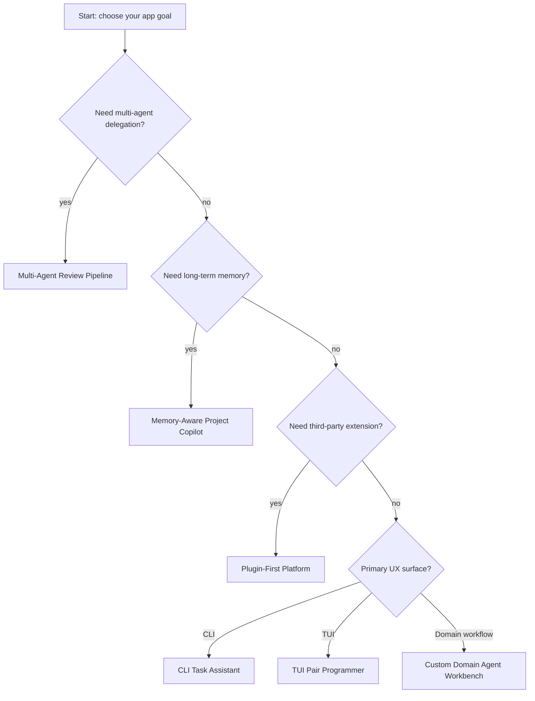
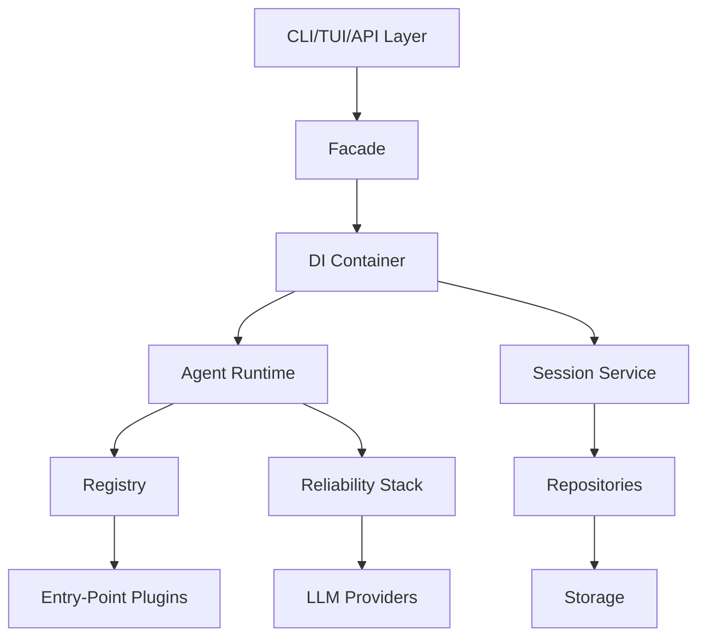
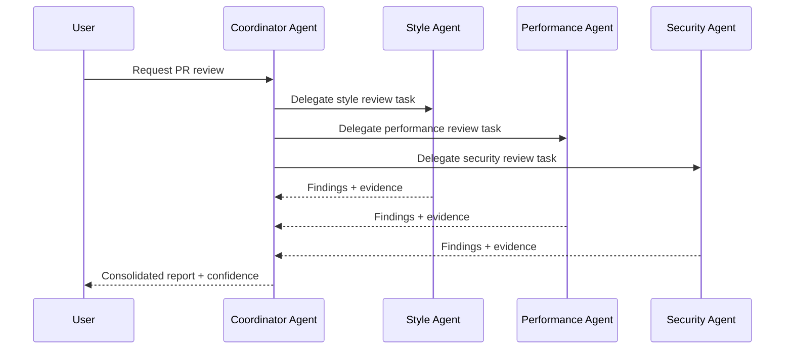
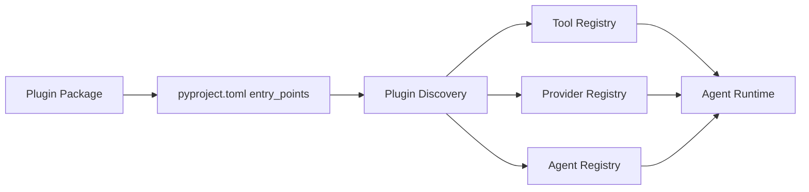

# Dawn Kestrel Application Blueprints for Coding Agents

This document provides build-ready application examples for Dawn Kestrel and concrete pattern options a coding agent can use when implementing new features.

Use this as a practical companion to `docs/patterns.md`.

## How to Use This Document

1. Pick an application blueprint from the matrix below.
2. Pick pattern options for composition, extension, reliability, orchestration, and memory.
3. Copy the implementation checklist into your task plan.
4. Build in thin slices (MVP first, then optional upgrades).

## Quick Pick Matrix

| Blueprint | Best For | Start From | Core Patterns |
|---|---|---|---|
| CLI Task Assistant | Scripting, CI helpers, local automation | `docs/examples/cli_integration.py` | Bridge, Result, Repository, Null Object |
| TUI Pair Programmer | Interactive terminal UX | `docs/examples/tui_integration.py` | Bridge, Observer, State, DI |
| Multi-Agent Review Pipeline | Delegation and coordinated review workflows | `docs/examples/multi_agent_workflow.py` | Command, Mediator, State, Strategy |
| Custom Domain Agent Workbench | Domain-specific assistants and tools | `docs/examples/custom_agent.py` and `custom_agent_app_example.py` | Plugin, Registry, Adapter, Facade |
| Memory-Aware Project Copilot | Long-running sessions with recall | `docs/examples/memory_usage.py` | Repository, Unit of Work, Composite, Strategy |
| Plugin-First Platform | Extensible product surface for third parties | `pyproject.toml` entry points + `dawn_kestrel/core/plugin_discovery.py` | Plugin, Registry, DI, Adapter |

## Blueprint Selection Flow

## Pattern Option Menu

### 1) Composition Root Options

| Option | Use When | Tradeoffs | Key Files |
|---|---|---|---|
| Direct SDK Client | Small scripts or prototypes | Fastest start, less structure | `dawn_kestrel/sdk/client.py`, `docs/examples/basic_usage.py` |
| DI Container | Medium/large apps with multiple services | Better testability and wiring clarity | `dawn_kestrel/core/di_container.py` |
| Facade over DI | You want a stable app-facing API boundary | Extra layer, cleaner external API | `dawn_kestrel/core/facade.py`, `dawn_kestrel/core/di_container.py` |

### 2) Extension Options

| Option | Use When | Tradeoffs | Key Files |
|---|---|---|---|
| Built-ins only | Internal app, no third-party extension | Lowest complexity, limited extensibility | `dawn_kestrel/tools/`, `dawn_kestrel/providers/`, `dawn_kestrel/agents/` |
| Runtime registration | Dynamic app bootstrapping in one codebase | More boot logic to maintain | `docs/examples/custom_agent.py` |
| Entry-point plugins | External packages should add tools/providers/agents | Packaging and versioning complexity | `pyproject.toml`, `dawn_kestrel/core/plugin_discovery.py` |

### 3) Error + Reliability Options

| Option | Include | Use When | Key Files |
|---|---|---|---|
| Basic | Result pattern only | Local/internal workloads | `dawn_kestrel/core/result.py` |
| Standard | Result + Retry + Circuit Breaker | Typical production APIs | `dawn_kestrel/core/result.py`, reliability modules in core |
| Strict | Result + Retry + Circuit Breaker + Bulkhead + Rate Limiter | Multi-tenant/high-traffic systems | reliability modules + provider/agent runtime wiring |

### 4) Orchestration Options

| Option | Use When | Tradeoffs | Key Files |
|---|---|---|---|
| Single Agent Flow | One clear agent role | Simple, less specialized | `dawn_kestrel/agents/runtime.py` |
| Delegated Subagents | Coordinator + specialized workers | More prompts/permissions to manage | `docs/examples/multi_agent_workflow.py`, `dawn_kestrel/agents/orchestrator.py` |
| Explicit Workflow FSM | Phase-driven execution requirements | More modeling work, strongest control | state/fsm patterns in core + orchestrator |

### 5) Memory Options

| Option | Use When | Tradeoffs | Key Files |
|---|---|---|---|
| Stateless | One-shot or short workflows | No long-term context | `docs/examples/basic_usage.py` |
| Session-only | Need message history but not semantic recall | Simple, bounded capability | `dawn_kestrel/core/services/session_service.py` |
| Memory Manager | Need retrieval/summarization across long sessions | More storage and tuning overhead | `docs/examples/memory_usage.py`, `dawn_kestrel/agents/memory_manager.py` |

## Blueprint 1: CLI Task Assistant

### What You Build

A command-line assistant that creates sessions, processes user prompts, and returns structured outputs for local tooling or CI scripts.

### Minimum Pattern Stack

- Bridge Pattern for IO abstraction
- Result Pattern for explicit failures
- Repository Pattern for storage access

### Start Here

- `docs/examples/cli_integration.py`
- `dawn_kestrel/cli/main.py`
- `dawn_kestrel/cli/handlers.py`

### Implementation Slices

1. Create command surface (`click` command + options).
2. Initialize `OpenCodeAsyncClient` with appropriate IO handlers.
3. Implement session lifecycle commands (create/list/delete).
4. Add output mode (`text`, `json`) and deterministic exit codes.

### Optional Upgrades

- Add Retry + Circuit Breaker around external provider calls.
- Add Strategy pattern for output formatting by command/context.

## Blueprint 2: TUI Pair Programmer

### What You Build

A Textual-based interactive assistant with streaming updates, tool visibility, and session navigation.

### Minimum Pattern Stack

- Bridge Pattern for UI/SDK separation
- Observer Pattern for event-driven updates
- State Pattern for screen and workflow transitions

### Start Here

- `docs/examples/tui_integration.py`
- `dawn_kestrel/tui/app.py`
- `dawn_kestrel/tui/screens/`
- `dawn_kestrel/tui/widgets/`

### Implementation Slices

1. Wire app shell and session list screen.
2. Add message view with incremental rendering.
3. Connect progress + notification handlers to widgets.
4. Add keyboard workflows (open, send, cancel, switch session).

### Optional Upgrades

- Add Mediator for decoupled screen-to-screen communication.
- Add Rate Limiter for bursty user actions.

## Blueprint 3: Multi-Agent Review Pipeline

### What You Build

A coordinator agent that dispatches specialized review tasks (style, security, performance, tests) and aggregates findings.

### Minimum Pattern Stack

- Command Pattern for delegated task units
- Mediator Pattern for agent coordination
- State/FSM Pattern for phase transitions

### Start Here

- `docs/examples/multi_agent_workflow.py`
- `dawn_kestrel/agents/orchestrator.py`
- `dawn_kestrel/agents/runtime.py`

### Implementation Slices

1. Define review phases and output contract.
2. Implement coordinator prompt and task decomposition.
3. Execute parallel subagent tasks and collect results.
4. Merge findings and emit final report with confidence and evidence.

### Optional Upgrades

- Add Bulkhead limits per review type.
- Add per-agent Circuit Breakers and fallback agent routing (Strategy).

## Blueprint 4: Custom Domain Agent Workbench

### What You Build

A domain-focused app (for example: finance, legal, DevOps) with custom agents, custom tools, and scoped permissions.

### Minimum Pattern Stack

- Plugin + Registry for extensibility
- Adapter Pattern for external systems
- Facade Pattern for stable app API

### Start Here

- `docs/examples/custom_agent.py`
- `custom_agent_app_example.py`
- `dawn_kestrel/tools/framework.py`

### Implementation Slices

1. Define domain tools and JSON schemas.
2. Define specialist agents and permission policies.
3. Register tools/agents and run a validation command.
4. Add domain-specific guardrails and structured output schema.

### Optional Upgrades

- Move registrations to entry-point plugins for package-level extension.
- Add Unit of Work for multi-step domain write operations.

## Blueprint 5: Memory-Aware Project Copilot

### What You Build

An assistant that remembers constraints, prior decisions, and long-running task context across sessions.

### Minimum Pattern Stack

- Repository + Unit of Work for memory persistence
- Composite Pattern for grouped context blocks
- Strategy Pattern for retrieval modes (recent-first, relevance-first)

### Start Here

- `docs/examples/memory_usage.py`
- `dawn_kestrel/agents/memory_manager.py`
- `dawn_kestrel/storage/`

### Implementation Slices

1. Persist memory entries with metadata and timestamps.
2. Add retrieval APIs (query, limit, offset, by id).
3. Add summarization and compaction policy for long sessions.
4. Inject retrieved memory snippets into prompt context.

### Optional Upgrades

- Add semantic retrieval with embeddings.
- Add retention policies by memory class (decision/action/preference).

## Blueprint 6: Plugin-First Platform

### What You Build

A host application where internal teams or third parties can ship new tools, providers, and agents without modifying core code.

### Minimum Pattern Stack

- Plugin System via Python entry points
- Registry Pattern for runtime lookup
- DI Container for wiring plugin dependencies

### Start Here

- `pyproject.toml` (`dawn_kestrel.tools`, `dawn_kestrel.providers`, `dawn_kestrel.agents` groups)
- `dawn_kestrel/core/plugin_discovery.py`
- `tests/core/test_plugin_discovery.py`

### Implementation Slices

1. Define plugin contracts and version compatibility policy.
2. Implement discovery, loading, and failure isolation.
3. Add plugin health checks and startup diagnostics.
4. Add integration tests for plugin discovery and execution.

### Optional Upgrades

- Add capability negotiation and deprecation lifecycle metadata.
- Add signature/allowlist checks for plugin trust policy.

## Recommended Pattern Bundles

### Bundle A: Lean MVP

- Direct SDK Client
- Built-ins only
- Result pattern only
- Single-agent orchestration

Use for prototypes and internal tooling.

### Bundle B: Balanced Production

- DI Container + Facade
- Runtime registration or entry-point plugins
- Result + Retry + Circuit Breaker
- Delegated subagents for specialized tasks
- Session-only memory or lightweight memory manager

Use for production internal products with moderate complexity.

### Bundle C: Platform Grade

- DI + Facade + strict plugin contracts
- Entry-point plugin ecosystem
- Full reliability stack (Circuit Breaker, Bulkhead, Retry, Rate Limiter)
- Explicit workflow FSM + multi-agent orchestration
- Memory manager with summarization and retention controls

Use for large, multi-team, long-lived systems.

## Coding Agent Build Checklist

Copy this checklist into your implementation plan:

1. Define target blueprint and pattern bundle.
2. Document chosen options (composition, extension, reliability, orchestration, memory).
3. Create MVP with one vertical end-to-end flow.
4. Add tests for core path and one failure path.
5. Add reliability controls matching the selected bundle.
6. Add docs with file-level references and command examples.
7. Validate with diagnostics and tests before handoff.

## Review Notes for Agents

- Prefer options that already exist in this repo before introducing new abstractions.
- Keep bug fixes minimal; avoid incidental refactors.
- If using advanced examples (`custom_agent_app_example.py`), verify API parity with current SDK tests.
- Record tradeoffs explicitly when choosing between pattern options.

## References

- `docs/patterns.md`
- `docs/getting-started.md`
- `docs/examples/basic_usage.py`
- `docs/examples/sync_usage.py`
- `docs/examples/cli_integration.py`
- `docs/examples/tui_integration.py`
- `docs/examples/custom_agent.py`
- `docs/examples/memory_usage.py`
- `docs/examples/multi_agent_workflow.py`
- `custom_agent_app_example.py`
- `dawn_kestrel/core/di_container.py`
- `dawn_kestrel/core/plugin_discovery.py`
- `dawn_kestrel/core/result.py`
