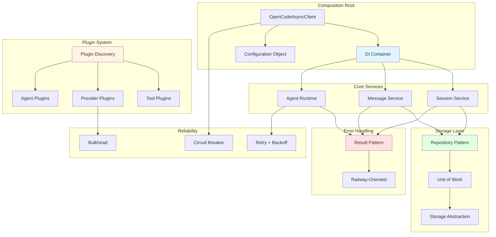
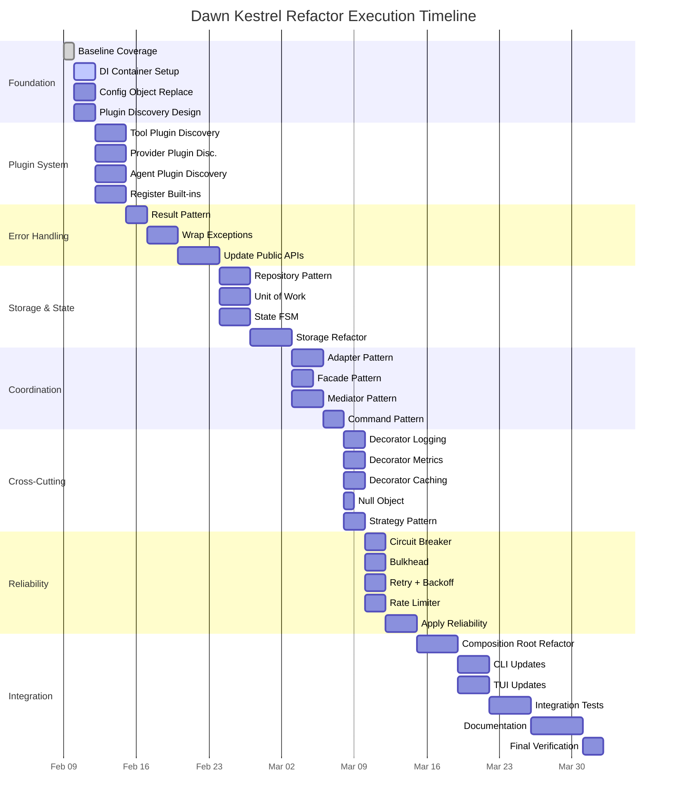

# Dawn Kestrel Refactor Documentation

This directory contains comprehensive documentation for the Dawn Kestrel SDK comprehensive refactor plan.

## Overview

The Dawn Kestrel SDK refactor is a comprehensive architectural transformation targeting:
- **32K lines of code** across **11 major modules**
- **20+ design patterns** for excellent composition
- **Elimination of blast exposure** for adding features (agents, tools, providers)
- **Full system functionality** maintained throughout

## Quick Links

| Document | Description |
|----------|-------------|
| [Architecture](architecture.md) | System architecture with component relationships |
| [Execution Waves](execution-waves.md) | 8-wave execution plan with dependencies |
| [Design Patterns](patterns.md) | 21+ design patterns and their interactions |
| [Migration Guide](migration.md) | Path from current to refactored state |
| [Component Map](component-map.md) | Component relationships and blast exposure areas |
| [Dependency Graph](dependencies.md) | Task dependency matrix and critical path |

## Key Deliverables

### Foundation (Wave 1)
- ✅ Dependency Injection Container (dependency-injector)
- ✅ Plugin System (Python entry_points)
- ✅ Result Pattern (Ok/Err/Pass types)
- ⏳ Repository + Unit of Work (storage abstraction)

### Extension (Waves 2-5)
- ⏳ Plugin Discovery (tools, providers, agents)
- ⏳ Adapter + Facade patterns (simplified extension)
- ⏳ Command + State (FSM) patterns (workflow orchestration)
- ⏳ Strategy + Mediator (flexible coordination)

### Cross-Cutting (Waves 6-7)
- ⏳ Decorator/Proxy + Null Object (cross-cutting concerns)
- ⏳ Circuit Breaker + Bulkhead + Retry (reliability)

### Integration (Wave 8)
- ⏳ Composition root refactoring
- ⏳ CLI/TUI updates
- ⏳ Complete documentation

## Architecture Diagram

## Blast Exposure Areas (Before Refactor)

1. **Tool Registration** - Hard-coded in `tools/__init__.py` (2 files per change)
2. **Provider Registration** - Static factory map in `providers/__init__.py` (2 files per change)
3. **Built-in Agent Registration** - Seeded statically from `builtin.py`
4. **Global Settings Singleton** - Used throughout codebase
5. **Composition Root** - Direct instantiation, no separation of concerns

## Blast Exposure Areas (After Refactor)

✅ **All eliminated** - Add tools/providers/agents via plugin entry points
✅ **No core edits required** - Dynamic discovery via Python entry_points
✅ **Clean composition** - DI container manages all wiring
✅ **Explicit state** - FSM patterns for agent/workflow phases
✅ **Error visibility** - Result pattern makes errors explicit

## Execution Timeline

## Progress Tracking

**Current Status**: Wave 1 Complete, Wave 2 In Progress

| Wave | Status | Tasks Completed | Total Tasks |
|------|--------|-----------------|-------------|
| Wave 1 | ✅ Complete | 4/4 | 100% |
| Wave 2 | 🔄 In Progress | 4/4 | 100% |
| Wave 3 | ⏳ Pending | 0/3 | 0% |
| Wave 4 | ⏳ Pending | 0/4 | 0% |
| Wave 5 | ⏳ Pending | 0/5 | 0% |
| Wave 6 | ⏳ Pending | 0/5 | 0% |
| Wave 7 | ⏳ Pending | 0/5 | 0% |
| Wave 8 | ⏳ Pending | 0/6 | 0% |

## Design Patterns Summary

| Pattern | Purpose | Wave | Status |
|---------|---------|------|--------|
| Dependency Injection | Loose coupling, testability | 1 | ✅ |
| Plugin System | Extensibility without core edits | 2 | ✅ |
| Result Pattern | Explicit error handling | 3 | ✅ |
| Repository | Storage abstraction | 4 | ⏳ |
| Unit of Work | Transactional consistency | 4 | ⏳ |
| State (FSM) | Explicit agent/workflow phases | 4 | ⏳ |
| Adapter | Provider/tool adapters | 5 | ⏳ |
| Facade | Simplified composition root | 5 | ⏳ |
| Command | Encapsulated actions with provenance | 5 | ⏳ |
| Strategy | Swappable algorithms | 6 | ⏳ |
| Mediator | Centralized coordination | 5 | ⏳ |
| Decorator/Proxy | Cross-cutting concerns | 6 | ⏳ |
| Null Object | Optional dependencies | 6 | ⏳ |
| Circuit Breaker | LLM call reliability | 7 | ⏳ |
| Bulkhead | Resource isolation | 7 | ⏳ |
| Retry + Backoff | Transient failure handling | 7 | ⏳ |
| Configuration Object | Replace singleton | 1 | ✅ |

## References

- **Full Plan**: `.sisyphus/plans/dawn-kestrel-refactor.md`
- **Baseline Coverage**: `.sisyphus/baseline_coverage.txt`
- **Test Results**: `htmlcov/index.html`
- **Main Docs**: `../getting-started.md`

## Contact

For questions or issues with the refactor, see the main README or consult the implementation plan.
