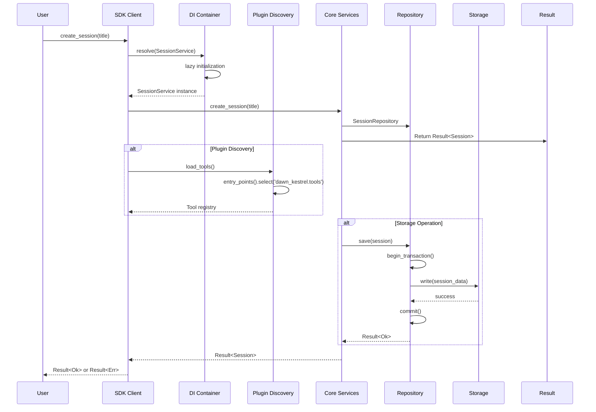

# Dawn Kestrel Architecture

This document describes the current and target architecture for the Dawn Kestrel SDK refactor.

## Overview

The Dawn Kestrel SDK is organized into several key layers:

1. **Composition Root** - SDK client and DI container
2. **Plugin System** - Dynamic discovery of tools, providers, agents
3. **Core Services** - Session, message, agent services
4. **Storage Layer** - Repository pattern with unit of work
5. **Error Handling** - Result pattern with railway-oriented programming
6. **Reliability** - Circuit breaker, retry, bulkhead patterns
7. **Cross-Cutting** - Logging, metrics, caching via decorators

## Current Architecture (Pre-Refactor)

```mermaid
graph TB
    subgraph "Client Layer"
        Client[OpenCodeAsyncClient]
        SyncClient[OpenCodeSyncClient]
    end

    subgraph "Composition Root - IMPERATIVE WIRING"
        Client -->|Direct instantiation| ToolsRegistry[Tools Registry<br/>Hard-coded]
        Client -->|Direct instantiation| ProvidersMap[Providers Map<br/>Static factory]
        Client -->|Direct instantiation| AgentsList[Agents List<br/>Static seeding]
        Client -->|Direct instantiation| SessionService[Session Service]
        Client -->|Direct instantiation| AgentRuntime[Agent Runtime]
    end

    subgraph "Global State - SINGLETON"
        Settings[Settings Singleton<br/>get_storage_dir()<br/>get_config_dir()]
    end

    subgraph "Hard-coded Registrations"
        ToolsRegistry -->|22 tools| Builtins1[builtin.py]
        ToolsRegistry -->|17 tools| Additional1[additional.py]
        ProvidersMap -->|4 providers| Builtins2[openai.py, zai.py, ...]
        AgentsList -->|Static| Builtins3[builtin.py]
    end

    subgraph "Error Handling - EXCEPTIONS"
        Exceptions[Custom Exceptions<br/>OpenCodeError<br/>SessionError]
    end

    subgraph "Storage - DIRECT ACCESS"
        Storage[Direct Storage Access<br/>No abstraction layer]
    end

    Client --> Settings
    SessionService --> Storage
    SessionService --> Exceptions
    AgentRuntime --> AgentsList
    AgentRuntime --> ToolsRegistry

    style ToolsRegistry fill:#ffcccc
    style ProvidersMap fill:#ffcccc
    style AgentsList fill:#ffcccc
    style Settings fill:#ffcccc
    style Storage fill:#ffcccc
```

### Issues with Current Architecture

| Issue | Impact | Location |
|-------|--------|----------|
| Hard-coded tool registration | 2 files per change | `tools/__init__.py` |
| Static provider factory map | 2 files per change | `providers/__init__.py` |
| Static agent seeding | Direct code edits | `agents/registry.py` |
| Global Settings singleton | Non-testable, implicit deps | `core/settings.py` |
| Direct storage access | No abstraction, hard to mock | Throughout codebase |
| Exception-based errors | Unchecked, implicit control flow | Domain layer |
| No DI container | Tight coupling, hard to test | Composition root |

## Target Architecture (Post-Refactor)

```mermaid
graph TB
    subgraph "Composition Root - DI-DRIVEN"
        Client[OpenCodeAsyncClient]
        Container[DI Container<br/>dependency-injector]
        Config[Configuration Object<br/>Pydantic Settings]
    end

    subgraph "Plugin System - DYNAMIC DISCOVERY"
        Discovery[Plugin Discovery<br/>entry_points()]
        Tools[Tool Plugins<br/>22+ tools]
        Providers[Provider Plugins<br/>4+ providers]
        Agents[Agent Plugins<br/>Multiple agents]
    end

    subgraph "Core Services"
        SessionService[Session Service]
        MessageService[Message Service]
        AgentRuntime[Agent Runtime]
        EventSystem[Event System<br/>Observer Pattern]
    end

    subgraph "Storage Layer - ABSTRACTED"
        SessionRepo[Session Repository]
        MessageRepo[Message Repository]
        PartRepo[Part Repository]
        UnitOfWork[Unit of Work<br/>Transactional]
    end

    subgraph "Error Handling - RESULT PATTERN"
        Result[Result Types<br/>Ok/Err/Pass]
        Railway[Railway-Oriented<br/>Composition]
    end

    subgraph "Reliability - RESILIENCE"
        CircuitBreaker[Circuit Breaker<br/>LLM calls]
        Retry[Retry + Backoff<br/>Transient failures]
        Bulkhead[Bulkhead<br/>Resource isolation]
        RateLimiter[Rate Limiter<br/>API calls]
    end

    subgraph "Cross-Cutting - DECORATORS"
        Logging[Logging Decorator]
        Metrics[Metrics Decorator]
        Caching[Caching Decorator]
        NullObject[Null Object<br/>Optional deps]
    end

    subgraph "Coordination - PATTERNS"
        Facade[Facade Pattern<br/>Simplified root]
        Mediator[Mediator Pattern<br/>Event coordination]
        Command[Command Pattern<br/>Encapsulated actions]
        Strategy[Strategy Pattern<br/>Swappable algos]
        State[State FSM<br/>Agent phases]
    end

    Client --> Container
    Client --> Config
    Container --> SessionService
    Container --> MessageService
    Container --> AgentRuntime
    Container --> Discovery

    Discovery --> Tools
    Discovery --> Providers
    Discovery --> Agents

    SessionService --> SessionRepo
    MessageService --> MessageRepo
    AgentRuntime --> PartRepo

    SessionRepo --> UnitOfWork
    MessageRepo --> UnitOfWork
    PartRepo --> UnitOfWork

    SessionService --> Result
    MessageService --> Result
    AgentRuntime --> Result

    Result --> Railway

    AgentRuntime --> CircuitBreaker
    Providers --> Retry
    Tools --> Bulkhead
    Client --> RateLimiter

    Logging -.-> SessionService
    Logging -.-> MessageService
    Logging -.-> AgentRuntime

    Metrics -.-> SessionService
    Metrics -.-> MessageService
    Metrics -.-> AgentRuntime

    Caching -.-> SessionService
    Caching -.-> MessageService

    Container --> Facade
    Facade --> Mediator
    Mediator --> EventSystem
    AgentRuntime --> Command
    AgentRuntime --> State
    UnitOfWork --> Strategy

    Client --> NullObject

    style Container fill:#e1f5ff
    style Discovery fill:#fff4e1
    style Result fill:#ffe1e1
    style UnitOfWork fill:#e1ffe1
    style Facade fill:#f5e1ff
```

## Layer Interactions



## Component Relationships

```mermaid
erDiagram
    CLIENT ||--o| CONFIGURATION : uses
    CLIENT ||--o| DI_CONTAINER : resolves
    CLIENT ||--o| FACADE : simplifies

    DI_CONTAINER ||--o| SESSION_SERVICE : provides
    DI_CONTAINER ||--o| MESSAGE_SERVICE : provides
    DI_CONTAINER ||--o| AGENT_RUNTIME : provides
    DI_CONTAINER ||--o| PLUGIN_DISCOVERY : provides

    PLUGIN_DISCOVERY ||--o{ TOOL_PLUGINS : discovers
    PLUGIN_DISCOVERY ||--o{ PROVIDER_PLUGINS : discovers
    PLUGIN_DISCOVERY ||--o{ AGENT_PLUGINS : discovers

    SESSION_SERVICE ||--o| SESSION_REPOSITORY : uses
    MESSAGE_SERVICE ||--o| MESSAGE_REPOSITORY : uses
    AGENT_RUNTIME ||--o| PART_REPOSITORY : uses

    SESSION_REPOSITORY ||--| UNIT_OF_WORK : participates
    MESSAGE_REPOSITORY ||--| UNIT_OF_WORK : participates
    PART_REPOSITORY ||--| UNIT_OF_WORK : participates

    SESSION_SERVICE ||--o| RESULT : returns
    MESSAGE_SERVICE ||--o| RESULT : returns
    AGENT_RUNTIME ||--o| RESULT : returns

    AGENT_RUNTIME ||--o| CIRCUIT_BREAKER : uses
    AGENT_RUNTIME ||--o| RETRY : uses
    PROVIDER_PLUGINS ||--o| BULKHEAD : uses
    CLIENT ||--o| RATE_LIMITER : uses

    SESSION_SERVICE }o--|| LOGGING_DECORATOR : applies
    SESSION_SERVICE }o--|| METRICS_DECORATOR : applies
    MESSAGE_SERVICE }o--|| LOGGING_DECORATOR : applies
    MESSAGE_SERVICE }o--|| CACHING_DECORATOR : applies

    AGENT_RUNTIME ||--o| COMMAND : uses
    AGENT_RUNTIME ||--o| STATE_FSM : uses
    FACADE ||--o| MEDIATOR : uses
    UNIT_OF_WORK ||--o| STRATEGY : uses
```

## Key Architecture Changes

### 1. Composition Root (DI Container)

**Before**:
```python
class OpenCodeAsyncClient:
    def __init__(self):
        self.storage_dir = get_storage_dir()  # Global singleton
        self.tools = create_complete_registry()  # Hard-coded
        self.providers = PROVIDER_FACTORIES  # Static map
        self.service = DefaultSessionService(...)  # Direct instantiation
```

**After**:
```python
class OpenCodeAsyncClient:
    def __init__(self, config: Configuration):
        self.container = Container(config=config)
        # All dependencies resolved lazily via DI
```

### 2. Plugin System

**Before**:
```python
# Hard-coded in tools/__init__.py
def create_complete_registry():
    return {
        "bash": BashTool,
        "read": ReadTool,
        # ... 20 more tools
    }
```

**After**:
```python
# Discovered via entry_points
from importlib.metadata import entry_points

def load_tools():
    eps = entry_points()
    return {ep.name: ep.load() for ep in eps.select(group='dawn_kestrel.tools')}
```

### 3. Result Pattern

**Before**:
```python
def create_session(title: str) -> Session:
    if not title:
        raise SessionError("Title required")
    # ... create session
    return session
```

**After**:
```python
def create_session(title: str) -> Result[Session, Error]:
    if not title:
        return Err("Title required", code="ERR_NO_TITLE")
    # ... create session
    return Ok(session)
```

### 4. Repository + Unit of Work

**Before**:
```python
# Direct storage access
async def create_session(title: str):
    data = {"id": uuid4(), "title": title}
    await storage.write(f"sessions/{data['id']}.json", data)
    return Session(**data)
```

**After**:
```python
# Repository abstraction with transactions
async def create_session(title: str) -> Result[Session, Error]:
    async with uow as unit:
        session = Session(id=uuid4(), title=title)
        unit.session_repo.add(session)
        await unit.commit()
        return Ok(session)
```

## Benefits of Refactored Architecture

| Aspect | Before | After |
|--------|--------|-------|
| **Extensibility** | Edit core files for tools/providers/agents | Add via plugins, zero core edits |
| **Testability** | Hard to mock, global state | DI container, all dependencies injectable |
| **Error Handling** | Exceptions, implicit control flow | Result pattern, explicit errors |
| **Storage** | Direct access, no transactions | Repository + Unit of Work, ACID guarantees |
| **Reliability** | No resilience patterns | Circuit breaker, retry, bulkhead |
| **Configuration** | Global singleton | Configuration object, explicit dependencies |
| **Composition** | Imperative wiring | Declarative DI container |

## Migration Path

See [migration.md](migration.md) for detailed step-by-step migration instructions.
