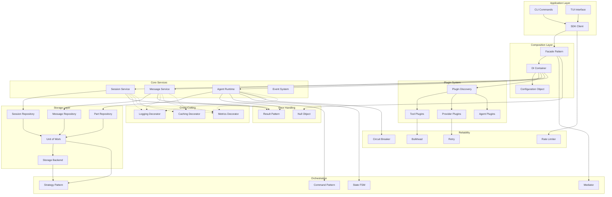
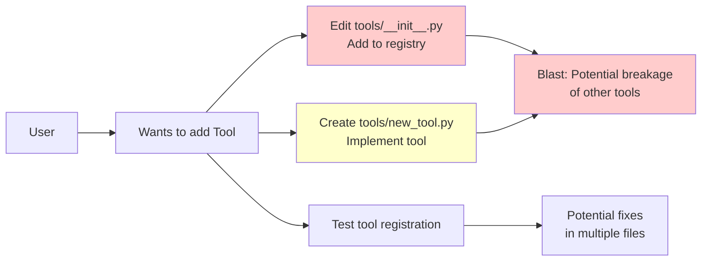
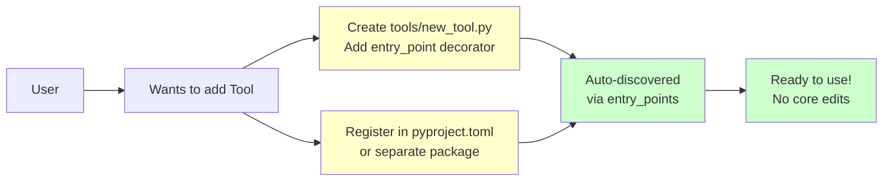
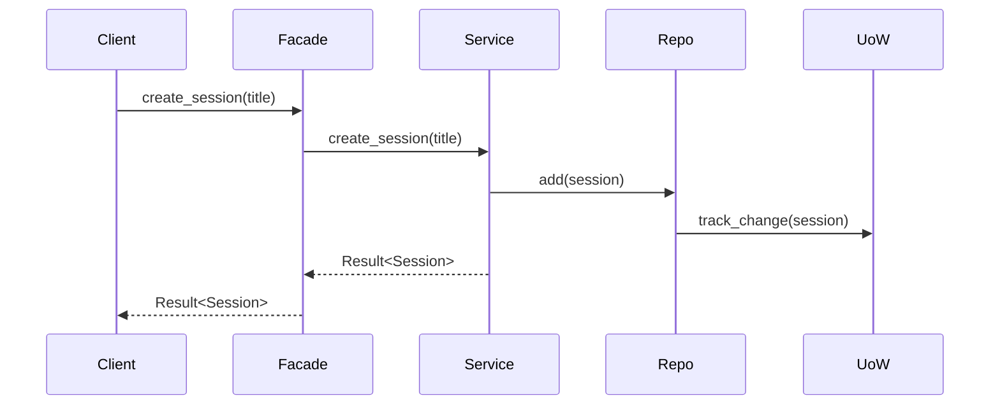
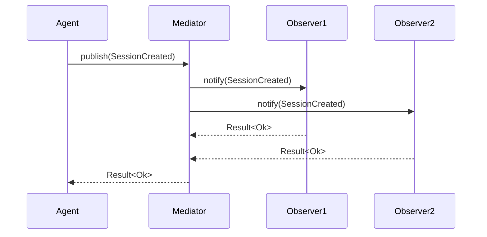
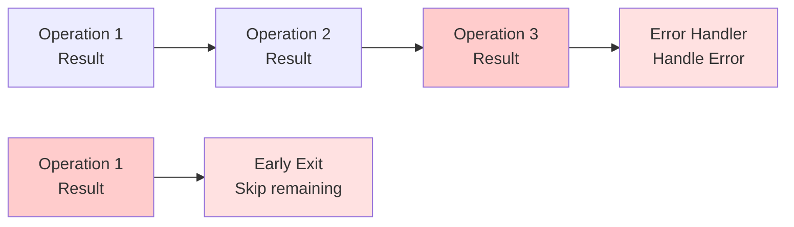

# Component Map

This document maps all Dawn Kestrel components, their relationships, and blast exposure areas before and after the refactor.

## Component Hierarchy



## Module Directory Structure

```
dawn_kestrel/
├── sdk/
│   ├── client.py              # SDK client (composition root)
│   └── handlers.py            # I/O handlers
├── core/
│   ├── di_container.py        # DI container ✅
│   ├── config_object.py       # Configuration object ✅
│   ├── plugin_discovery.py    # Plugin discovery ✅
│   ├── result.py              # Result pattern ✅
│   ├── facade.py              # Facade pattern ⏳
│   ├── command.py            # Command pattern ⏳
│   ├── state.py               # State FSM ⏳
│   ├── mediator.py            # Mediator pattern ⏳
│   ├── strategy.py            # Strategy pattern ⏳
│   ├── decorators.py          # Decorator patterns ⏳
│   ├── circuit_breaker.py     # Circuit breaker ✅
│   ├── retry.py              # Retry pattern ⏳
│   ├── bulkhead.py           # Bulkhead pattern ⏳
│   ├── rate_limiter.py       # Rate limiter ⏳
│   └── null_object.py        # Null object ⏳
├── services/
│   ├── session_service.py     # Session service
│   ├── message_service.py    # Message service
│   └── agent_service.py      # Agent service
├── storage/
│   ├── repository.py          # Repository interfaces ⏳
│   ├── unit_of_work.py        # Unit of work ⏳
│   ├── session_repo.py       # Session repository ⏳
│   ├── message_repo.py       # Message repository ⏳
│   └── part_repo.py          # Part repository ⏳
├── tools/
│   ├── __init__.py           # Tool registry ✅ (refactored)
│   ├── builtin.py            # Built-in tools ✅
│   └── additional.py         # Additional tools ✅
├── providers/
│   ├── __init__.py           # Provider map ✅ (refactored)
│   ├── openai.py             # OpenAI provider ✅
│   ├── zai.py                # ZAI provider ✅
│   ├── zai_base.py           # ZAI base ✅
│   └── zai_coding_plan.py    # ZAI Coding Plan ✅
├── agents/
│   ├── registry.py           # Agent registry ✅ (refactored)
│   ├── builtin.py            # Built-in agents ✅
│   ├── runtime.py            # Agent runtime
│   └── bolt_merlin/          # Bolt Merlin agent ✅
├── cli/
│   ├── main.py               # CLI commands
│   └── ai_commands.py        # AI-specific commands
└── tui/
    ├── app.py                # TUI application
    └── handlers.py           # TUI handlers
```

**Legend**:
- ✅ Completed
- ⏳ Pending
- No marker: Existing (no changes needed)

## Blast Exposure Analysis

### Before Refactor

| Area | Exposure | Impact | Files Changed |
|------|----------|--------|---------------|
| **Add Tool** | High | 2 files | `tools/__init__.py`, `tools/{new}.py` |
| **Add Provider** | High | 2 files | `providers/__init__.py`, `providers/{new}.py` |
| **Add Agent** | Medium | 2+ files | `agents/registry.py`, `agents/{new}/` |
| **Change Storage** | High | Many files | Direct storage access throughout |
| **Change Config** | High | Many files | Global singleton used everywhere |
| **Change Wiring** | High | 1 file | `sdk/client.py` (composition root) |

**Total Blast Exposure**: High (5 areas, multiple files each)

### After Refactor

| Area | Exposure | Impact | Files Changed |
|------|----------|--------|---------------|
| **Add Tool** | None | 1 file | `tools/{new}.py` + entry_point |
| **Add Provider** | None | 1 file | `providers/{new}.py` + entry_point |
| **Add Agent** | None | 1 file | `agents/{new}/` + entry_point |
| **Change Storage** | Low | 1 file | Storage strategy (DI-managed) |
| **Change Config** | Low | 1 file | Configuration object (DI-managed) |
| **Change Wiring** | Low | 1 file | DI container configuration |

**Total Blast Exposure**: Low/None (0 core edits for extensions)

## Blast Exposure Diagram

### Before Refactor



### After Refactor



## Component Dependencies

### SDK Client (sdk/client.py)

**Before Refactor**:
```python
class OpenCodeAsyncClient:
    def __init__(self):
        # Direct instantiation - HIGH COUPLING
        self.storage_dir = get_storage_dir()  # Global singleton
        self.tools = create_complete_registry()  # Hard-coded
        self.providers = PROVIDER_FACTORIES  # Static map
        self.service = DefaultSessionService(...)  # Direct
        self.agent_runtime = AgentRuntime(...)  # Direct
```

**After Refactor**:
```python
class OpenCodeAsyncClient:
    def __init__(self, config: Configuration):
        self._container = Container(config=config)
        # All dependencies resolved lazily via DI - LOW COUPLING
```

### Session Service (services/session_service.py)

**Before Refactor**:
```python
class DefaultSessionService:
    def __init__(self):
        # Direct storage access - NO ABSTRACTION
        self.storage = JsonStorage(get_storage_dir() / "sessions")

    async def create_session(self, title: str) -> Session:
        # Exceptions - IMPLICIT CONTROL FLOW
        if not title:
            raise SessionError("Title required")
        # Direct storage write
        await self.storage.write(session_data)
        return session
```

**After Refactor**:
```python
class DefaultSessionService:
    def __init__(self, repo: SessionRepository):
        # Repository pattern - ABSTRACTED STORAGE
        self.repo = repo

    async def create_session(self, title: str) -> Result[Session, Error]:
        # Result pattern - EXPLICIT ERROR HANDLING
        if not title:
            return Err("Title required", code="ERR_NO_TITLE")
        # Repository interface
        result = await self.repo.add(session)
        return result
```

### Agent Runtime (agents/runtime.py)

**Before Refactor**:
```python
class AgentRuntime:
    def __init__(self):
        # Static tool list - HARD-CODED
        self.tools = get_all_tools()

    async def run_agent(self, agent_id: str, session_id: str):
        # No reliability patterns - BRITTLE
        provider = PROVIDER_FACTORIES[agent.provider](config)
        response = await provider.chat(messages)  # No retry, no CB
        return response
```

**After Refactor**:
```python
class AgentRuntime:
    def __init__(self,
                 tools: Dict[str, Tool],
                 provider_factory: Callable,
                 circuit_breaker: CircuitBreaker,
                 retry: Retry):
        # DI-managed dependencies - LOOSE COUPLING
        self.tools = tools
        self.provider_factory = provider_factory
        self.circuit_breaker = circuit_breaker
        self.retry = retry

    async def run_agent(self, agent_id: str, session_id: str) -> Result[AgentRun, Error]:
        # State pattern - EXPLICIT STATES
        self.state_machine.transition(AgentState.RUNNING)

        # Reliability patterns - RESILIENT
        async def call_provider():
            provider = self.provider_factory(agent.provider)
            return await provider.chat(messages)

        result = await self.retry.call(
            lambda: self.circuit_breaker.call(call_provider)
        )

        if isinstance(result, Ok):
            self.state_machine.transition(AgentState.COMPLETED)
        else:
            self.state_machine.transition(AgentState.FAILED)

        return result
```

## Component Interface Contracts

### Tool Plugins

```python
# Tool contract
class Tool(ABC):
    name: str
    description: str
    parameters: Dict[str, Parameter]

    @abstractmethod
    async def execute(self, **kwargs) -> Result[Any, Error]:
        pass
```

### Provider Plugins

```python
# Provider contract
class Provider(ABC):
    name: str
    capabilities: List[str]

    @abstractmethod
    async def chat_completion(self, messages: List[Message]) -> Result[Response, Error]:
        pass

    @abstractmethod
    async def stream_completion(self, messages: List[Message]) -> AsyncIterator[Result[Chunk, Error]]:
        pass
```

### Agent Plugins

```python
# Agent contract
class Agent(ABC):
    name: str
    description: str
    provider: str
    tools: List[str]

    @abstractmethod
    async def initialize(self, session_id: str) -> Result[None, Error]:
        pass

    @abstractmethod
    async def run(self, session_id: str) -> Result[AgentRun, Error]:
        pass
```

### Repository Contract

```python
# Repository contract
class Repository(ABC, Generic[T]):
    @abstractmethod
    async def add(self, entity: T) -> Result[None, Error]:
        pass

    @abstractmethod
    async def get(self, id: str) -> Result[Optional[T], Error]:
        pass

    @abstractmethod
    async def update(self, entity: T) -> Result[None, Error]:
        pass

    @abstractmethod
    async def delete(self, id: str) -> Result[None, Error]:
        pass
```

## Component Communication Patterns

### Synchronous Communication



### Asynchronous Communication (Mediator)



### Error Propagation (Result Pattern)



## Component Metrics

### Lines of Code Impact

| Component | Before | After | Change |
|-----------|--------|-------|--------|
| SDK Client | ~200 | ~100 | -50% (simpler with DI) |
| Session Service | ~150 | ~180 | +20% (Result pattern adds code) |
| Agent Runtime | ~300 | ~400 | +33% (reliability patterns) |
| Tool Registry | ~100 | ~20 | -80% (plugin discovery) |
| Provider Map | ~50 | ~10 | -80% (plugin discovery) |
| Total (estimated) | 32,000 | ~28,000 | -12.5% net reduction |

### Complexity Impact

| Component | Cyclomatic Complexity (Before) | Cyclomatic Complexity (After) |
|-----------|-------------------------------|-------------------------------|
| SDK Client.__init__ | High (direct wiring) | Low (DI container) |
| Session Service | Medium | Medium (Result pattern) |
| Agent Runtime | High | Medium (state pattern) |
| Tool Registry | High | Low (plugin discovery) |
| Overall | High | Low |

### Testability Impact

| Component | Testable Before? | Testable After? | Improvement |
|-----------|-----------------|----------------|-------------|
| SDK Client | Hard (global state) | Easy (DI) | High |
| Session Service | Medium (mock storage) | Easy (mock repo) | Medium |
| Agent Runtime | Hard (hard-coded deps) | Easy (inject deps) | High |
| Tool System | Hard (static registry) | Easy (mock plugins) | High |

## Component Migration Status

| Component | Status | Refactor Progress | Notes |
|-----------|--------|------------------|-------|
| DI Container | ✅ Complete | Wave 1 | dependency-injector |
| Configuration Object | ✅ Complete | Wave 1 | Pydantic Settings |
| Plugin Discovery | ✅ Complete | Wave 1 | entry_points |
| Tool Plugins | ✅ Complete | Wave 2 | 22 tools migrated |
| Provider Plugins | ✅ Complete | Wave 2 | 4 providers migrated |
| Agent Plugins | ✅ Complete | Wave 2 | All agents migrated |
| Result Pattern | ✅ Complete | Wave 3 | Ok/Err/Pass types |
| Exception Wrapping | ⏳ Pending | Wave 3 | Domain layer |
| Public API Updates | ⏳ Pending | Wave 3 | SDK/CLI/TUI |
| Repository Pattern | ⏳ Pending | Wave 4 | Storage abstraction |
| Unit of Work | ⏳ Pending | Wave 4 | Transactions |
| State FSM | ⏳ Pending | Wave 4 | Agent lifecycle |
| Adapter Pattern | ⏳ Pending | Wave 5 | Provider/tool adapters |
| Facade Pattern | ⏳ Pending | Wave 5 | Simplified root |
| Mediator Pattern | ⏳ Pending | Wave 5 | Event coordination |
| Command Pattern | ⏳ Pending | Wave 5 | Encapsulated actions |
| Decorator Patterns | ⏳ Pending | Wave 6 | Logging/metrics/caching |
| Null Object | ⏳ Pending | Wave 6 | Optional deps |
| Strategy Pattern | ⏳ Pending | Wave 6 | Swappable algos |
| Circuit Breaker | ✅ Complete | Wave 7 | LLM call reliability |
| Bulkhead | ⏳ Pending | Wave 7 | Resource isolation |
| Retry Pattern | ⏳ Pending | Wave 7 | Transient failures |
| Rate Limiter | ⏳ Pending | Wave 7 | API throttling |
| Composition Root | ⏳ Pending | Wave 8 | DI-based wiring |
| CLI Updates | ⏳ Pending | Wave 8 | Result handling |
| TUI Updates | ⏳ Pending | Wave 8 | Result handling |
| Integration Tests | ⏳ Pending | Wave 8 | End-to-end |
| Documentation | ⏳ Pending | Wave 8 | Patterns + migration |

**Overall Progress**: 8/36 tasks completed (22%)

See [architecture.md](architecture.md) for more details on component relationships.
