# Dependency Graph

This document provides a detailed task dependency matrix and critical path analysis for the Dawn Kestrel refactor.

## Full Task Dependency Matrix

| Task | Depends On | Blocks | Can Parallelize With |
|------|------------|--------|---------------------|
| 1 | None | 2-36 | None (must start first) |
| 2 | 1 | 5-36 | 3, 4 |
| 3 | 1 | 4-36 | 2 |
| 4 | 1 | 5-36 | 2, 3 |
| 5 | 2, 3, 4 | 6-36 | 6, 7, 8 |
| 6 | 2, 3, 4 | 7-36 | 5, 7, 8 |
| 7 | 2, 3, 4 | 8-36 | 5, 6, 8 |
| 8 | 2, 3, 4 | 9-36 | 5, 6, 7 |
| 9 | 5, 6, 7, 8 | 10-36 | 10, 11 |
| 10 | 9 | 11-36 | 11 |
| 11 | 9, 10 | 12-36 | None (sequential) |
| 12 | 11 | 13-36 | 13, 14, 15 |
| 13 | 11 | 14-36 | 12, 14, 15 |
| 14 | 11 | 15-36 | 12, 13, 15 |
| 15 | 12, 13, 14 | 16-36 | None (sequential) |
| 16 | 15 | 17-36 | 17, 18, 19 |
| 17 | 15 | 18-36 | 16, 18, 19 |
| 18 | 15 | 19-36 | 16, 17, 19 |
| 19 | 15 | 20-36 | 16, 17, 18, 20 |
| 20 | 16, 17, 18, 19 | 21-36 | None (sequential) |
| 21 | 20 | 22-36 | 22, 23, 24, 25 |
| 22 | 20 | 23-36 | 21, 23, 24, 25 |
| 23 | 20 | 24-36 | 21, 22, 24, 25 |
| 24 | 20 | 25-36 | 21, 22, 23, 25 |
| 25 | 20 | 26-36 | 21, 22, 23, 24 |
| 26 | 25 | 27-36 | 27, 28, 29, 30 |
| 27 | 25 | 28-36 | 26, 28, 29, 30 |
| 28 | 25 | 29-36 | 26, 27, 29, 30 |
| 29 | 25 | 30-36 | 26, 27, 28, 30 |
| 30 | 25 | 31-36 | 26, 27, 28, 29 |
| 31 | 26, 27, 28, 29, 30 | 32-36 | 32, 33 |
| 32 | 31 | 34-36 | 33 |
| 33 | 31 | 34-36 | 32 |
| 34 | 32, 33 | 35-36 | 35 |
| 35 | 34 | 36 | None (sequential) |
| 36 | 35 | None | None (final task) |

## Critical Path Analysis

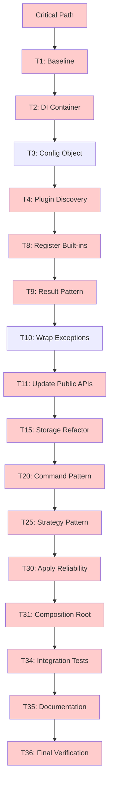

### Critical Path Tasks (15 tasks)

| Task | Name | Estimated Effort | Why Critical |
|------|------|-----------------|-------------|
| 1 | Baseline Coverage | 0.5d | Must establish before any changes |
| 2 | DI Container | 2d | Foundation for all DI-managed components |
| 3 | Config Object | 2d | Required by DI container |
| 4 | Plugin Discovery | 2d | Required by all plugin-based loading |
| 8 | Register Built-ins | 3d | Enables plugin-based loading of all components |
| 9 | Result Pattern | 2d | Foundation for error handling |
| 10 | Wrap Exceptions | 3d | Domain layer must use Results |
| 11 | Update Public APIs | 4d | Exposes Results to users (breaking change) |
| 15 | Storage Refactor | 4d | Enables Repository-based storage |
| 20 | Command Pattern | 2d | Foundation for orchestration |
| 25 | Strategy Pattern | 2d | Required for reliability patterns |
| 30 | Apply Reliability | 3d | All reliability must be applied |
| 31 | Composition Root | 4d | Final wiring with DI container |
| 34 | Integration Tests | 4d | Verifies all components work together |
| 35 | Documentation | 5d | Required deliverable |
| 36 | Final Verification | 2d | Sign-off task |

**Total Critical Path Effort**: ~44.5 days

### Non-Critical Tasks (21 tasks)

| Task | Name | Estimated Effort | Why Non-Critical |
|------|------|-----------------|------------------|
| 5 | Tool Plugin Discovery | 3d | Can run parallel to 6, 7, 8 |
| 6 | Provider Plugin Discovery | 3d | Can run parallel to 5, 7, 8 |
| 7 | Agent Plugin Discovery | 3d | Can run parallel to 5, 6, 8 |
| 12 | Repository Pattern | 3d | Can run parallel to 13, 14 |
| 13 | Unit of Work | 3d | Can run parallel to 12, 14 |
| 14 | State FSM | 3d | Can run parallel to 12, 13 |
| 16 | Provider Adapters | 3d | Can run parallel to 17, 18, 19 |
| 17 | Tool Adapters | 3d | Can run parallel to 16, 18, 19 |
| 18 | Facade | 2d | Can run parallel to 16, 17, 19 |
| 19 | Mediator | 3d | Can run parallel to 16, 17, 18, 20 |
| 21 | Logging Decorator | 2d | Can run parallel to 22, 23, 24, 25 |
| 22 | Metrics Decorator | 2d | Can run parallel to 21, 23, 24, 25 |
| 23 | Caching Decorator | 2d | Can run parallel to 21, 22, 24, 25 |
| 24 | Null Object | 1d | Can run parallel to 21, 22, 23, 25 |
| 26 | Circuit Breaker | 2d | Can run parallel to 27, 28, 29, 30 |
| 27 | Bulkhead | 2d | Can run parallel to 26, 28, 29, 30 |
| 28 | Retry + Backoff | 2d | Can run parallel to 26, 27, 29, 30 |
| 29 | Rate Limiter | 2d | Can run parallel to 26, 27, 28, 30 |
| 32 | CLI Updates | 3d | Can run parallel to 33 |
| 33 | TUI Updates | 3d | Can run parallel to 32 |

**Total Non-Critical Effort**: ~56 days

## Dependency Graph Visualization

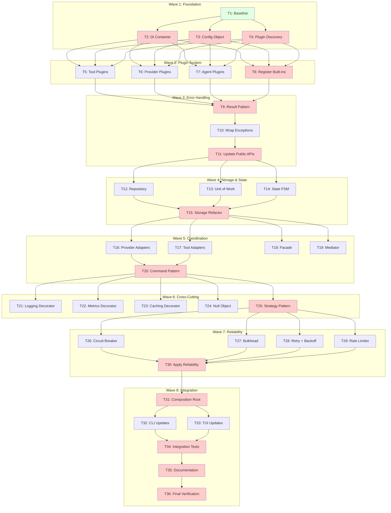

## Parallelization Opportunities

### Wave 1 Parallelization

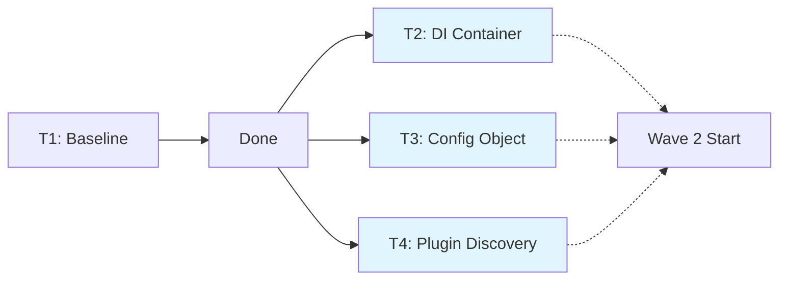

**Parallel Tasks**: T2, T3, T4 (3 tasks)
**Speedup**: 3x (if unlimited parallel capacity)

### Wave 2 Parallelization

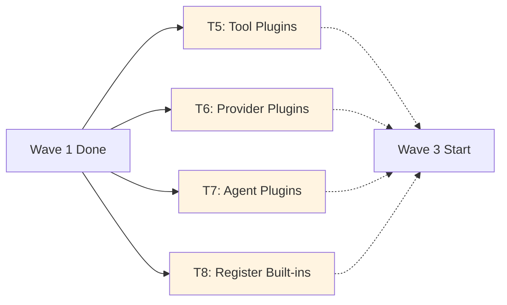

**Parallel Tasks**: T5, T6, T7, T8 (4 tasks)
**Speedup**: 4x (if unlimited parallel capacity)

### Wave 3 Parallelization

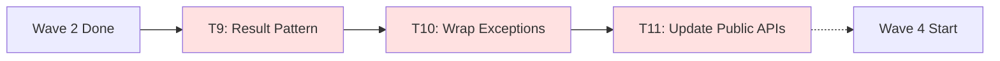

**Parallel Tasks**: None (sequential)
**Speedup**: 1x

### Wave 4 Parallelization

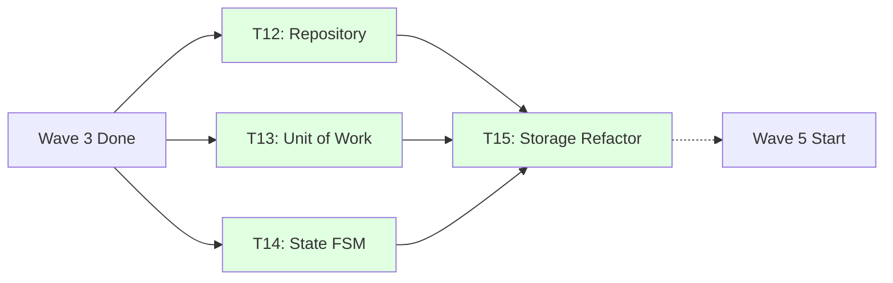

**Parallel Tasks**: T12, T13, T14 (3 tasks)
**Speedup**: 3x (if unlimited parallel capacity)

### Wave 5 Parallelization

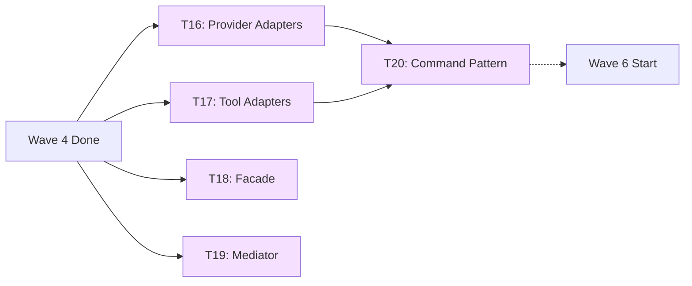

**Parallel Tasks**: T16, T17, T18, T19 (4 tasks)
**Speedup**: 4x (if unlimited parallel capacity)

### Wave 6 Parallelization

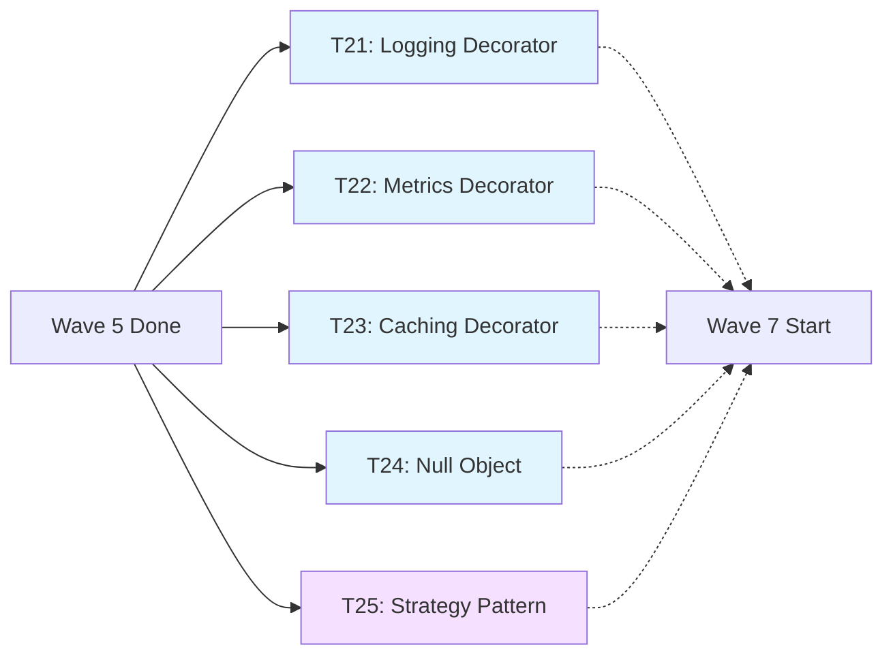

**Parallel Tasks**: T21, T22, T23, T24, T25 (5 tasks)
**Speedup**: 5x (if unlimited parallel capacity)

### Wave 7 Parallelization

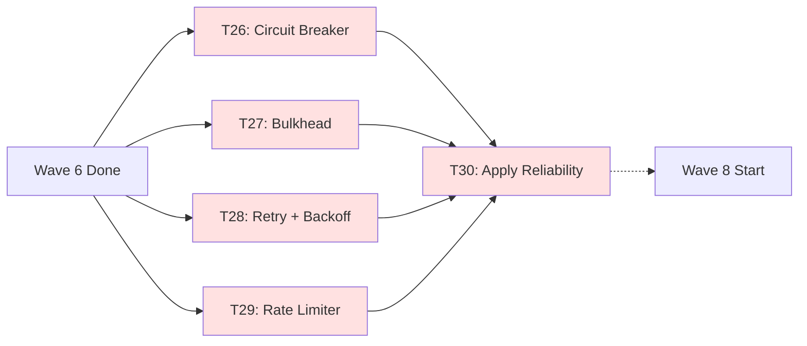

**Parallel Tasks**: T26, T27, T28, T29 (4 tasks)
**Speedup**: 4x (if unlimited parallel capacity)

### Wave 8 Parallelization

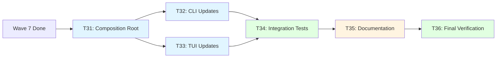

**Parallel Tasks**: T32, T33 (2 tasks)
**Speedup**: 2x (if unlimited parallel capacity)

## Task Complexity vs. Dependencies

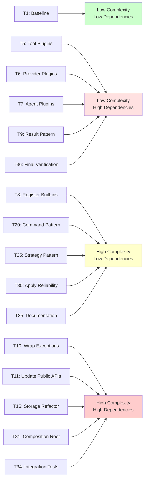

## Resource Allocation Strategy

### Recommended Agent Allocation

| Wave | Tasks | Parallel Capacity | Recommended Agents |
|------|-------|------------------|-------------------|
| Wave 1 | 1-4 | 3 parallel | 2 agents (1 main + 1 helper) |
| Wave 2 | 5-8 | 4 parallel | 3 agents (1 main + 2 helpers) |
| Wave 3 | 9-11 | Sequential | 1 agent (main) |
| Wave 4 | 12-15 | 3 parallel | 2 agents (1 main + 1 helper) |
| Wave 5 | 16-20 | 4 parallel | 3 agents (1 main + 2 helpers) |
| Wave 6 | 21-25 | 5 parallel | 4 agents (1 main + 3 helpers) |
| Wave 7 | 26-30 | 4 parallel | 3 agents (1 main + 2 helpers) |
| Wave 8 | 31-36 | 2 parallel | 2 agents (1 main + 1 helper) |

**Peak Parallel Capacity**: 4-5 agents (Wave 6)
**Average Parallel Capacity**: 2-3 agents

### Task Prioritization

**High Priority** (on critical path):
- T1: Baseline (blocks all)
- T2: DI Container (blocks all DI-managed code)
- T4: Plugin Discovery (blocks all plugin loading)
- T9: Result Pattern (blocks error handling)
- T11: Update Public APIs (blocks user-facing changes)
- T15: Storage Refactor (blocks Repository pattern)
- T20: Command Pattern (blocks orchestration)
- T25: Strategy Pattern (blocks reliability)
- T31: Composition Root (blocks final integration)
- T34: Integration Tests (blocks completion)
- T35: Documentation (required deliverable)

**Medium Priority** (significant parallelization benefit):
- T5, T6, T7, T8: Plugin system (4x parallelization)
- T12, T13, T14: Storage patterns (3x parallelization)
- T16, T17, T18, T19: Coordination patterns (4x parallelization)
- T21, T22, T23, T24, T25: Cross-cutting patterns (5x parallelization)
- T26, T27, T28, T29: Reliability patterns (4x parallelization)

**Low Priority** (sequential or limited parallelization):
- T3: Config Object (1x speedup)
- T10: Wrap Exceptions (sequential)
- T32, T33: CLI/TUI updates (2x speedup)
- T36: Final verification (sequential)

## Risk Assessment

### High-Risk Tasks (high complexity, many dependencies)

| Task | Risk | Mitigation |
|------|------|------------|
| T10: Wrap Exceptions | May break existing functionality | Comprehensive test suite, incremental wrapping |
| T11: Update Public APIs | Breaking change for users | Clear migration guide, feature flags |
| T15: Storage Refactor | Data loss risk | Comprehensive testing, backup strategy |
| T31: Composition Root | System may not initialize | Incremental DI integration, fallback to old wiring |

### Medium-Risk Tasks (moderate complexity, some dependencies)

| Task | Risk | Mitigation |
|------|------|------------|
| T20: Command Pattern | May affect agent workflows | Extensive agent testing |
| T25: Strategy Pattern | May affect storage reliability | Multiple backend testing |
| T34: Integration Tests | May reveal hidden bugs | Parallel execution, detailed reporting |

### Low-Risk Tasks (low complexity, few dependencies)

| Task | Risk | Mitigation |
|------|------|------------|
| T1: Baseline | None (read-only) | None needed |
| T9: Result Pattern | Limited usage initially | Comprehensive unit tests |
| T21-24: Decorator Patterns | Can be disabled | Feature flags |

## Task Status Tracking

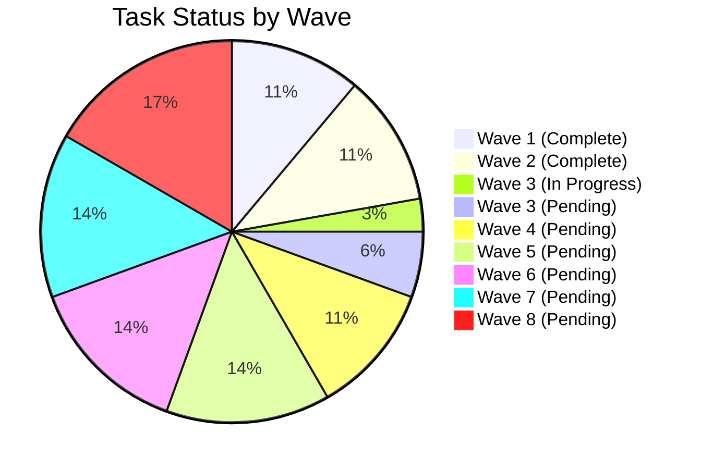

## Completion Metrics

| Metric | Target | Current | Percentage |
|--------|--------|---------|------------|
| Total Tasks | 36 | 9 | 25% |
| Critical Path Tasks | 15 | 5 | 33% |
| Non-Critical Tasks | 21 | 4 | 19% |
| Waves Completed | 8 | 2 | 25% |
| Design Patterns Implemented | 21 | 6 | 29% |

See [execution-waves.md](execution-waves.md) for detailed wave execution plans.
