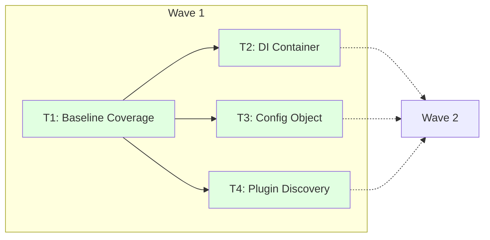
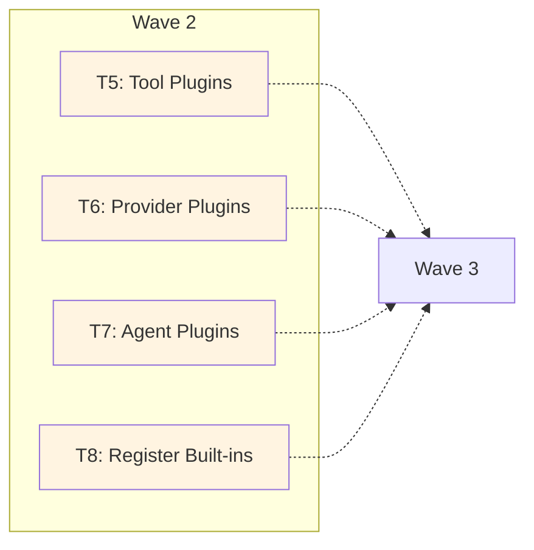
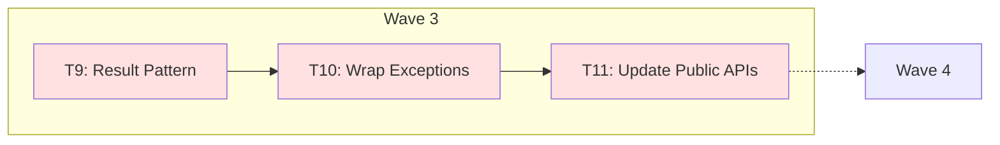
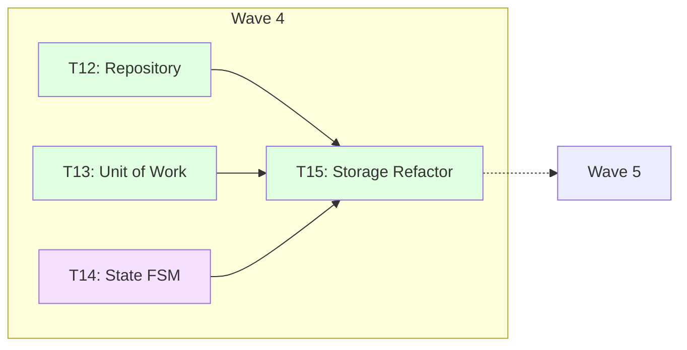
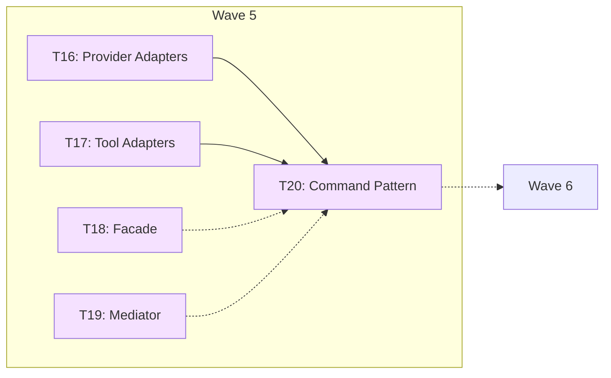
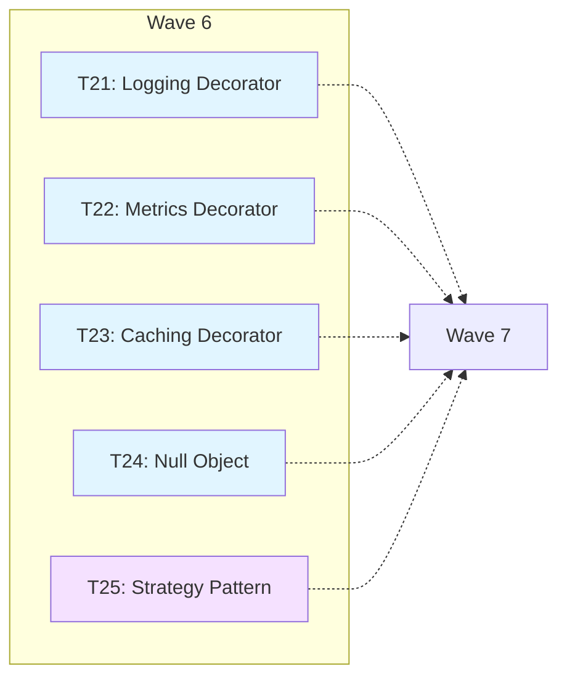
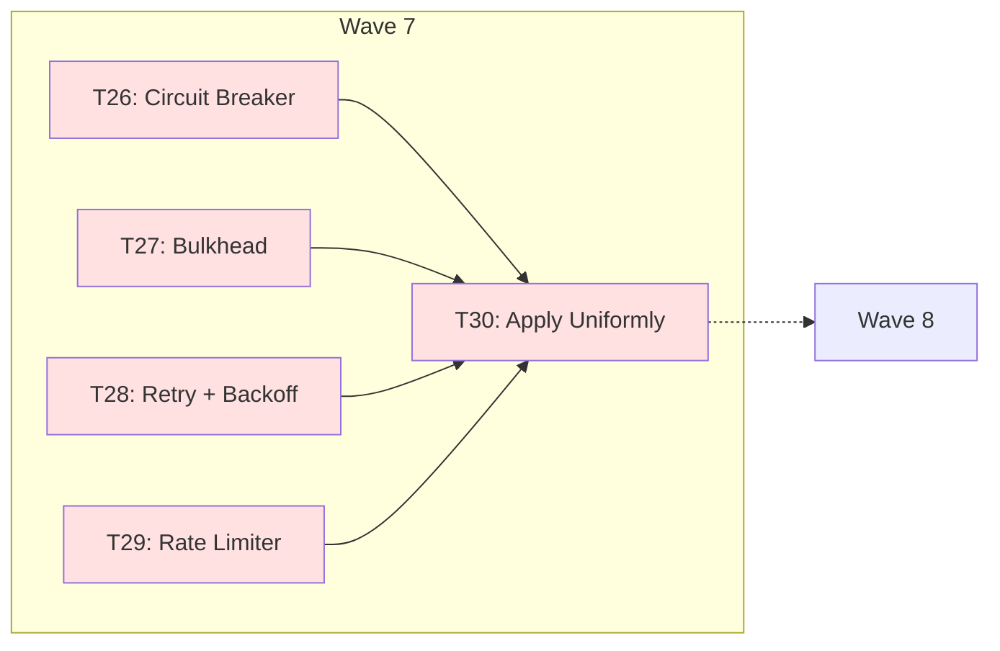
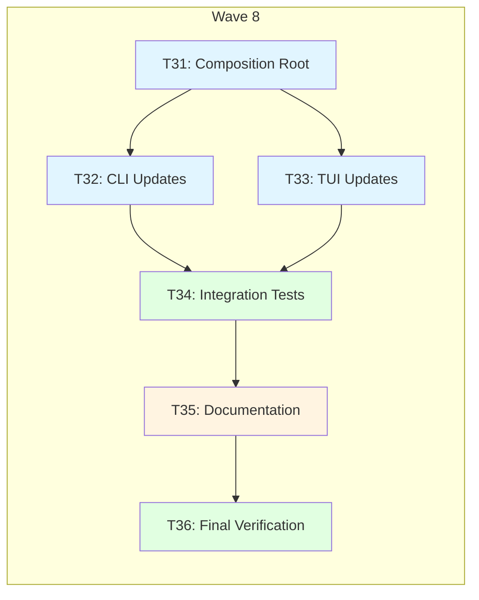
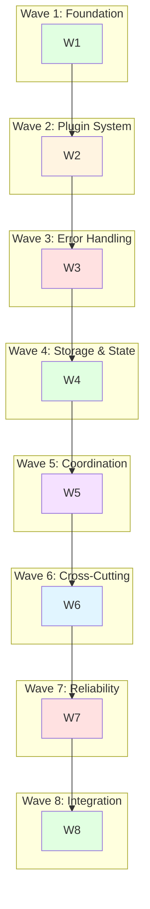

# Execution Waves

The Dawn Kestrel refactor is organized into 8 execution waves to maximize parallelization while respecting dependencies. Each wave contains related tasks that can be executed in parallel.

## Wave Overview

```mermaid
gantt
    title 8-Wave Execution Plan
    dateFormat  YYYY-MM-DD
    axisFormat  Wave %W

    section Foundation
    Wave 1: Foundation            :milestone, w1, 2025-02-09, 0d
    section Plugin System
    Wave 2: Plugin System        :milestone, w2, after w1, 0d
    section Error Handling
    Wave 3: Error Handling       :milestone, w3, after w2, 0d
    section Storage & State
    Wave 4: Storage & State      :milestone, w4, after w3, 0d
    section Coordination
    Wave 5: Coordination         :milestone, w5, after w4, 0d
    section Cross-Cutting
    Wave 6: Cross-Cutting        :milestone, w6, after w5, 0d
    section Reliability
    Wave 7: Reliability           :milestone, w7, after w6, 0d
    section Integration
    Wave 8: Integration           :milestone, w8, after w7, 0d
```

## Wave 1: Foundation

**Goal**: Establish foundational infrastructure for all subsequent waves

**Tasks** (4 total):
1. ✅ Establish baseline test coverage
2. ✅ Setup DI container (dependency-injector)
3. ✅ Replace Settings singleton with Configuration Object
4. ✅ Design plugin discovery system (entry_points)

**Parallelization**: Tasks 2, 3, 4 can run in parallel after Task 1 completes

**Blocks**: All subsequent waves (2-8)



**Acceptance Criteria**:
- ✅ Baseline coverage report saved to `.sisyphus/baseline_coverage.txt`
- ✅ DI container resolves SessionStorage and DefaultSessionService
- ✅ Configuration object provides storage_dir, config_dir, cache_dir
- ✅ Entry points groups defined in pyproject.toml

## Wave 2: Plugin System

**Goal**: Enable dynamic discovery and loading of tools, providers, and agents

**Tasks** (4 total):
5. ✅ Implement tool plugin discovery
6. ✅ Implement provider plugin discovery
7. ✅ Implement agent plugin discovery
8. ✅ Register all built-in tools/providers/agents as plugins

**Parallelization**: Tasks 5, 6, 7, 8 can run in parallel

**Blocks**: Wave 3 (Error Handling)



**Acceptance Criteria**:
- ✅ All 22 tools discovered via plugins
- ✅ All 4 providers discovered via plugins
- ✅ All built-in agents discovered via plugins
- ✅ Entry point decorators added to all components
- ✅ Backward compatibility maintained for direct imports

## Wave 3: Error Handling

**Goal**: Replace exception-based error handling with explicit Result pattern

**Tasks** (3 total):
9. ✅ Implement Result pattern (Ok/Err/Pass)
10. ⏳ Wrap existing exceptions with Result types
11. ⏳ Update all public APIs to return Results

**Parallelization**: Sequential (Task 10 depends on Task 9, Task 11 depends on Task 10)

**Blocks**: Wave 4 (Storage & State)



**Acceptance Criteria**:
- ✅ Result types (Ok, Err, Pass) created with bind/map/fold
- ⏳ All domain functions return Results (not raise exceptions)
- ⏳ SDK client methods return Results
- ⏳ CLI commands handle Results correctly
- ⏳ TUI displays Result errors

## Wave 4: Storage & State

**Goal**: Abstract storage with Repository pattern and manage agent state with FSM

**Tasks** (4 total):
12. ⏳ Implement Repository pattern (session/message/part)
13. ⏳ Implement Unit of Work for transactions
14. ⏳ Implement State (FSM) for agent lifecycle
15. ⏳ Refactor storage layer to use Repository

**Parallelization**: Tasks 12, 13, 14 can run in parallel; Task 15 waits for all three

**Blocks**: Wave 5 (Coordination)



**Acceptance Criteria**:
- ⏳ Repository interfaces defined for session/message/part
- ⏳ Unit of Work provides transactional consistency
- ⏳ Agent lifecycle states explicitly defined with valid transitions
- ⏳ All storage operations go through Repository abstraction

## Wave 5: Coordination & Extension

**Goal**: Simplify extension and centralize coordination with design patterns

**Tasks** (5 total):
16. ⏳ Implement Adapter pattern for providers
17. ⏳ Implement Adapter pattern for tools
18. ⏳ Implement Facade for composition root
19. ⏳ Implement Mediator for event coordination
20. ⏳ Implement Command pattern for actions

**Parallelization**: Tasks 16, 17, 18, 19 can run in parallel; Task 20 waits for 16, 17, 18

**Blocks**: Wave 6 (Cross-Cutting)



**Acceptance Criteria**:
- ⏳ Provider adapters enable extension without core edits
- ⏳ Tool adapters enable extension without core edits
- ⏳ Facade simplifies composition root initialization
- ⏳ Mediator coordinates component interactions
- ⏳ Commands encapsulate actions with provenance

## Wave 6: Cross-Cutting

**Goal**: Apply cross-cutting concerns uniformly via decorators and patterns

**Tasks** (5 total):
21. ⏳ Implement Decorator/Proxy for logging
22. ⏳ Implement Decorator/Proxy for metrics
23. ⏳ Implement Decorator/Proxy for caching
24. ⏳ Implement Null Object for optional deps
25. ⏳ Implement Strategy pattern for swappable algos

**Parallelization**: All tasks can run in parallel

**Blocks**: Wave 7 (Reliability)



**Acceptance Criteria**:
- ⏳ Logging applied uniformly to all services
- ⏳ Metrics collected for all operations
- ⏳ Caching applied to expensive operations
- ⏳ Null Object eliminates None checks for optional deps
- ⏳ Strategy pattern enables swapping storage backends, routing, retry policies

## Wave 7: Reliability

**Goal**: Add resilience patterns for LLM calls and external dependencies

**Tasks** (5 total):
26. ✅ Implement Circuit Breaker for LLM calls
27. ⏳ Implement Bulkhead for resource isolation
28. ⏳ Implement Retry + Backoff for transient failures
29. ⏳ Implement Rate Limiter for API calls
30. ⏳ Apply reliability patterns uniformly

**Parallelization**: Tasks 26, 27, 28, 29 can run in parallel; Task 30 waits for all four

**Blocks**: Wave 8 (Integration)



**Acceptance Criteria**:
- ✅ Circuit breaker prevents cascading failures
- ⏳ Bulkhead isolates resource pools
- ⏳ Retry with exponential backoff handles transient failures
- ⏳ Rate limiter prevents API throttling
- ⏳ All reliability patterns applied consistently

## Wave 8: Final Integration

**Goal**: Integrate all patterns and complete documentation

**Tasks** (6 total):
31. ⏳ Refactor composition root to use DI container
32. ⏳ Update CLI to use new APIs
33. ⏳ Update TUI to use new APIs
34. ⏳ Comprehensive integration tests
35. ⏳ Documentation (patterns + migration)
36. ⏳ Final verification and cleanup

**Parallelization**: Tasks 32 and 33 can run in parallel after Task 31; Task 34 waits for 32 and 33

**Blocks**: None (final wave)



**Acceptance Criteria**:
- ⏳ Composition root uses DI container exclusively
- ⏳ CLI handles Results and new APIs correctly
- ⏳ TUI displays Results and uses new APIs correctly
- ⏳ All integration tests pass
- ⏳ All patterns documented in docs/patterns.md
- ⏳ Migration guide (MIGRATION.md) complete
- ⏳ Full test suite passes with coverage >= baseline

## Wave Dependency Graph



## Parallelization Strategy

### Within-Wave Parallelization

| Wave | Parallel Tasks | Speedup |
|------|---------------|---------|
| Wave 1 | 3 (Tasks 2, 3, 4) | 3x |
| Wave 2 | 4 (Tasks 5, 6, 7, 8) | 4x |
| Wave 3 | 0 (sequential) | 1x |
| Wave 4 | 3 (Tasks 12, 13, 14) | 3x |
| Wave 5 | 4 (Tasks 16, 17, 18, 19) | 4x |
| Wave 6 | 5 (Tasks 21-25) | 5x |
| Wave 7 | 4 (Tasks 26-29) | 4x |
| Wave 8 | 2 (Tasks 32, 33) | 2x |

### Overall Parallelization Speedup

**Estimated speedup: ~40% faster than sequential execution**

This is achieved by:
- Within-wave parallelization (average 3x)
- Wave pipeline (later waves start as soon as dependencies complete)
- Independent task execution within parallel tasks

## Critical Path

```
Wave 1 → Wave 2 → Wave 3 → Wave 4 → Wave 5 → Wave 6 → Wave 7 → Wave 8
```

Tasks on critical path:
- Task 1: Baseline (must start first)
- Task 2: DI Container (foundational)
- Task 3: Config Object (foundational)
- Task 4: Plugin Discovery (foundational)
- Task 8: Register Built-ins (enables all plugin-based loading)
- Task 9: Result Pattern (foundational for error handling)
- Task 11: Update Public APIs (exposes Results to users)
- Task 15: Storage Refactor (enables Repository pattern)
- Task 20: Command Pattern (foundational for orchestration)
- Task 25: Strategy Pattern (foundational for reliability)
- Task 30: Apply Reliability (enables final integration)
- Task 31: Composition Root (final wiring)
- Task 34: Integration Tests (verifies everything)
- Task 35: Documentation (final deliverable)
- Task 36: Final Verification (sign-off)

## Rollback Strategy

Each wave has checkpoints that enable rollback if issues arise:

| Wave | Checkpoint | Rollback Mechanism |
|------|------------|-------------------|
| Wave 1 | Task 4 completion | git revert to pre-refactor |
| Wave 2 | Task 8 completion | Disable entry_points, use fallback registry |
| Wave 3 | Task 11 completion | Keep Result types, wrap with exception adapters |
| Wave 4 | Task 15 completion | Keep Repository facade, revert implementation |
| Wave 5 | Task 20 completion | Keep Adapter interfaces, revert to direct calls |
| Wave 6 | Task 25 completion | Remove decorators, keep Null Object shims |
| Wave 7 | Task 30 completion | Disable reliability wrappers |
| Wave 8 | Task 36 completion | Final rollback to Wave 7 checkpoint |

See [dependencies.md](dependencies.md) for full task dependency matrix.
