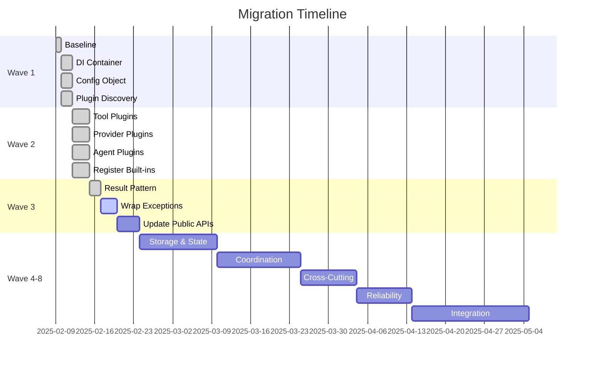

# Migration Guide

This document provides a step-by-step guide for migrating from the current Dawn Kestrel SDK architecture to the refactored architecture.

## Overview

The refactor is designed to be **incremental** with clear checkpoints, enabling rollback at any point. Each wave is self-contained and can be completed independently.

## Migration Phases

```mermaid
graph LR
    A[Current State] --> B[Wave 1<br/>Foundation]
    B --> C[Wave 2<br/>Plugin System]
    C --> D[Wave 3<br/>Error Handling]
    D --> E[Wave 4<br/>Storage & State]
    E --> F[Wave 5<br/>Coordination]
    F --> G[Wave 6<br/>Cross-Cutting]
    G --> H[Wave 7<br/>Reliability]
    H --> I[Wave 8<br/>Integration]
    I --> J[Target State]

    style A fill:#ffcccc
    style J fill:#ccffcc
    style B fill:#e1f5ff
    style C fill:#fff4e1
    style D fill:#ffe1e1
    style E fill:#e1ffe1
    style F fill:#f5e1ff
    style G fill:#e1f5ff
    style H fill:#ffe1e1
    style I fill:#e1ffe1
```



## Prerequisites

Before starting migration, ensure:

1. ✅ Python 3.9+ installed
2. ✅ `poetry` or `pip` for dependency management
3. ✅ Git repository initialized
4. ✅ Existing test suite passing
5. ✅ Baseline coverage established

```bash
# Verify environment
python --version  # Should be 3.9+
poetry --version   # Or pip --version

# Verify tests pass
pytest -xvs

# Establish baseline coverage
pytest -xvs --cov=dawn_kestrel --cov-report=term-missing --cov-report=html
cp htmlcov/index.html .sisyphus/baseline_coverage.txt
```

## Wave 1: Foundation Migration

### Task 1: Establish Baseline

**Status**: ✅ Complete

**What changes**:
- No code changes
- Establish test coverage baseline
- Identify under-tested modules

**How to verify**:
```bash
# Check baseline file exists
ls -l .sisyphus/baseline_coverage.txt

# Compare with pre-refactor
diff .sisyphus/baseline_coverage.txt htmlcov/index.html
```

### Task 2: Setup DI Container

**Status**: ✅ Complete

**What changes**:
- Add `dependency-injector` to dependencies
- Create `dawn_kestrel/core/di_container.py`
- Define service bindings

**Migration steps**:
```python
# 1. Install dependency
poetry add dependency-injector  # or pip install dependency-injector

# 2. Create container
# dawn_kestrel/core/di_container.py
from dependency_injector import containers, providers

class Container(containers.DeclarativeContainer):
    config = providers.Configuration()

    # Services
    session_service = providers.Factory(
        SessionService,
        config=config
    )
```

**Breaking changes**: None (container not yet used)

**How to verify**:
```bash
# Test DI container resolves services
python -c "
from dawn_kestrel.core.di_container import container
service = container.session_service()
print(f'Service type: {type(service).__name__}')
"
```

### Task 3: Replace Settings Singleton

**Status**: ✅ Complete

**What changes**:
- Create `dawn_kestrel/core/config_object.py`
- Replace `get_storage_dir()`, `get_config_dir()`, `get_cache_dir()` with instance methods
- Update all callers

**Migration steps**:
```python
# Before
from dawn_kestrel.core.settings import get_storage_dir
storage_dir = get_storage_dir()

# After
from dawn_kestrel.core.config_object import Configuration
config = Configuration()
storage_dir = config.storage_dir
```

**Breaking changes**: Minor
- Import changes: `from dawn_kestrel.core.settings import ...` → `from dawn_kestrel.core.config_object import ...`
- Function calls: `get_storage_dir()` → `config.storage_dir`

**How to verify**:
```bash
# Test configuration object
python -c "
from dawn_kestrel.core.config_object import Configuration
config = Configuration()
print(f'Storage: {config.storage_dir}')
print(f'Config: {config.config_dir}')
"

# Check no old singleton references
grep -r "get_storage_dir" dawn_kestrel/
# Should return nothing
```

### Task 4: Design Plugin Discovery

**Status**: ✅ Complete

**What changes**:
- Define entry_points groups in `pyproject.toml`
- Create `dawn_kestrel/core/plugin_discovery.py`
- Implement plugin loading logic

**Migration steps**:
```python
# pyproject.toml
[project.entry-points]
"dawn_kestrel.tools" = []
"dawn_kestrel.providers" = []
"dawn_kestrel.agents" = []

# dawn_kestrel/core/plugin_discovery.py
from importlib.metadata import entry_points

def load_tools():
    eps = entry_points()
    return {ep.name: ep.load() for ep in eps.select(group='dawn_kestrel.tools')}
```

**Breaking changes**: None (discovery not yet used)

**How to verify**:
```bash
# Check entry points defined
grep -A 5 "project.entry-points" pyproject.toml

# Test discovery (will be empty initially)
python -c "
from dawn_kestrel.core.plugin_discovery import load_tools
tools = load_tools()
print(f'Tools: {len(tools)}')
"
```

## Wave 2: Plugin System Migration

### Task 5: Tool Plugin Discovery

**Status**: ✅ Complete

**What changes**:
- Migrate `tools/__init__.py` hard-coded list to plugin-based
- Update tool modules to register as entry points
- Remove `create_complete_registry()` static list

**Migration steps**:
```python
# pyproject.toml - Add tool entry points
[project.entry-points."dawn_kestrel.tools"]
"bash" = "dawn_kestrel.tools.builtin:BashTool"
"read" = "dawn_kestrel.tools.builtin:ReadTool"
"write" = "dawn_kestrel.tools.builtin:WriteTool"
# ... all 22 tools

# dawn_kestrel/tools/__init__.py - Remove hard-coded registry
def get_tools() -> Dict[str, Tool]:
    """Get all tools via plugin discovery."""
    from dawn_kestrel.core.plugin_discovery import load_tools
    return load_tools()
```

**Breaking changes**: None (backward compatibility maintained)

**How to verify**:
```bash
# Test all tools discovered
python -c "
from dawn_kestrel.core.plugin_discovery import load_tools
tools = load_tools()
print(f'Tools discovered: {len(tools)}')
assert 'bash' in tools
assert 'read' in tools
"
```

### Task 6: Provider Plugin Discovery

**Status**: ✅ Complete

**What changes**:
- Migrate `providers/__init__.py` `PROVIDER_FACTORIES` to plugin-based
- Update provider modules to register as entry points

**Migration steps**:
```python
# pyproject.toml - Add provider entry points
[project.entry-points."dawn_kestrel.providers"]
"openai" = "dawn_kestrel.providers.openai:OpenAIProvider"
"zai" = "dawn_kestrel.providers.zai:ZAIProvider"
"zai_base" = "dawn_kestrel.providers.zai_base:ZAIBaseProvider"
"zai_coding_plan" = "dawn_kestrel.providers.zai_coding_plan:ZAICodingPlanProvider"

# dawn_kestrel/providers/__init__.py - Remove static map
def get_providers() -> Dict[str, Provider]:
    """Get all providers via plugin discovery."""
    from dawn_kestrel.core.plugin_discovery import load_providers
    return load_providers()
```

**Breaking changes**: None (backward compatibility maintained)

**How to verify**:
```bash
# Test all providers discovered
python -c "
from dawn_kestrel.core.plugin_discovery import load_providers
providers = load_providers()
print(f'Providers discovered: {len(providers)}')
assert 'openai' in providers
assert 'zai' in providers
"
```

### Task 7: Agent Plugin Discovery

**Status**: ✅ Complete

**What changes**:
- Update `agents/registry.py` to load from plugins
- Register built-in agents via entry points

**Migration steps**:
```python
# pyproject.toml - Add agent entry points
[project.entry-points."dawn_kestrel.agents"]
"bolt_merlin" = "dawn_kestrel.agents.bolt_merlin:BoltMerlinAgent"
"prometheus" = "dawn_kestrel.agents.builtin:PrometheusAgent"

# dawn_kestrel/agents/registry.py - Use plugin discovery
def get_all_agents() -> Dict[str, Agent]:
    """Get all agents via plugin discovery."""
    from dawn_kestrel.core.plugin_discovery import load_agents
    return load_agents()
```

**Breaking changes**: None (backward compatibility maintained)

**How to verify**:
```bash
# Test all agents discovered
python -c "
from dawn_kestrel.core.plugin_discovery import load_agents
agents = load_agents()
print(f'Agents discovered: {len(agents)}')
assert 'bolt_merlin' in agents
"
```

### Task 8: Register Built-in Components

**Status**: ✅ Complete

**What changes**:
- Verify all built-in tools/providers/agents have entry points
- Add metadata (version, capabilities) to entry points

**Migration steps**:
```python
# Verify all entry points registered
python -c "
from importlib.metadata import entry_points

eps = entry_points()
tools = list(eps.select(group='dawn_kestrel.tools'))
providers = list(eps.select(group='dawn_kestrel.providers'))
agents = list(eps.select(group='dawn_kestrel.agents'))

print(f'Tools: {len(tools)}, Providers: {len(providers)}, Agents: {len(agents)}')
"
```

**Breaking changes**: None

**How to verify**:
```bash
# Test direct imports still work (backward compat)
python -c "
from dawn_kestrel.tools import BashTool, ReadTool
from dawn_kestrel.providers import OpenAIProvider
from dawn_kestrel.agents.bolt_merlin import BoltMerlinAgent
print('Direct imports work!')
"
```

## Wave 3: Error Handling Migration

### Task 9: Implement Result Pattern

**Status**: ✅ Complete

**What changes**:
- Create `dawn_kestrel/core/result.py` with `Ok`, `Err`, `Pass` types
- Implement Result helpers (bind, map, fold)

**Migration steps**:
```python
# dawn_kestrel/core/result.py
from dataclasses import dataclass
from typing import Generic, TypeVar, Union

T = TypeVar('T')
E = TypeVar('E')

@dataclass
class Ok(Generic[T]):
    value: T
    def is_ok(self) -> bool: return True
    def is_err(self) -> bool: return False

@dataclass
class Err(Generic[E]):
    error: E
    code: str
    def is_ok(self) -> bool: return False
    def is_err(self) -> bool: return True

@dataclass
class Pass(Generic[T]):
    value: T
    def is_pass(self) -> bool: return True

Result = Union[Ok[T], Err[E], Pass[T]]

def bind(result: Result[T, E], func) -> Result:
    if isinstance(result, Err):
        return result
    return func(result.value)

def map(result: Result[T, E], func) -> Result:
    if isinstance(result, Err):
        return result
    return Ok(func(result.value))
```

**Breaking changes**: None (Result types not yet used)

**How to verify**:
```bash
# Test Result types
python -c "
from dawn_kestrel.core.result import Ok, Err, Pass, bind

ok = Ok('success')
err = Err('failure', code='ERR_001')
pass_result = Pass('continue')

print(f'Ok: {ok.is_ok()}, Err: {err.is_err()}, Pass: {pass_result.is_pass()}')

# Test composition
result = Ok('42')
doubled = bind(result, lambda x: Ok(x * 2))
print(f'Doubled: {doubled.value}')
"
```

### Task 10: Wrap Exceptions with Result

**Status**: ⏳ Pending

**What changes**:
- Identify all exception-raising functions in domain layer
- Wrap returns with `Result` types
- Convert custom exceptions to `Result.Err`

**Migration steps**:
```python
# Before
def create_session(title: str) -> Session:
    if not title:
        raise SessionError("Title required")
    session = Session(id=uuid4(), title=title)
    return session

# After
def create_session(title: str) -> Result[Session, Error]:
    if not title:
        return Err("Title required", code="ERR_NO_TITLE")
    session = Session(id=uuid4(), title=title)
    return Ok(session)
```

**Breaking changes**: None (Result types used internally)

**How to verify**:
```bash
# Test SessionService returns Results
python -c "
from dawn_kestrel.core.services.session_service import DefaultSessionService
from dawn_kestrel.core.result import Ok, Err

service = DefaultSessionService(...)
result = service.create_session('Test Session')

if isinstance(result, Ok):
    print(f'Created: {result.value.id}')
elif isinstance(result, Err):
    print(f'Error: {result.error}')
"
```

### Task 11: Update Public APIs

**Status**: ⏳ Pending

**What changes**:
- Update all SDK methods to return `Result` types
- Update CLI commands to handle `Result` types
- Update TUI interactions to handle `Result` types

**Migration steps**:
```python
# Before
async def create_session(title: str) -> Session:
    ...

# After
async def create_session(title: str) -> Result[Session, Error]:
    ...
```

**Breaking changes**: Major
- SDK methods now return `Result[Type, Error]` instead of raising exceptions
- Users must handle `Result` types

**User migration guide**:
```python
# Before
client = OpenCodeAsyncClient()
try:
    session = await client.create_session("My Session")
    message = await client.add_message(session.id, "Hello!")
except SessionError as e:
    print(f"Error: {e}")

# After
client = OpenCodeAsyncClient()
session_result = await client.create_session("My Session")

if session_result.is_ok():
    session = session_result.value
    message_result = await client.add_message(session.id, "Hello!")

    if message_result.is_ok():
        message = message_result.value
        print(f"Success: {message.id}")
    else:
        print(f"Error: {message_result.error}")
else:
    print(f"Error: {session_result.error}")
```

**How to verify**:
```bash
# Test SDK returns Results
python -c "
import asyncio
from dawn_kestrel.sdk import OpenCodeAsyncClient
from dawn_kestrel.core.result import Ok

async def test():
    client = OpenCodeAsyncClient()
    result = await client.create_session('Test Session')
    assert isinstance(result, Ok), f'Not a Result: {type(result)}'
    print('SDK returns Result')

asyncio.run(test())
"
```

## Wave 4-8: Migration Summaries

### Wave 4: Storage & State

**Key changes**:
- Implement Repository pattern for session/message/part
- Implement Unit of Work for transactions
- Implement State FSM for agent lifecycle
- Refactor storage layer to use Repository

**User impact**: None (internal changes)

### Wave 5: Coordination & Extension

**Key changes**:
- Implement Adapter pattern for providers/tools
- Implement Facade for simplified composition root
- Implement Mediator for event coordination
- Implement Command pattern for actions

**User impact**: None (internal changes)

### Wave 6: Cross-Cutting

**Key changes**:
- Implement Decorator/Proxy for logging, metrics, caching
- Implement Null Object for optional dependencies
- Implement Strategy pattern for swappable algorithms

**User impact**: None (internal changes, better observability)

### Wave 7: Reliability

**Key changes**:
- Implement Circuit Breaker for LLM calls
- Implement Bulkhead for resource isolation
- Implement Retry + Backoff for transient failures
- Implement Rate Limiter for API calls

**User impact**: None (internal changes, improved reliability)

### Wave 8: Integration

**Key changes**:
- Refactor composition root to use DI container
- Update CLI to handle Results
- Update TUI to handle Results
- Comprehensive integration tests
- Complete documentation

**User impact**: Minor (improved error messages, better UX)

## Breaking Changes Summary

| Change Type | Impact | Migration Required |
|-------------|--------|-------------------|
| **Settings singleton → Config object** | Low | Import changes, instance usage |
| **Tool/provider/agent registration** | None | Plugin system (transparent) |
| **Exceptions → Result pattern** | High | Handle Result types in user code |
| **DI container in composition root** | None | Internal only |
| **Repository pattern** | None | Internal only |
| **Reliability patterns** | None | Internal only |
| **Cross-cutting decorators** | None | Internal only |

**Total Breaking Changes**: 2 (Settings, Result pattern)

## Rollback Strategy

### Wave-Level Rollback

Each wave can be rolled back independently:

| Wave | Rollback Mechanism | Command |
|------|--------------------|---------|
| Wave 1 | Git revert to pre-refactor | `git revert --no-commit wave-1..HEAD` |
| Wave 2 | Disable entry_points, use fallback | Remove entry_points from pyproject.toml |
| Wave 3 | Keep Result types, wrap with exception adapters | Add `result.to_exception()` method |
| Wave 4 | Keep Repository facade, revert implementation | Swap storage backend config |
| Wave 5 | Keep Adapter interfaces, revert to direct calls | Remove adapter DI bindings |
| Wave 6 | Remove decorators, keep Null Object shims | Decorator configuration flags |
| Wave 7 | Disable reliability wrappers | Feature flags for reliability |
| Wave 8 | Rollback to Wave 7 checkpoint | `git checkout wave-7-checkpoint` |

### Feature Flags

For incremental deployment, use feature flags:

```python
# pyproject.toml or environment variables
[tool.dawn-kestrel.features]
use_di_container = true
use_result_pattern = true
use_plugin_system = true
use_reliability_patterns = true
```

```python
# dawn_kestrel/core/feature_flags.py
import os

USE_DI_CONTAINER = os.getenv("USE_DI_CONTAINER", "true").lower() == "true"
USE_RESULT_PATTERN = os.getenv("USE_RESULT_PATTERN", "true").lower() == "true"
```

## Testing Strategy

### Regression Tests

```bash
# Run full test suite after each wave
pytest -xvs --cov=dawn_kestrel --cov-report=term-missing

# Compare with baseline
diff .sisyphus/baseline_coverage.txt htmlcov/index.html
```

### Integration Tests

```bash
# End-to-end workflow tests
pytest tests/integration/test_workflows.py -v

# Critical path tests
pytest tests/critical/ -v
```

### Manual Verification

```bash
# Test SDK client
python -c "
import asyncio
from dawn_kestrel.sdk import OpenCodeAsyncClient

async def test():
    client = OpenCodeAsyncClient()
    session = await client.create_session('Manual Test')
    print(f'Session: {session.id}')

asyncio.run(test())
"

# Test CLI
dawn-kestrel create-session "CLI Test"

# Test TUI (if available)
python -c "from dawn_kestrel.tui.app import DawnKestrelApp; print('TUI imports OK')"
```

## Timeline



## Support Resources

- **Full Plan**: `.sisyphus/plans/dawn-kestrel-refactor.md`
- **Architecture**: [architecture.md](architecture.md)
- **Patterns**: [patterns.md](patterns.md)
- **Component Map**: [component-map.md](component-map.md)
- **Execution Waves**: [execution-waves.md](execution-waves.md)

## FAQ

### Q: Do I need to migrate all at once?

**A**: No. The refactor is designed to be incremental. You can stop after any wave and the system will still work.

### Q: Will my existing code break?

**A**: Only the Result pattern change (Wave 3, Task 11) is breaking. All other changes are backward compatible.

### Q: How do I add a custom tool/provider/agent?

**A**: After Wave 2, you can add custom components via entry points without editing core code. See [plugin documentation](patterns.md#plugin-system).

### Q: What if something goes wrong?

**A**: Each wave has checkpoint-based rollback. See [Rollback Strategy](#rollback-strategy) for details.

### Q: Can I use the new patterns before the refactor is complete?

**A**: Yes. Each pattern is usable as soon as it's implemented. For example, you can use the Result pattern (Wave 3, Task 9) immediately.

### Q: Will performance be affected?

**A**: The refactor may have a small performance overhead from DI container lazy initialization, but this is offset by:
- Improved caching (decorator pattern)
- Circuit breaker avoiding failed calls
- Bulkhead preventing resource exhaustion
- Result pattern avoiding exception overhead

Overall performance is expected to be similar or better.

See [execution-waves.md](execution-waves.md) for detailed wave execution plans.
