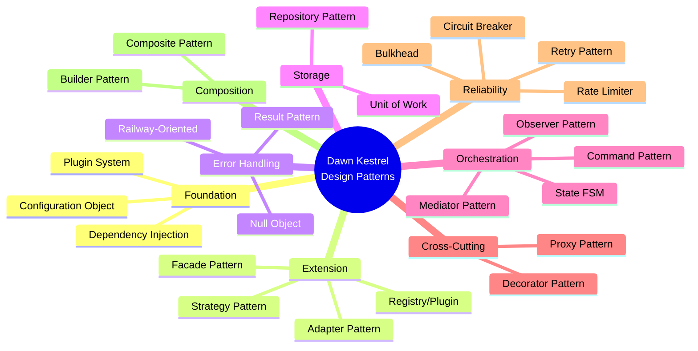
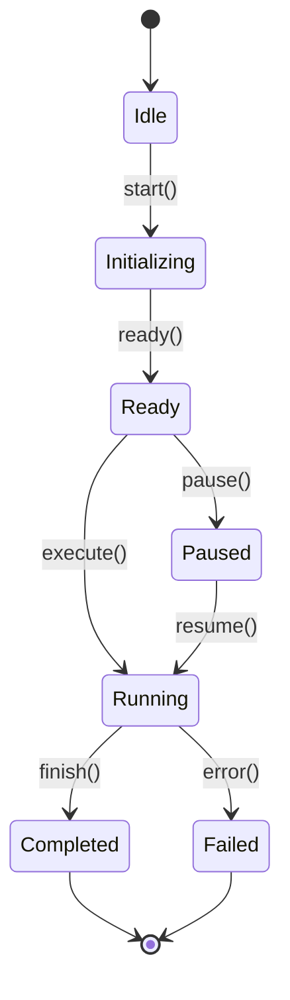
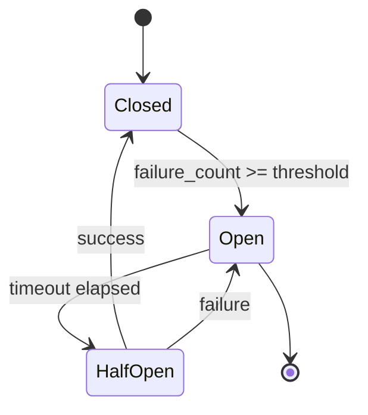

# Design Patterns

This document describes all 21+ design patterns being applied in the Dawn Kestrel refactor, their purposes, and how they interact.

## Pattern Overview



## Pattern Matrix

| Pattern | Category | Wave | Status | Purpose |
|---------|----------|------|--------|---------|
| Dependency Injection | Foundation | 1 | ✅ | Loose coupling, testability |
| Plugin System | Foundation | 2 | ✅ | Extensibility without core edits |
| Result Pattern | Error Handling | 3 | ✅ | Explicit error handling |
| Repository | Storage | 4 | ⏳ | Storage abstraction |
| Unit of Work | Storage | 4 | ⏳ | Transactional consistency |
| State (FSM) | Orchestration | 4 | ⏳ | Explicit state transitions |
| Adapter | Extension | 5 | ⏳ | Provider/tool adapters |
| Facade | Extension | 5 | ⏳ | Simplified composition root |
| Command | Orchestration | 5 | ⏳ | Encapsulated actions |
| Strategy | Extension | 6 | ⏳ | Swappable algorithms |
| Mediator | Orchestration | 5 | ⏳ | Centralized coordination |
| Decorator | Cross-Cutting | 6 | ⏳ | Logging, metrics, caching |
| Proxy | Cross-Cutting | 6 | ⏳ | Lazy initialization, auth checks |
| Null Object | Error Handling | 6 | ⏳ | Optional dependencies |
| Circuit Breaker | Reliability | 7 | ✅ | Prevent cascading failures |
| Bulkhead | Reliability | 7 | ⏳ | Resource isolation |
| Retry | Reliability | 7 | ⏳ | Transient failure handling |
| Rate Limiter | Reliability | 7 | ⏳ | API throttling prevention |
| Configuration Object | Foundation | 1 | ✅ | Replace singleton |
| Observer | Orchestration | - | ⏳ | Event handling |
| Composite | Composition | - | ⏳ | Plan trees |

## Foundation Patterns

### Dependency Injection

**Purpose**: Loose coupling, testability, explicit dependencies

**Implementation**: Using `dependency-injector` library

```python
# dawn_kestrel/core/di_container.py
from dependency_injector import containers, providers

class Container(containers.DeclarativeContainer):
    config = providers.Configuration()

    storage = providers.Singleton(
        SessionStorage,
        storage_dir=config.storage_dir
    )

    service = providers.Factory(
        DefaultSessionService,
        storage=storage
    )
```

**Benefits**:
- Explicit dependency graph
- Easy to swap implementations
- Simplified testing (mock dependencies)
- Lazy initialization for performance

**Relationships**:
- Used by: All services, composition root
- Enables: Plugin system, Repository pattern, Strategy pattern

### Plugin System

**Purpose**: Dynamic discovery of tools, providers, agents without core edits

**Implementation**: Python `entry_points`

```python
# pyproject.toml
[project.entry-points]
"dawn_kestrel.tools" = [
    "bash = dawn_kestrel.tools.builtin:BashTool",
    "read = dawn_kestrel.tools.builtin:ReadTool",
    # ... 20 more tools
]
```

```python
# dawn_kestrel/core/plugin_discovery.py
from importlib.metadata import entry_points

def load_tools():
    eps = entry_points()
    return {ep.name: ep.load() for ep in eps.select(group='dawn_kestrel.tools')}
```

**Benefits**:
- Zero blast exposure for adding tools/providers/agents
- Third-party extensions possible
- No core edits for custom components

**Relationships**:
- Uses: Entry points
- Enables: Tool/provider/agent extensibility
- Integrates with: DI container

### Configuration Object

**Purpose**: Replace global Settings singleton with proper Pydantic model

**Implementation**: Pydantic Settings

```python
# dawn_kestrel/core/config_object.py
from pydantic import BaseSettings, Field

class Configuration(BaseSettings):
    app_name: str = "dawn-kestrel"
    storage_dir: Optional[Path] = None
    config_dir: Optional[Path] = None
    cache_dir: Optional[Path] = None

    class Config:
        env_prefix = "DAWN_KESTREL_"
```

**Benefits**:
- Thread-safe configuration access
- Explicit dependencies
- Type-safe with validation
- Testable (not a singleton)

**Relationships**:
- Used by: DI container, all services
- Replaces: Global Settings singleton

## Extension Patterns

### Adapter Pattern

**Purpose**: Enable extension of providers and tools without core edits

**Implementation**: Adapter interfaces

```python
# dawn_kestrel/providers/adapter.py
from abc import ABC, abstractmethod

class ProviderAdapter(ABC):
    @abstractmethod
    async def chat_completion(self, messages: List[Message]) -> Result[Response, Error]:
        pass

class OpenAIAdapter(ProviderAdapter):
    async def chat_completion(self, messages: List[Message]) -> Result[Response, Error]:
        # OpenAI-specific implementation
        pass
```

**Benefits**:
- Add new providers without editing core code
- Uniform interface for all providers
- Easy to test with mock adapters

**Relationships**:
- Uses: Result pattern
- Enables: Third-party provider plugins
- Integrates with: Plugin system, DI container

### Facade Pattern

**Purpose**: Simplify composition root over multiple subsystems

**Implementation**: Facade over DI container

```python
# dawn_kestrel/core/facade.py
class DawnKestrelFacade:
    def __init__(self, container: Container):
        self._container = container

    async def create_session(self, title: str) -> Result[Session, Error]:
        service = self._container.service()
        return await service.create_session(title)

    async def run_agent(self, agent_id: str, session_id: str) -> Result[AgentRun, Error]:
        runtime = self._container.agent_runtime()
        return await runtime.run(agent_id, session_id)
```

**Benefits**:
- Simplified API for common operations
- Hides complexity of DI container
- Easy to mock for testing

**Relationships**:
- Uses: DI container, Result pattern
- Hides: Multiple subsystems
- Used by: Composition root, CLI, TUI

### Strategy Pattern

**Purpose**: Swappable algorithms (storage backends, routing, retry policies)

**Implementation**: Strategy interfaces with DI

```python
# dawn_kestrel/storage/strategy.py
class StorageStrategy(ABC):
    @abstractmethod
    async def read(self, key: str) -> Result[Data, Error]:
        pass

    @abstractmethod
    async def write(self, key: str, data: Data) -> Result[None, Error]:
        pass

class FileSystemStorage(StorageStrategy):
    # File system implementation
    pass

class S3Storage(StorageStrategy):
    # S3 implementation
    pass
```

**Benefits**:
- Swap storage backends without code changes
- Configurable routing strategies
- Flexible retry policies

**Relationships**:
- Used by: Repository pattern, Unit of Work
- Enables: Multiple storage backends
- Integrates with: DI container

## Error Handling Patterns

### Result Pattern

**Purpose**: Explicit error handling with Ok/Err/Pass types

**Implementation**: Result types

```python
# dawn_kestrel/core/result.py
from typing import Generic, TypeVar, Union
from dataclasses import dataclass

T = TypeVar('T')
E = TypeVar('E')

@dataclass
class Ok(Generic[T]):
    value: T
    def is_ok(self) -> bool: return True
    def is_err(self) -> bool: return False

@dataclass
class Err(Generic[E]):
    error: E
    code: str
    def is_ok(self) -> bool: return False
    def is_err(self) -> bool: return True

@dataclass
class Pass(Generic[T]):
    value: T
    def is_pass(self) -> bool: return True

Result = Union[Ok[T], Err[E], Pass[T]]
```

**Benefits**:
- Explicit error handling
- Railway-oriented composition
- Type-safe error propagation
- No unchecked exceptions

**Relationships**:
- Used by: All domain services, public APIs
- Enables: Railway-oriented programming
- Integrates with: Command pattern, Repository pattern

### Railway-Oriented Programming

**Purpose**: Compose Results along a "railway" of success/failure tracks

**Implementation**: Result combinators (bind, map, fold)

```python
# Result combinators
def bind(result: Result[T, E], func: Callable[[T], Result[U, E]]) -> Result[U, E]:
    if isinstance(result, Err):
        return result
    return func(result.value)

def map(result: Result[T, E], func: Callable[[T], U]) -> Result[U, E]:
    if isinstance(result, Err):
        return result
    return Ok(func(result.value))

# Usage
def create_and_save_session(title: str) -> Result[Session, Error]:
    return (
        Ok(title)
        .bind(validate_title)
        .map(create_session)
        .bind(save_session)
    )
```

**Benefits**:
- Clean error propagation
- Composable operations
- Avoids pyramid of doom

**Relationships**:
- Uses: Result pattern
- Used by: All service compositions

### Null Object Pattern

**Purpose**: Optional dependencies without None checks (telemetry, notifier)

**Implementation**: Null implementations of interfaces

```python
# dawn_kestrel/core/null_object.py
class TelemetryProvider(ABC):
    @abstractmethod
    def track_event(self, event: str, **kwargs) -> None:
        pass

class NullTelemetryProvider(TelemetryProvider):
    def track_event(self, event: str, **kwargs) -> None:
        pass  # No-op

class DefaultTelemetryProvider(TelemetryProvider):
    def track_event(self, event: str, **kwargs) -> None:
        # Actual telemetry implementation
        pass
```

**Benefits**:
- Eliminates None checks
- Simplifies client code
- Easy to enable/disable features

**Relationships**:
- Used by: Composition root, services
- Integrates with: DI container

## Storage Patterns

### Repository Pattern

**Purpose**: Storage abstraction layer with session/message/part repositories

**Implementation**: Repository interfaces

```python
# dawn_kestrel/storage/repository.py
from abc import ABC, abstractmethod
from typing import List, Optional

class SessionRepository(ABC):
    @abstractmethod
    async def add(self, session: Session) -> Result[None, Error]:
        pass

    @abstractmethod
    async def get(self, session_id: str) -> Result[Optional[Session], Error]:
        pass

    @abstractmethod
    async def list(self) -> Result[List[Session], Error]:
        pass
```

**Benefits**:
- Abstract storage implementation
- Easy to mock for testing
- Swap storage backends

**Relationships**:
- Uses: Result pattern, Unit of Work
- Used by: Services, Unit of Work
- Integrates with: Strategy pattern

### Unit of Work

**Purpose**: Transactional consistency for multi-write session operations

**Implementation**: Transaction manager

```python
# dawn_kestrel/storage/unit_of_work.py
class UnitOfWork(ABC):
    session_repo: SessionRepository
    message_repo: MessageRepository

    @abstractmethod
    async def __aenter__(self) -> "UnitOfWork":
        pass

    @abstractmethod
    async def __aexit__(self, exc_type, exc_val, exc_tb):
        await self.rollback() if exc_type else await self.commit()

    @abstractmethod
    async def commit(self) -> Result[None, Error]:
        pass

    @abstractmethod
    async def rollback(self) -> Result[None, Error]:
        pass
```

**Benefits**:
- ACID transactions across multiple repositories
- Automatic rollback on errors
- Atomic operations

**Relationships**:
- Uses: Repository pattern, Result pattern
- Used by: Services

## Orchestration Patterns

### Command Pattern

**Purpose**: Encapsulated actions with provenance and orchestration

**Implementation**: Command classes

```python
# dawn_kestrel/core/command.py
from dataclasses import dataclass
from typing import Optional
from datetime import datetime

@dataclass
class Command:
    name: str
    parameters: dict
    provenance: Optional[Provenance] = None
    timestamp: datetime = None

    async def execute(self) -> Result[Any, Error]:
        pass

class CreateSessionCommand(Command):
    async def execute(self) -> Result[Session, Error]:
        # Create session logic
        pass
```

**Benefits**:
- Encapsulated actions
- Audit trail (provenance)
- Easy to queue/undo

**Relationships**:
- Uses: Result pattern
- Used by: Agent runtime, Mediator

### State Pattern (FSM)

**Purpose**: Explicit agent/workflow phases with valid transitions

**Implementation**: State machine



```python
# dawn_kestrel/agents/state.py
from enum import Enum

class AgentState(Enum):
    IDLE = "idle"
    INITIALIZING = "initializing"
    READY = "ready"
    RUNNING = "running"
    PAUSED = "paused"
    COMPLETED = "completed"
    FAILED = "failed"

class AgentStateMachine:
    def __init__(self):
        self.state = AgentState.IDLE

    def transition(self, new_state: AgentState) -> Result[None, Error]:
        if not self._is_valid_transition(new_state):
            return Err(f"Invalid transition: {self.state} -> {new_state}")
        self.state = new_state
        return Ok(None)

    def _is_valid_transition(self, new_state: AgentState) -> bool:
        # Define valid transitions
        valid = {
            AgentState.IDLE: [AgentState.INITIALIZING],
            AgentState.INITIALIZING: [AgentState.READY, AgentState.FAILED],
            AgentState.READY: [AgentState.RUNNING, AgentState.PAUSED],
            AgentState.RUNNING: [AgentState.COMPLETED, AgentState.FAILED, AgentState.PAUSED],
            AgentState.PAUSED: [AgentState.RUNNING],
        }
        return new_state in valid.get(self.state, [])
```

**Benefits**:
- Explicit state transitions
- Prevents invalid operations
- Easy to reason about

**Relationships**:
- Uses: Result pattern
- Used by: Agent runtime

### Mediator Pattern

**Purpose**: Centralized coordination for component interactions

**Implementation**: Event mediator

```python
# dawn_kestrel/core/mediator.py
from typing import Callable, Dict, Type

class Mediator:
    def __init__(self):
        self._handlers: Dict[Type, List[Callable]] = {}

    def subscribe(self, event_type: Type, handler: Callable):
        if event_type not in self._handlers:
            self._handlers[event_type] = []
        self._handlers[event_type].append(handler)

    async def publish(self, event) -> Result[None, Error]:
        handlers = self._handlers.get(type(event), [])
        for handler in handlers:
            result = await handler(event)
            if isinstance(result, Err):
                return result
        return Ok(None)
```

**Benefits**:
- Decouples components
- Centralized event handling
- Easy to add new handlers

**Relationships**:
- Uses: Result pattern
- Used by: Facade, Agent runtime

### Observer Pattern

**Purpose**: Event handling with pub/sub for domain/application events

**Implementation**: Observable subjects

```python
# dawn_kestrel/core/observer.py
class Observable:
    def __init__(self):
        self._observers: List[Callable] = []

    def subscribe(self, observer: Callable):
        self._observers.append(observer)

    def unsubscribe(self, observer: Callable):
        self._observers.remove(observer)

    async def notify(self, event):
        for observer in self._observers:
            await observer(event)
```

**Benefits**:
- Publish-subscribe pattern
- Multiple subscribers
- Decoupled notifications

**Relationships**:
- Uses: Mediator
- Used by: Services, Agent runtime

## Cross-Cutting Patterns

### Decorator Pattern

**Purpose**: Cross-cutting concerns (logging, metrics, caching, auth checks)

**Implementation**: Decorator functions

```python
# dawn_kestrel/core/decorators.py
from functools import wraps

def log_calls(func):
    @wraps(func)
    async def wrapper(*args, **kwargs):
        logger.info(f"Calling {func.__name__}")
        result = await func(*args, **kwargs)
        logger.info(f"{func.__name__} returned {result}")
        return result
    return wrapper

def track_metrics(func):
    @wraps(func)
    async def wrapper(*args, **kwargs):
        start = time.time()
        try:
            result = await func(*args, **kwargs)
            metrics.record_success(func.__name__, time.time() - start)
            return result
        except Exception as e:
            metrics.record_failure(func.__name__, time.time() - start)
            raise
    return wrapper
```

**Benefits**:
- Separation of concerns
- Composable behaviors
- Easy to add/remove

**Relationships**:
- Applied to: Service methods, Repository methods
- Integrates with: Mediator (for events)

### Proxy Pattern

**Purpose**: Lazy initialization, access control, caching

**Implementation**: Proxy classes

```python
# dawn_kestrel/core/proxy.py
class LazyProxy:
    def __init__(self, factory: Callable):
        self._factory = factory
        self._instance = None

    def __getattr__(self, name):
        if self._instance is None:
            self._instance = self._factory()
        return getattr(self._instance, name)
```

**Benefits**:
- Lazy initialization
- Access control
- Transparent behavior

**Relationships**:
- Used by: DI container (for lazy services)
- Integrates with: Configuration object

## Reliability Patterns

### Circuit Breaker

**Purpose**: LLM call reliability, prevent cascading failures

**Implementation**: Circuit breaker with states



```python
# dawn_kestrel/core/circuit_breaker.py
class CircuitBreaker:
    def __init__(self, failure_threshold: int = 5, timeout: float = 60.0):
        self.failure_threshold = failure_threshold
        self.timeout = timeout
        self.failures = 0
        self.last_failure_time = None
        self.state = "closed"

    async def call(self, func: Callable) -> Result[Any, Error]:
        if self.state == "open":
            if time.time() - self.last_failure_time > self.timeout:
                self.state = "half_open"
            else:
                return Err("Circuit breaker is open")

        try:
            result = await func()
            if self.state == "half_open":
                self.state = "closed"
                self.failures = 0
            return Ok(result)
        except Exception as e:
            self.failures += 1
            self.last_failure_time = time.time()
            if self.failures >= self.failure_threshold:
                self.state = "open"
            return Err(str(e))
```

**Benefits**:
- Prevents cascading failures
- Automatic recovery
- Configurable thresholds

**Relationships**:
- Used by: Agent runtime, Providers
- Integrates with: Retry pattern

### Bulkhead

**Purpose**: Resource isolation for multiple dependencies

**Implementation**: Bounded semaphore pools

```python
# dawn_kestrel/core/bulkhead.py
import asyncio

class Bulkhead:
    def __init__(self, max_concurrent: int):
        self.semaphore = asyncio.Semaphore(max_concurrent)

    async def call(self, func: Callable) -> Result[Any, Error]:
        async with self.semaphore:
            try:
                result = await func()
                return Ok(result)
            except Exception as e:
                return Err(str(e))
```

**Benefits**:
- Prevents resource exhaustion
- Isolates failure domains
- Bounded concurrency

**Relationships**:
- Used by: Provider calls, Tool executions
- Integrates with: Circuit breaker

### Retry Pattern

**Purpose**: Transient failure handling with bounded retries

**Implementation**: Retry with exponential backoff

```python
# dawn_kestrel/core/retry.py
import asyncio
import random

class Retry:
    def __init__(self, max_attempts: int = 3, base_delay: float = 1.0):
        self.max_attempts = max_attempts
        self.base_delay = base_delay

    async def call(self, func: Callable) -> Result[Any, Error]:
        last_error = None
        for attempt in range(self.max_attempts):
            try:
                result = await func()
                return Ok(result)
            except Exception as e:
                last_error = e
                if attempt < self.max_attempts - 1:
                    delay = self.base_delay * (2 ** attempt) + random.random()
                    await asyncio.sleep(delay)
        return Err(str(last_error))
```

**Benefits**:
- Handles transient failures
- Exponential backoff
- Jitter to prevent thundering herd

**Relationships**:
- Used by: Agent runtime, Providers
- Integrates with: Circuit breaker, Bulkhead

### Rate Limiter

**Purpose**: API call throttling prevention

**Implementation**: Token bucket

```python
# dawn_kestrel/core/rate_limiter.py
import time
from collections import deque

class RateLimiter:
    def __init__(self, rate: float, capacity: int):
        self.rate = rate
        self.capacity = capacity
        self.tokens = capacity
        self.last_update = time.time()
        self.queue = deque()

    async def acquire(self) -> Result[None, Error]:
        now = time.time()
        elapsed = now - self.last_update
        self.tokens = min(self.capacity, self.tokens + elapsed * self.rate)
        self.last_update = now

        if self.tokens >= 1:
            self.tokens -= 1
            return Ok(None)
        else:
            wait_time = (1 - self.tokens) / self.rate
            await asyncio.sleep(wait_time)
            return Ok(None)
```

**Benefits**:
- Prevents API throttling
- Token bucket algorithm
- Smooth traffic shaping

**Relationships**:
- Used by: Provider calls, CLI commands
- Integrates with: Circuit breaker

## Composition Patterns

### Composite Pattern

**Purpose**: Plan trees for validation, metrics, rendering

**Implementation**: Composite structure

```python
# dawn_kestrel/core/composite.py
from abc import ABC, abstractmethod
from typing import List

class PlanNode(ABC):
    @abstractmethod
    async def execute(self) -> Result[Any, Error]:
        pass

class TaskNode(PlanNode):
    def __init__(self, task: Callable):
        self.task = task

    async def execute(self) -> Result[Any, Error]:
        return await self.task()

class CompositePlan(PlanNode):
    def __init__(self):
        self.children: List[PlanNode] = []

    def add(self, node: PlanNode):
        self.children.append(node)

    async def execute(self) -> Result[List[Any], Error]:
        results = []
        for child in self.children:
            result = await child.execute()
            if isinstance(result, Err):
                return result
            results.append(result.value)
        return Ok(results)
```

**Benefits**:
- Hierarchical structure
- Uniform treatment
- Easy to compose

**Relationships**:
- Used by: Agent plans, Workflows
- Integrates with: Command pattern

## Pattern Interactions

```mermaid
graph TB
    DI[Dependency Injection] --> Provides[Provides]
    Provides --> Facade[Facade]
    Provides --> Services[Services]

    Plugin[Plugin System] --> Discovers[Discovers]
    Discovers --> Tools[Tool Plugins]
    Discovers --> Providers[Provider Plugins]
    Discovers --> Agents[Agent Plugins]

    Services --> UsesResult[Uses Result Pattern]
    Services --> UsesRepo[Uses Repository]
    Services --> UsesCommand[Uses Command]

    Result[Result Pattern] --> Enables[Enables]
    Enables --> Railway[Railway-Oriented]
    Enables --> Command[Command Pattern]
    Enables --> Repo[Repository]

    Repository --> UsesUoW[Uses Unit of Work]
    UnitOfWork --> UsesStrategy[Uses Strategy]

    Agents --> UsesState[Uses State FSM]
    Agents --> UsesMediator[Uses Mediator]
    Agents --> UsesCB[Uses Circuit Breaker]

    Mediator --> Publishes[Publishes]
    Publishes --> Observer[Observer]

    Services --> DecoratedBy[Decorated By]
    DecoratedBy --> Logging[Logging Decorator]
    DecoratedBy --> Metrics[Metrics Decorator]
    DecoratedBy --> Caching[Caching Decorator]

    Providers --> ProtectedBy[Protected By]
    ProtectedBy --> CB[Circuit Breaker]
    ProtectedBy --> Retry[Retry]
    ProtectedBy --> Bulkhead[Bulkhead]

    Facade --> Null[Uses Null Object]

    style DI fill:#e1f5ff
    style Plugin fill:#fff4e1
    style Result fill:#ffe1e1
    style Repo fill:#e1ffe1
    style Command fill:#f5e1ff
    style State fill:#f5e1ff
    style Mediator fill:#f5e1ff
    style CB fill:#ffe1e1
```



## Pattern Benefits Summary

| Pattern | Primary Benefit | Secondary Benefits |
|---------|----------------|-------------------|
| Dependency Injection | Testability | Loose coupling, explicit deps |
| Plugin System | Extensibility | Zero blast exposure |
| Result Pattern | Explicit errors | Type-safe, railway-oriented |
| Repository | Abstraction | Easy to mock, swap backends |
| Unit of Work | Transactions | ACID guarantees |
| State FSM | Explicit states | Prevents invalid transitions |
| Adapter | Extension | Uniform interfaces |
| Facade | Simplification | Hide complexity |
| Command | Encapsulation | Audit trail, queueable |
| Strategy | Flexibility | Swappable algorithms |
| Mediator | Decoupling | Centralized coordination |
| Decorator | Separation | Composable behaviors |
| Proxy | Transparency | Lazy loading, access control |
| Null Object | Simplicity | No None checks |
| Circuit Breaker | Reliability | Prevent cascading failures |
| Bulkhead | Isolation | Resource protection |
| Retry | Resilience | Transient failure handling |
| Rate Limiter | Throttling | API protection |
| Composite | Composition | Hierarchical structures |

See [architecture.md](architecture.md) for more details on pattern integration.
