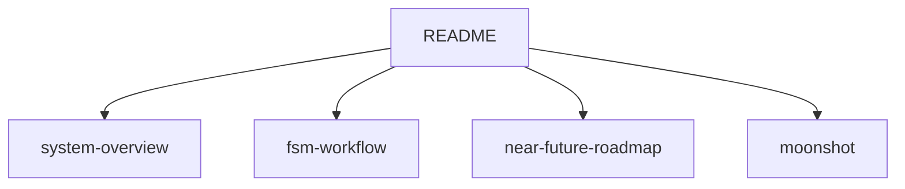

# Dawn Kestrel Specs

Engineering specifications for dawn-kestrel (agent SDK).

## Spec Index

| Spec | Horizon | Status | Description |
|------|---------|--------|-------------|
| [system-overview](./system-overview.md) | shipped | draft | Current shipped capabilities |
| [fsm-workflow-component](./fsm-workflow-component.md) | shipped | active | FSM Protocol, builders, and workflow phase/runtime contracts |
| [near-future-roadmap](./near-future-roadmap.md) | near-future | draft | Next 1-2 quarters roadmap |
| [moonshot](./moonshot.md) | moonshot | draft | Long-term exploratory ideas |
## Related Documents
- [SDK Gaps & Next Steps](../../SDK_GAPS_AND_NEXT_STEPS.md)
- [AGENTS.md](../../AGENTS.md) - Knowledge base
- [ADRs](../adrs/) - Architecture decisions

## Mermaid Diagram

