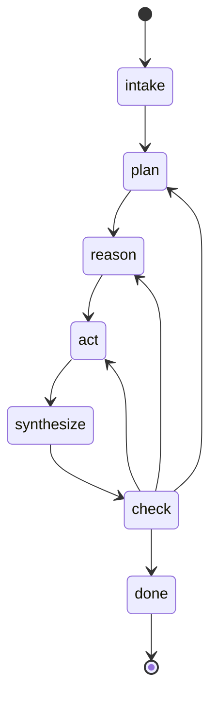

# FSM Workflow Component

A reusable finite state machine component for building workflow-driven agent systems. This component provides the core state management infrastructure used by bolt-merlin and iron-rook.

## Overview

The FSM Workflow Component provides:

- **FSM Protocol** - Interface contract for state machine operations
- **FSMBuilder** - Fluent API for constructing custom state machines
- **WorkflowFSMBuilder** - Pre-configured builder with standard workflow states
- **Workflow Phase Schemas** - Intake/Plan/Act/Synthesize/Check contracts plus runtime payload traces

This component is horizon: shipped and production-ready.

## Consumers

This component is consumed by:

| Repo | Implementation | Notes |
|------|----------------|-------|
| bolt-merlin | Standard workflow FSM | Uses all workflow states as-is |
| iron-rook | SecurityWorkflowFSM | Extends WorkflowFSM with security-specific phases |

## FSM Protocol

The `FSM` protocol defines the interface contract for all state machine implementations:

```python
from typing import Protocol, runtime_checkable

@runtime_checkable
class FSM(Protocol):
    """Protocol for finite state machine.
    
    State machine manages state transitions with validation,
    ensuring only valid transitions are executed.
    """
    
    async def get_state(self) -> str:
        """Get current state of the FSM.
        
        Returns:
            str: Current state of the FSM.
        """
        ...
    
    async def transition_to(
        self, new_state: str, context: FSMContext | None = None
    ) -> Result[None]:
        """Transition FSM to new state.
        
        Args:
            new_state: Target state to transition to.
            context: Optional context passed to hooks and guards.
        
        Returns:
            Result[None]: Ok on successful transition, Err if transition invalid.
        """
        ...
    
    async def is_transition_valid(self, from_state: str, to_state: str) -> bool:
        """Check if transition from one state to another is valid.
        
        Args:
            from_state: Current state of FSM.
            to_state: Desired next state.
        
        Returns:
            bool: True if transition is valid, False otherwise.
        """
        ...
```

## FSMBuilder

Fluent API builder for constructing FSM instances:

```python
from dawn_kestrel.core.fsm import FSMBuilder

fsm = (FSMBuilder()
    .with_initial_state("idle")
    .with_state("idle")
    .with_state("running")
    .with_state("completed")
    .with_transition("idle", "running")
    .with_transition("running", "completed")
    .with_entry_hook("running", on_enter_running)
    .with_exit_hook("running", on_exit_running)
    .with_guard("idle", "running", can_start)
    .with_persistence(repository)
    .with_mediator(event_mediator)
    .with_observer(my_observer)
    .with_reliability(reliability_config)
    .build()
    .unwrap())
```

### Builder Methods

| Method | Description |
|--------|-------------|
| `with_initial_state(state)` | Set the starting state (default: "idle") |
| `with_state(state)` | Add a valid state |
| `with_transition(from, to)` | Add a valid transition |
| `with_entry_hook(state, hook)` | Hook called when entering state |
| `with_exit_hook(state, hook)` | Hook called when exiting state |
| `with_guard(from, to, guard)` | Guard function that must return True |
| `with_persistence(repo)` | Enable state persistence |
| `with_mediator(mediator)` | Enable event publishing |
| `with_observer(observer)` | Add state change observer |
| `with_reliability(config)` | Enable reliability wrappers |

## WorkflowFSMBuilder

Pre-configured builder for standard agent workflows:

```python
from dawn_kestrel.core.fsm import WorkflowFSMBuilder, FSMBudget

fsm = (WorkflowFSMBuilder()
    .with_budget(FSMBudget(max_iterations=50, max_tool_calls=500))
    .with_stagnation_threshold(3)
    .with_reasoning_strategy(my_strategy)
    .with_reason_executor(my_executor)
    .build()
    .unwrap())
```

### Workflow Methods

| Method | Description |
|--------|-------------|
| `with_budget(budget)` | Set execution budget limits |
| `with_stagnation_threshold(n)` | Set threshold for stagnation detection |
| `with_reasoning_strategy(strategy)` | Set the REASON state strategy |
| `with_reason_executor(executor)` | Set the reason executor |
| `check_novelty(data)` | Check if data is novel (for stagnation) |
| `is_stagnation_detected()` | Check if stagnation threshold reached |
| `is_budget_exceeded()` | Check if budget limits exceeded |
| `track_budget_consumed(...)` | Update budget consumption |
| `get_budget_status()` | Get consumed and total budget |

## Workflow States

Predefined states for agent workflows:

```python
WORKFLOW_STATES: set[str] = {
    "intake",      # Initial input processing
    "plan",        # Planning and task breakdown
    "reason",      # Reasoning and decision making
    "act",         # Execute actions/tools
    "synthesize",  # Combine results
    "check",       # Verify outcomes
    "done"         # Terminal state
}
```

## Workflow Transitions

### Strict routing profile (policy)

This spec adopts a strict routing profile to reduce ambiguity and keep `check` as the
purposeful router for loop control.

| From | To | Transition Name | Why this transition can happen |
|------|----|-----------------|--------------------------------|
| intake | plan | Scope Framing | Request is converted into a scoped plan before execution |
| plan | reason | Problem Decomposition | Planned work is converted into actionable reasoning |
| reason | act | Gathering Facts | Reasoning selects one concrete evidence-gathering action |
| act | synthesize | Evidence Consolidation | Action output is normalized into structured findings/artifacts |
| synthesize | check | Verifying Plan | Consolidated output is validated against intent and constraints |
| check | plan | Replan Loop | New gaps require revised or additional todos |
| check | reason | Refine Hypothesis | Continue with updated reasoning but without full replanning |
| check | act | Continue Current Todo | Current todo is incomplete and needs another action step |
| check | done | Exit Criteria Met | Work is complete or a stop condition is satisfied |

`done` is terminal and has no outgoing transitions.

Transition diagram (strict profile):

```
intake -> plan -> reason -> act -> synthesize -> check
                                              |-> plan
                                              |-> reason
                                              |-> act
                                              `-> done
```

### Transitions intentionally excluded from strict profile

These edges are omitted by design to reduce confusion and keep routing responsibility in
`check`.

| Excluded Edge | Why excluded | When to add it |
|---------------|--------------|----------------|
| intake -> reason | Skips explicit planning and weakens scope discipline | Add for fast-triage mode where planning overhead is unacceptable |
| plan -> act | Bypasses reasoning validation and can start execution too early | Add when planner output is deterministic and pre-validated |
| reason -> synthesize | Allows consolidation without action grounding | Add for analysis-only tasks where no tool/action is needed |
| reason -> check | Dilutes the principle that `check` follows synthesis | Add only if avoiding forced no-op acts is more important than linearity |
| reason -> done | Risks premature completion outside explicit check gate | Add only as a guarded runtime safety stop (budget/human override) |

Implementation note: existing `WORKFLOW_TRANSITIONS` in `dawn_kestrel/core/fsm.py`
currently allows a superset of edges for compatibility. This spec defines the stricter
policy profile that execution logic/prompts should enforce.

## State Artifacts (by state)

State artifacts are the concrete outputs produced while traversing the FSM loop.

| State | Primary artifact | Contract/source |
|-------|------------------|-----------------|
| intake | Intent, constraints, initial evidence | `IntakeOutput` in `dawn_kestrel/agents/workflow.py` |
| plan | Prioritized todo list and planning rationale | `PlanOutput` in `dawn_kestrel/agents/workflow.py` |
| reason | Next-phase decision and rationale | Dawn workflow runtime routing contract + reasoning payload fields |
| act | Single tool execution result plus produced artifacts | `ActOutput` and `ToolExecution` in `dawn_kestrel/agents/workflow.py` |
| synthesize | Merged findings and todo updates | `SynthesizeOutput` in `dawn_kestrel/agents/workflow.py` |
| check | Completion verdict, next phase, confidence, budget snapshot | `CheckOutput` in `dawn_kestrel/agents/workflow.py` |
| done | Finalized workflow context and trace output | Terminal state; aggregate context + logger/event artifacts |

### Required thinking/transition trace artifacts

In addition to phase contracts, every state execution should produce a user-traceable
thinking/transition record that can be rendered as a conversation timeline.

| Artifact | Producer | Consumer | Required fields |
|----------|----------|----------|-----------------|
| PhaseOutput | State prompt + parser (`IntakeOutput`/`PlanOutput`/`ActOutput`/`SynthesizeOutput`/`CheckOutput`) | State handlers, routing logic, validators | phase data per schema |
| ThinkingEvent | `FSMOrchestrator._emit_fsm_event` via `Events.FSM_THINKING` | CLI/TUI renderer, transcript loggers | `session_id`, `state`, `reasoning`, `iteration`, `timestamp`, state-specific metadata |
| StateTransitionEvent | `FSMImpl.transition_to` (`TransitionCommand`) and runtime event bus hooks | Auditors, observers, checkpointing, timeline renderers | `fsm_id`, `from_state`, `to_state`, `timestamp`, transition context |
| TimelineEntry | UI/CLI formatter derived from thinking + transition events | End users | `turn_index`, `state`, `intent`, `action`, `observation/result`, `next_phase`, `confidence` |

### Conversation timeline contract (recommended)

To make transitions understandable to users, timeline entries should be generated per
state and rendered in order:

```json
{
  "turn_index": 3,
  "state": "check",
  "reasoning": "Todo complete; moving to reason for next item.",
  "artifacts": {
    "phase_output_ref": "check_output#3",
    "evidence_refs": ["tool:grep#7", "file:src/auth.py:120"],
    "budget": {"iterations": 3, "tool_calls": 7}
  },
  "transition": {"from": "check", "to": "reason", "name": "Refine Hypothesis"},
  "timestamp": "2026-03-03T20:41:00Z"
}
```

This contract is intentionally presentation-oriented: it does not replace phase schemas,
it makes them traceable for humans.

### Traceability acceptance criteria

- Every phase execution emits one thinking event.
- Every state change emits one transition record.
- Every transition shown to users has a named transition label.
- Timeline can be reconstructed deterministically from emitted events + phase artifacts.

## State Prompt Tuning (strict profile)

Prompt tuning follows one rule: each state has one job, and prompt language must only
optimize for that job.

### Shared prompt envelope

All state prompts should use this envelope to minimize drift:

```text
ROLE: You are in FSM state <STATE>.
OBJECTIVE: <single state objective>
INPUTS:
- intent
- constraints
- current_todo
- evidence_snapshot
- budget_snapshot

HARD GUARDRAILS:
- Do not perform responsibilities of other states
- Do not invent evidence
- Follow output contract exactly

SUCCESS CRITERIA:
- <state-specific checks>

OUTPUT CONTRACT:
- <schema/model for this state>
```

### Per-state tuning matrix

| State | Prompt objective | Must emphasize | Must avoid | Output artifact |
|-------|------------------|----------------|------------|-----------------|
| intake | Build a clean problem frame | intent restatement, constraints, initial evidence inventory | todo authoring, routing decisions | `IntakeOutput` |
| plan | Build executable todo graph | atomic todos, dependencies, priority, acceptance checks | tool execution details, completion verdicts | `PlanOutput` |
| reason | Select next action for current todo | hypothesis quality, evidence gaps, one actionable next move | replanning, finalization, routing to done | reasoning payload fields + next-phase hint |
| act | Execute one concrete action | single-action constraint, command/tool precision, artifact capture | multi-action bundles, synthesis language | `ActOutput` + `ToolExecution` |
| synthesize | Consolidate raw outputs into findings | evidence normalization, dedupe, uncertainty reduction | picking next phase, adding new work scope | `SynthesizeOutput` |
| check | Route workflow intentionally | completion gate, novelty/stagnation, confidence + budget | doing tool work, deep analysis prose | `CheckOutput` |
| done | Produce terminal summary | closure reason, residual risk, final context snapshot | new tasks, further routing | terminal context + trace payload/log output |

### State prompt templates

#### intake template

```text
You are in state INTAKE.
Goal: create an accurate problem frame.

Return JSON matching IntakeOutput.
Focus on:
1) intent: one concise sentence
2) constraints: explicit limits only
3) initial_evidence: concrete known facts only

Do not create todos. Do not choose next phase.
```

#### plan template

```text
You are in state PLAN.
Goal: convert intake frame into executable todos.

Return JSON matching PlanOutput.
Requirements:
- todos are atomic and testable
- each todo has priority and dependency clarity
- estimated_iterations is realistic
- strategy_selected explains plan style briefly

Do not execute tools. Do not claim completion.
```

#### reason template

```text
You are in state REASON.
Goal: choose the next best action for the current todo.

Produce reasoning that:
- references current evidence gaps
- selects exactly one next action target
- explains why this action is highest leverage now

Do not route to done directly in strict profile.
Do not synthesize results in this state.
```

#### act template

```text
You are in state ACT.
Goal: perform exactly one action and report it.

Return JSON matching ActOutput.
Hard rules:
- one tool execution only
- acted_todo_id must match current todo
- summarize result and list artifacts
- record failure explicitly when relevant

Do not synthesize. Do not route.
```

#### synthesize template

```text
You are in state SYNTHESIZE.
Goal: convert raw outputs into structured findings.

Return JSON matching SynthesizeOutput.
Focus on:
- merge duplicate signals
- map findings to evidence
- update todo statuses
- estimate uncertainty_reduction and confidence_level

Do not choose next phase.
```

#### check template

```text
You are in state CHECK.
Goal: route intentionally and only here.

Return JSON matching CheckOutput.
Routing options in strict profile: plan | reason | act | done.

Route selection policy:
- act: same todo needs more evidence
- reason: hypothesis refinement needed
- plan: todo graph or priorities need revision
- done: completion/stop criteria satisfied
```

### Prompt quality acceptance checklist

- State prompt contains only one primary objective
- Prompt references current state's artifact contract
- Prompt explicitly forbids cross-state behavior
- Prompt has measurable success criteria
- Prompt uses current budget/constraints as hard limits

## Durability and Resume Semantics

Durability is explicit and layered.

- **FSM state persistence (optional):** `FSMBuilder.with_persistence(repository)` wires persistence into transitions.
- **Repository contract:** `FSMStateRepository.get_state()` and `set_state()` in `dawn_kestrel/core/fsm_state_repository.py`.
- **Storage key:** `FSMStateRepositoryImpl` stores current state at `fsm_state/{fsm_id}`.
- **Persistence scope:** Current state is persisted; full transition history is not automatically persisted by repository.
- **Transition failure behavior:** if persistence fails after transition, FSM returns `Err(..., code="PERSISTENCE_ERROR")`; caller decides retry/recovery policy.
- **In-memory audit trail:** `FSMImpl._command_history` keeps executed `TransitionCommand` records for process lifetime.
- **Event durability hook:** mediator/observer notifications on transitions allow external systems to checkpoint or stream state changes.

## Extension Pattern

To extend WorkflowFSMBuilder with custom states:

```python
from dawn_kestrel.core.fsm import WorkflowFSMBuilder

class CustomWorkflowFSMBuilder(WorkflowFSMBuilder):
    """Extended workflow with custom states."""
    
    def __init__(self) -> None:
        super().__init__()
        # Add custom state
        self.with_state("custom_state")
        # Add transition from existing state
        self.with_transition("check", "custom_state")
        # Add transition to existing state
        self.with_transition("custom_state", "done")
```

## Workflow Trace Payloads

`dawn_kestrel/workflow/models.py` was removed. Workflow traces are represented as
phase output schemas and runtime payloads/events.

```python
from dawn_kestrel.agents.workflow import (
    IntakeOutput,
    PlanOutput,
    ActOutput,
    SynthesizeOutput,
    CheckOutput,
)

trace_payload = {
    "state": "plan",
    "reasoning": "Prioritize security-critical files first",
    "evidence_refs": ["file:src/auth.py:42", "tool:grep#3"],
    "next_phase": "reason",
}
```

## Enums

### Confidence

```python
class Confidence(str, Enum):
    LOW = "low"
    MEDIUM = "medium"
    HIGH = "high"
```

### ActionType

```python
class ActionType(str, Enum):
    REASON = "reason"    # Thinking/planning step
    ACT = "act"          # Tool execution or action
    OBSERVE = "observe"  # Result analysis
```

### DecisionType

```python
class DecisionType(str, Enum):
    TRANSITION = "transition"  # Move to next state
    TOOL = "tool"              # Execute a tool
    DELEGATE = "delegate"      # Delegate to subagent
    GATE = "gate"              # Conditional check
    STOP = "stop"              # Terminate workflow
```

## Budget Tracking

### FSMBudget

```python
@dataclass
class FSMBudget:
    max_iterations: int = 100
    max_tool_calls: int = 1000
    max_wall_time_seconds: float = 3600.0
    max_subagent_calls: int = 50
```

### BudgetConsumed

```python
@dataclass
class BudgetConsumed:
    iterations: int = 0
    tool_calls: int = 0
    wall_time_seconds: float = 0.0
    subagent_calls: int = 0
```

## Entry/Exit Hooks

Hooks execute on state transitions:

```python
async def on_enter_plan(ctx: FSMContext) -> Result[None]:
    """Called when entering plan state."""
    logger.info(f"Entering plan state: {ctx.metadata}")
    return Ok(None)

async def on_exit_plan(ctx: FSMContext) -> Result[None]:
    """Called when exiting plan state."""
    logger.info(f"Exiting plan state: {ctx.metadata}")
    return Ok(None)

fsm = (FSMBuilder()
    .with_entry_hook("plan", on_enter_plan)
    .with_exit_hook("plan", on_exit_plan)
    .build()
    .unwrap())
```

### FSMContext

```python
@dataclass
class FSMContext:
    timestamp: datetime        # When transition initiated
    source: str                # What triggered transition
    metadata: dict[str, Any]   # Additional context
    user_data: dict[str, Any]  # Application data
```

## Reliability Integration

Apply reliability patterns to external action callbacks:

```python
from dawn_kestrel.core.fsm import FSMReliabilityConfig
from dawn_kestrel.llm.circuit_breaker import CircuitBreaker
from dawn_kestrel.llm.retry import RetryExecutor
from dawn_kestrel.llm.rate_limiter import RateLimiter
from dawn_kestrel.llm.bulkhead import Bulkhead

reliability = FSMReliabilityConfig(
    circuit_breaker=CircuitBreaker(failure_threshold=5),
    retry_executor=RetryExecutor(max_retries=3),
    rate_limiter=RateLimiter(requests_per_second=10),
    bulkhead=Bulkhead(max_concurrent=5),
    enabled=True
)

fsm = (FSMBuilder()
    .with_reliability(reliability)
    .build()
    .unwrap())
```

Reliability wrappers apply to hooks (entry/exit), not internal FSM operations.

## Data Classes

### FSMConfig

Configuration for FSM builder:

```python
@dataclass
class FSMConfig:
    initial_state: str = "idle"
    states: set[str] = field(default_factory=set)
    transitions: dict[tuple[str, str], TransitionConfig] = field(default_factory=dict)
    on_transition: Callable | None = None
    after_transition: Callable | None = None
    on_error: Callable | None = None
```

### TransitionConfig

Metadata for individual transitions:

```python
@dataclass
class TransitionConfig:
    from_state: str
    to_state: str
    guards: list[Callable] | None = None
    on_enter: Callable | None = None
    on_exit: Callable | None = None
    metadata: dict[str, Any] = field(default_factory=dict)
```

## Validation

The `build()` method validates:

1. All states used in transitions are defined
2. Initial state is a valid state

```python
result = FSMBuilder().with_transition("a", "b").build()
# Returns Err: "Undefined states in transitions: ['a', 'b']"

result = FSMBuilder().with_state("a").with_initial_state("x").build()
# Returns Err: "Invalid initial state: x. Valid states are: ['a']"
```

## Thread Safety

`FSMImpl` and builders are NOT thread-safe. For concurrent access:

- Use locks around FSM operations
- Consider database-backed state with Unit of Work pattern
- Create separate FSM instances per thread

## API Summary

| Component | Purpose |
|-----------|---------|
| `FSM` | Protocol for state machine operations |
| `FSMBuilder` | Fluent builder for custom FSMs |
| `WorkflowFSMBuilder` | Pre-configured workflow FSM builder |
| `FSMImpl` | Default FSM implementation |
| `FSMContext` | Context passed to hooks and guards |
| `FSMConfig` | FSM configuration dataclass |
| `FSMReliabilityConfig` | Reliability wrapper configuration |
| `FSMBudget` | Execution budget limits |
| `BudgetConsumed` | Budget consumption tracking |

## Mermaid Diagram


