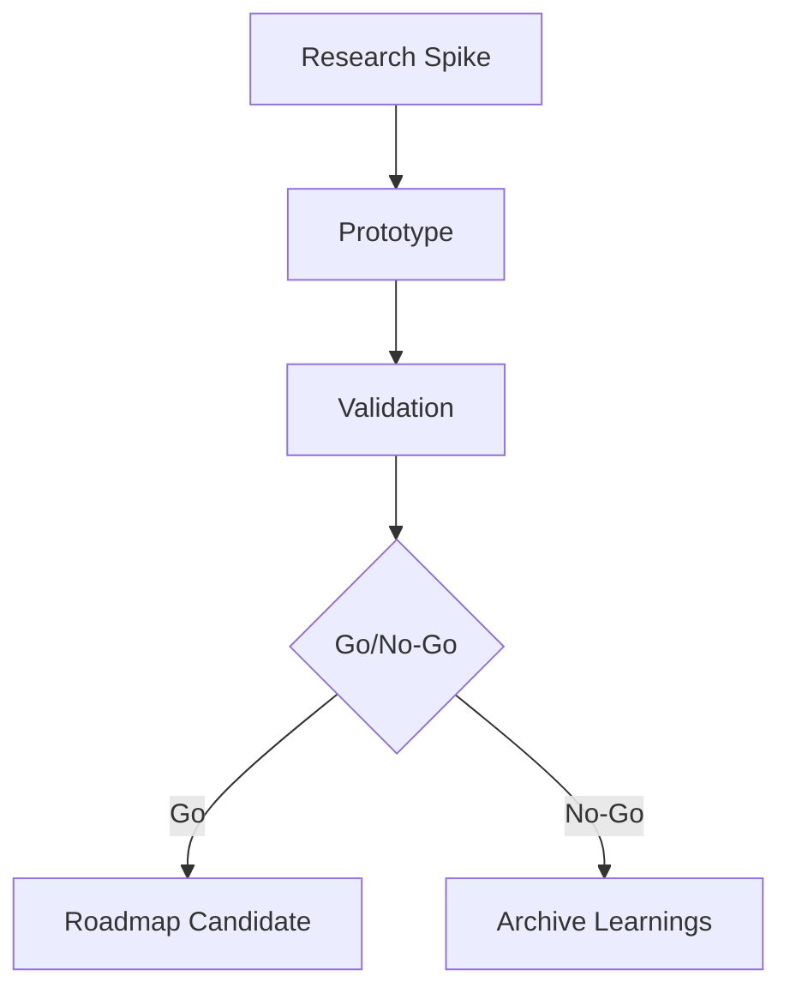

# Dawn Kestrel Moonshot Ideas

Long-term exploratory ideas for dawn-kestrel SDK evolution.

> **Speculative**: These ideas are exploratory and not committed. They represent potential future directions that warrant investigation, not planned features.

---

## intent

This spec captures ambitious, speculative ideas that could significantly extend dawn-kestrel's capabilities. Each idea explores how the existing architecture (FSM workflows, delegation engine, provider abstraction, reliability patterns) might evolve to solve larger problems.

These are conversation starters, not commitments. The goal is to identify high-value directions worth exploring when resources and priorities align.

---

## scope

- Exploratory ideas that leverage dawn-kestrel's core strengths
- Extensions to FSM, delegation, tools, and provider systems
- Long-term architectural evolutions (6-18+ month horizon)

---

## non-goals

- Near-term roadmap items (those go in near-future-roadmap.md)
- Ideas that require architectural rewrites rather than extensions
- Features that don't build on existing dawn-kestrel patterns

---

## moonshot ideas

### MS-1: Self-Healing Agent Networks

Agents that detect failures in delegated subtasks and dynamically reconfigure delegation paths to recover without human intervention.

**Why it fits**: Dawn-kestrel already has a delegation engine with task routing. The FSM provides state tracking, and the event bus can broadcast failure signals. Self-healing would extend the delegation layer with circuit-breaker-aware fallback routing and agent health scoring.

**Biggest Risk**: Cascading retry loops that exhaust budgets or create unpredictable behavior. An agent that keeps retrying broken paths could waste significant resources or produce confusing results.

**Open Questions**:
1. How do we define "agent health" in a way that's measurable and actionable?
2. What's the termination condition for self-healing attempts before escalating to humans?
3. Should health scores persist across sessions or reset each run?
4. How do we prevent heal attempts from masking underlying bugs that need fixing?

---

### MS-2: Cross-Provider Model Ensemble

Run the same prompt through multiple providers simultaneously, then synthesize results using configurable strategies (voting, confidence weighting, speciality routing).

**Why it fits**: The provider abstraction layer already decouples agent logic from specific LLMs. Adding parallel execution and result synthesis would leverage the existing `ProviderAdapter` protocol without major architectural changes.

**Biggest Risk**: Cost explosion. Running every prompt through 3-5 providers multiplies API costs. Without smart routing (only ensembling for high-stakes decisions), this becomes financially unsustainable.

**Open Questions**:
1. What synthesis strategies produce better results than single-provider calls?
2. How do we handle providers returning different response formats or schemas?
3. Should ensembling be opt-in per-task, per-agent, or global config?
4. What's the latency budget for parallel calls before it hurts UX?

---

### MS-3: Predictive FSM State Transitions

Use historical run data to predict optimal state transitions, allowing the FSM to "skip ahead" or suggest shortcuts when patterns are recognized.

**Why it fits**: The FSM already tracks all state transitions. With the event bus logging every transition, we have the data needed to build a predictive model. This would be an optional layer that suggests or auto-advances through predictable paths.

**Biggest Risk**: Wrong predictions lead to skipped validation steps or missed decision points. An FSM that jumps to conclusions could bypass important checks or human approvals.

**Open Questions**:
1. What's the minimum data needed before predictions are trustworthy?
2. How do we surface predictions to users without being annoying?
3. Should predictions be per-project, per-user, or global?
4. What happens when the model's prediction conflicts with explicit state guards?

---

### MS-4: Federated Tool Discovery

Enable agents to discover and negotiate access to tools from other agents or external registries at runtime, with automatic permission negotiation.

**Why it fits**: Dawn-kestrel already has a tool registry with permission checks. Extending this to federated discovery would use the same `Tool` ABC and permission model, just with dynamic registration and capability negotiation protocols.

**Biggest Risk**: Security exposure from dynamically loaded tools. A malicious or buggy remote tool could compromise the entire agent. Trust boundaries and sandboxing become critical and complex.

**Open Questions**:
1. What trust model works for federated tools (certificate-based, reputation, explicit allowlist)?
2. How do we handle version conflicts when tools have incompatible versions?
3. What's the fallback when a discovered tool becomes unavailable mid-task?
4. Should tool capabilities be declarative, or do we need runtime capability probing?

---

### MS-5: Persistent Agent Memory With Semantic Search

Long-term memory that persists across sessions, indexed with embeddings for semantic retrieval. Agents can "remember" patterns, decisions, and context from previous runs.

**Why it fits**: The event bus already captures rich run data. Adding a persistence layer with embedding-based retrieval would give agents continuity across sessions without changing core abstractions.

**Biggest Risk**: Stale or incorrect memories corrupting future decisions. An agent that "remembers" a wrong approach from months ago could repeat mistakes. Memory management (forgetting, updating, pruning) becomes a hard problem.

**Open Questions**:
1. What memory retention policy balances recall with noise reduction?
2. How do we handle sensitive data that shouldn't persist in memory?
3. Should memories be per-agent, per-project, or per-user?
4. What's the retrieval strategy when memory grows large (hundreds of thousands of entries)?

---

## current state

The baseline is a functional SDK with FSM workflows, delegation, tools, and provider abstraction. No memory persistence beyond single sessions. No multi-provider orchestration. No predictive capabilities. Federation is not implemented.

---

## target state

A research exploration of whether these directions are technically feasible and valuable. Success might look like:
- One or two ideas validated through proof-of-concept prototypes
- Clear go/no-go decisions for each idea based on risk/reward
- Identified dependencies and prerequisite work

---

## design notes

These ideas share common considerations:

1. **Opt-in by default** - None of these should be forced on existing users
2. **Result-type compatible** - All extensions should use `Ok`/`Err`/`Pass` patterns
3. **Event bus integration** - New capabilities should emit events for observability
4. **DI container ready** - Extensions should be injectable for testing

---

## delivery plan

Exploratory phases only. Not a commitment.

| Phase | Priority | Description | Dependencies |
|-------|----------|-------------|--------------|
| P0 | Must | Research spike on one idea (2-3 days) | None |
| P1 | Should | Proof-of-concept prototype for validated idea | P0 |
| P2 | Nice | User research on value proposition | P0 |

---

## validation

- Prototype demonstrates technical feasibility
- Cost/benefit analysis completed
- Clear list of what would need to change in core architecture
- Decision documented as ADR if proceeding

---

## risks & trade-offs

| Risk | Likelihood | Impact | Mitigation |
|------|------------|--------|------------|
| Moonshots distract from near-term value | Medium | High | Strict time-boxing for exploration |
| Ideas don't survive real-world testing | High | Medium | Fail fast, document learnings |
| Architecture changes break existing users | Low | High | All changes behind feature flags |

**Open Questions:**
1. Which idea has the best risk/reward ratio for a first spike?
2. Are there existing libraries or frameworks that solve parts of these problems?
3. What user research would validate demand for these capabilities?

**Alternatives Considered:**
- Focus only on incremental improvements - lower risk but may miss strategic opportunities
- Build one moonshot fully before exploring others - high commitment before validation

---

## references

| Document | Location | Role |
|----------|----------|------|
| SDK Gaps | `SDK_GAPS_AND_NEXT_STEPS.md` | Gap analysis with open questions |
| AGENTS.md | `AGENTS.md` | Knowledge base for conventions |
| Near-Future Roadmap | `near-future-roadmap.md` | Committed near-term work |

## Mermaid Diagram

