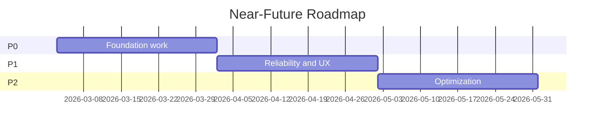

# Dawn Kestrel Near-Future Roadmap

Planning spec for work in the next 1-2 quarters.

---

## intent

This roadmap defines near-future deliverables for Dawn Kestrel's Python SDK over the next 1-2 quarters.

The source of truth is [`SDK_GAPS_AND_NEXT_STEPS.md`](../../SDK_GAPS_AND_NEXT_STEPS.md), which contains the detailed gap analysis. This document extracts the prioritized delivery plan.

- What problem: SDK has solid foundation but lacks key components for production agent apps
- Who benefits: Developers building agent applications on Dawn Kestrel
- Why this approach: Phased delivery from core execution through enhanced features

---

## scope

- Core agent execution (AgentRegistry, AgentRuntime, ContextBuilder)
- Memory system (storage, search, embeddings, summarization)
- Multi-agent orchestration (delegation, parallel execution)
- Bug fixes blocking SDK usage
- Provider and session lifecycle management

---

## non-goals

- Moonshot features (see `moonshot.md` for those)
- Full documentation rewrite (covered in Phase 5 of source)
- Performance benchmarking (deferred)
- Language bindings beyond Python

---

## current state

**What works:**
- AI Session with streaming (`AISession`)
- Tool execution with permissions (`ToolExecutionManager`)
- Agent lifecycle tracking (`AgentManager`)
- 23 built-in tools, 4 built-in agents
- Token usage and cost tracking
- Event bus for state updates

**Blocking bugs:**
- `SessionStorage()` called without required `base_dir` parameter
- `AgentExecutor` creates fake Session objects with empty fields
- `ToolExecutionManager.tool_registry` not exposed

---

## target state

- Fully functional agent execution pipeline
- Custom agent registration and execution
- Long-term memory with semantic search
- Agent-to-agent delegation
- Persisted tool execution history
- Session lifecycle hooks for extensibility

---

## design notes

- **Result pattern**: No exception-based flow, use `Ok`/`Err`/`Pass`
- **Protocol-based design**: `@runtime_checkable Protocol` for interfaces
- **Async-first**: All I/O operations are async
- **Pydantic v2**: Models with `BaseModel`, `Field`
- **Vector storage**: ChromaDB, FAISS, or SQLite with vectors (TBD)
- **Embeddings**: OpenAI embeddings or sentence-transformers (TBD)

---

## delivery plan

> See [`SDK_GAPS_AND_NEXT_STEPS.md`](../../SDK_GAPS_AND_NEXT_STEPS.md) for full details.

| ID | Deliverable | Priority | Dependencies | Success Signal |
|----|-------------|----------|--------------|----------------|
| NF-1 | Fix SessionStorage base_dir bug | P0 | None | SDK client initializes without error |
| NF-2 | Fix AgentExecutor fake sessions | P0 | None | AgentExecutor uses real Session objects |
| NF-3 | Expose tool_registry on ToolExecutionManager | P0 | None | Permission filtering works |
| NF-4 | AgentRegistry for custom agents | P0 | NF-1, NF-2 | Can register and retrieve custom agents |
| NF-5 | ContextBuilder (public API) | P0 | NF-4 | External code can build agent context |
| NF-6 | AgentRuntime unified execution | P1 | NF-4, NF-5 | Agents execute with filtered tools |
| NF-7 | SkillInjector for agent prompts | P1 | NF-5 | Skills injected into system prompts |
| NF-8 | MemoryStorage layer | P1 | None | Memories persist to storage |
| NF-9 | MemoryManager (store/search) | P1 | NF-8 | Semantic search across memories |
| NF-10 | AgentOrchestrator (delegation) | P2 | NF-6 | One agent can delegate to another |

**Estimated total effort:** 8-12 weeks per source analysis.

---

## validation

- Unit tests for each new component (AgentRegistry, MemoryManager, etc.)
- Integration tests for end-to-end agent execution
- Permission filtering tests (all patterns)
- Memory search latency benchmarks
- Existing pytest suite passes

---

## risks & trade-offs

| Risk | Likelihood | Impact | Mitigation |
|------|------------|--------|------------|
| Memory backend choice blocks Phase 2 | Medium | High | Prototype both ChromaDB and FAISS early |
| Embedding provider lock-in | Low | Medium | Abstract embedding interface |
| Agent isolation security | Low | High | Start with async tasks, containerize later |

**Open Questions:**
1. Default to ChromaDB, FAISS, or SQLite+vectors for memory?
2. Require user embedding model or default to OpenAI?
3. Memory retention and pruning strategy?

**Alternatives Considered:**
- Process isolation for agents (deferred, complexity vs benefit)
- In-memory only storage (rejected, loses long-term context)

---

## references

*Links to PRDs, ADRs, code, and other specs.*

| Document | Location | Role |
|----------|----------|------|
| SDK Gaps | [`SDK_GAPS_AND_NEXT_STEPS.md`](../../SDK_GAPS_AND_NEXT_STEPS.md) | Full gap analysis, implementation details |
| AGENTS.md | [`AGENTS.md`](../../AGENTS.md) | Conventions, patterns, commands |
| Pyproject | [`pyproject.toml`](../../pyproject.toml) | Build config, entry points |

## Mermaid Diagram

