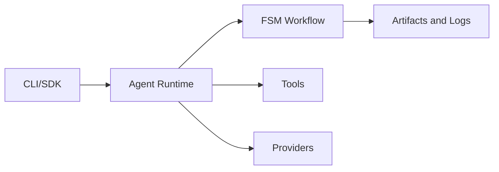

# Dawn Kestrel System Overview

Comprehensive documentation of the current shipped capabilities of dawn-kestrel SDK.

---

## intent

This spec documents what dawn-kestrel currently ships, providing a reference for:

- Developers integrating with the SDK
- Other repos (bolt-merlin, iron-rook, neon-wren, ash-hawk) that depend on dawn-kestrel
- Anyone verifying that claimed features actually exist in the codebase

---

## scope

Covers all shipped capabilities in the dawn-kestrel SDK:

- CLI surface and commands
- Agent SDK (builder patterns, runtime, registry)
- Tool framework and built-in tools
- Provider abstraction layer
- FSM-based workflow execution
- Multi-agent delegation engine
- Reliability patterns (rate limiting, circuit breaker, retry)
- TUI interface
- Core abstractions (Result types, EventBus, DI container)

---

## non-goals

- Near-future roadmap items (see separate roadmap docs)
- Planned but unshipped features
- Detailed API documentation (see docstrings and examples)
- Migration guides (see docs/migration/)

---

## current state

### Shipped Capabilities

#### 1. CLI Surface

Core harness CLI with connect, run, review, docs commands.

- **CLI Surface**: Click-based CLI with interactive configuration wizard
  - Evidence: `dawn_kestrel/cli/main.py`, `dawn_kestrel/cli/commands.py`, `dawn-kestrel --help`

Commands available:
- `dawn-kestrel connect` - Interactive configuration wizard
- `dawn-kestrel run "prompt"` - Run agent with prompt
- `dawn-kestrel review --help` - Multi-agent PR review
- `dawn-kestrel docs --help` - Generate documentation

#### 2. Agent SDK

Agent creation, configuration, and builder pattern for multi-agent orchestration.

- **Agent SDK**: AgentBuilder pattern for declarative agent configuration
  - Evidence: `dawn_kestrel/agents/agent_config.py`, `dawn_kestrel/agents/runtime.py`, `dawn_kestrel/agents/registry.py`

Key exports:
- `AgentBuilder` - Fluent builder for agent configuration
- `AgentConfig` - Pydantic model for agent settings
- `AgentRuntime` - Execution runtime for agents
- `AgentRegistry` - Registry for agent discovery via entry points

Built-in agents registered via `pyproject.toml`:
- `build`, `plan`, `general` (core agents)

#### 3. Tool Registry

Tool definitions, registry, and execution framework with 22 built-in tools.

- **Tool Registry**: 22 tools (5 builtin + 17 additional) with permission filtering
  - Evidence: `dawn_kestrel/tools/registry.py`, `dawn_kestrel/tools/builtin.py`, `dawn_kestrel/tools/additional.py`, `pyproject.toml [project.entry-points."dawn_kestrel.tools"]`

Built-in tools:
- **Builtin (5)**: `BashTool`, `ReadTool`, `WriteTool`, `GrepTool`, `GlobTool`, `ASTGrepTool`
- **Additional (17)**: `EditTool`, `ListTool`, `TaskTool`, `QuestionTool`, `TodoTool`, `TodowriteTool`, `WebFetchTool`, `WebSearchTool`, `MultiEditTool`, `CodeSearchTool`, `LspTool`, `SkillTool`, `ExternalDirectoryTool`, `CompactionTool`, `BatchTool`, `PlanEnterTool`, `PlanExitTool`

Key exports:
- `Tool` - Abstract base class for tool implementations
- `ToolRegistry` - Registry with permission filtering
- `ToolContext` - Context passed to tool execution
- `ToolResult` - Standardized tool result type

#### 4. Provider Abstraction

LLM provider interfaces with pluggable adapters.

- **Provider Abstraction**: Protocol-based provider adapters with reliability patterns
  - Evidence: `dawn_kestrel/providers/base.py`, `dawn_kestrel/providers/registry.py`, `pyproject.toml [project.entry-points."dawn_kestrel.providers"]`

Registered providers:
- `anthropic` - AnthropicProvider
- `openai` - OpenAIProvider
- `zai` - ZAIProvider
- `zai_coding_plan` - ZAICodingPlanProvider

#### 5. FSM Workflow

State machine for agent execution with builder pattern.

- **FSM Workflow**: Finite State Machine with FSMBuilder pattern
  - Evidence: `dawn_kestrel/core/fsm.py`, `dawn_kestrel/core/fsm_state_repository.py`

Key exports:
- `FSMBuilder` - Fluent builder for state machine configuration
- `WorkflowFSMBuilder` - Pre-configured builder with workflow states
- `FSMContext` - Context passed to hooks and guards
- Predefined states: `intake`, `plan`, `reason`, `act`, `synthesize`, `check`, `done`

Features:
- Entry/exit hooks per state
- Transition guards
- Persistence layer support
- Budget constraints (max iterations)

#### 6. Delegation Engine

Multi-agent task delegation with BFS/DFS strategies.

- **Delegation Engine**: Convergence-aware delegation with boundary enforcement
  - Evidence: `dawn_kestrel/delegation/engine.py`, `dawn_kestrel/delegation/tool.py`, `dawn_kestrel/delegation/types.py`

Key exports:
- `DelegationEngine` - Main engine for executing delegation trees
- `DelegationConfig` - Configuration for mode, budget, callbacks
- `TraversalMode` - BFS, DFS, or Adaptive
- `DelegateTool` - Tool wrapper for agent delegation

Features:
- **BFS mode**: Queue-based parallel execution with worker pool
- **DFS mode**: Sequential deep-dive per branch
- **Adaptive mode**: BFS depth 0-1, DFS depth 2+
- **Budget constraints**: max_depth, max_breadth, max_total_agents, max_wall_time
- **Convergence detection**: SHA-256 novelty detection with stagnation threshold

#### 7. Reliability Patterns

Rate limiting, circuit breaker, retry, and bulkhead patterns.

- **Reliability Patterns**: Token bucket rate limiter, circuit breaker, retry executor
  - Evidence: `dawn_kestrel/llm/rate_limiter.py`, `dawn_kestrel/llm/circuit_breaker.py`, `dawn_kestrel/llm/retry.py`, `dawn_kestrel/llm/bulkhead.py`

Key exports:
- `RateLimiter` / `TokenBucket` - Token bucket algorithm for API throttling
- `CircuitBreaker` - Circuit breaker pattern with half-open state
- `RetryExecutor` - Retry with exponential backoff
- `Bulkhead` - Isolation pattern for resource limits

#### 8. TUI Interface

Textual-based terminal UI with screens, widgets, and dialogs.

- **Terminal UX**: CLI-first interaction model; TUI package removed from dawn-kestrel
  - Evidence: `dawn_kestrel/cli/main.py`, `dawn_kestrel/cli/commands.py`

#### 9. Core Abstractions

Foundational patterns: Result types, EventBus, DI container, repositories.

- **Core Abstractions**: Result types, EventBus, DI container, observer, mediator
  - Evidence: `dawn_kestrel/core/result.py`, `dawn_kestrel/core/event_bus.py`, `dawn_kestrel/core/di_container.py`

Key exports:
- `Result[T]`, `Ok`, `Err`, `Pass` - Railway-oriented error handling
- `EventBus`, `bus` - Async event pub/sub with singleton
- `Container`, `container` - Dependency injection with lazy initialization
- `Observer`, `Observable` - Observer pattern
- `EventMediator` - Domain event mediation
- `SessionRepository`, `MessageRepository` - Repository pattern
- `UnitOfWork` - Transactional consistency

---

## target state

This spec documents the **delivered** end state. All capabilities listed above are shipped and verified.

### Verification Commands

```bash
# CLI works
uv run dawn-kestrel --help

# Tests pass
uv run pytest

# Type checking passes
uv run mypy dawn_kestrel

# Linting passes
uv run ruff check .
```

---

## design notes

### Architecture Patterns

- **Protocol-first design**: `@runtime_checkable Protocol` for all interfaces
- **Result types**: No exception-based control flow; all fallible ops return `Result[T]`
- **Builder pattern**: `AgentBuilder`, `FSMBuilder` for declarative configuration
- **Plugin discovery**: Entry points for tools, providers, agents in `pyproject.toml`
- **Singletons**: `bus` (EventBus), `container` (DI) are global

### Project Conventions

- **Python 3.11+** with strict mypy
- **Flat layout**: Package at root (`dawn_kestrel/`), not in `src/`
- **Ruff** for linting (line-length: 100)
- **UV build**: Uses `uv_build` backend
- **Pydantic v2**: Models with `BaseModel`, `Field`

---

## delivery plan

This SDK was delivered incrementally across multiple phases:

| Phase | Priority | Description | Dependencies |
|-------|----------|-------------|--------------|
| 1 | High | Core abstractions (Result, EventBus, DI) | None |
| 2 | High | FSM workflow engine | Phase 1 |
| 3 | High | Agent SDK (builder, runtime, registry) | Phase 1, 2 |
| 4 | High | Tool framework and built-in tools | Phase 1 |
| 5 | High | Provider abstraction | Phase 1 |
| 6 | Medium | CLI surface | Phase 2-5 |
| 7 | Medium | Delegation engine | Phase 3, 4 |
| 8 | Medium | Reliability patterns | Phase 5 |

---

## validation

### Test Coverage

- 177 test files in `tests/`
- pytest with `asyncio_mode = "auto"`
- Coverage reporting via `--cov=dawn_kestrel`

### Acceptance Criteria

- [x] CLI responds to `--help`
- [x] All entry points load correctly
- [x] Tests pass
- [x] Type checking passes with strict mypy
- [x] Cross-repo consumers (bolt-merlin, iron-rook, neon-wren, ash-hawk) can import dawn-kestrel

---

## risks & trade-offs

| Risk | Likelihood | Impact | Mitigation |
|------|------------|--------|------------|
| Flat layout confusion | Low | Low | Documented in AGENTS.md |
| No CI/CD configured | Medium | Medium | Manual verification required |
| Entry point conflicts | Low | Medium | Namespaced entry points |

**Open Questions:**
1. When to migrate from flat layout to src/ layout?
2. GitHub Actions configuration needed?

**Alternatives Considered:**
- Exception-based error handling (rejected: Result types provide better composability)
- setuptools backend (rejected: UV build is faster)

---

## cross-repo dependencies

The following repos depend on dawn-kestrel:

### bolt-merlin

**Dependency**: `dawn-kestrel>=0.1.0` (editable install)

Imports from dawn-kestrel:
- `dawn_kestrel.agents.agent_config` - AgentBuilder, AgentConfig
- `dawn_kestrel.core.result` - Result, Ok, Err
- `dawn_kestrel.tools.framework` - Tool, ToolContext, ToolResult
- `dawn_kestrel.agents.registry` - AgentRegistry
- `dawn_kestrel.agents.runtime` - AgentRuntime
- `dawn_kestrel.agents.execution_queue` - AgentExecutionJob, InMemoryAgentExecutionQueue
- `dawn_kestrel.sdk.client` - OpenCodeSyncClient
- `dawn_kestrel.core.config` - SDKConfig

Evidence: `bolt-merlin/pyproject.toml`, `bolt-merlin/bolt_merlin/**/*.py`

### iron-rook

**Dependency**: `dawn-kestrel` (editable install)

Description: PR Review Agent using dawn-kestrel SDK

Evidence: `iron-rook/pyproject.toml`

### neon-wren

**Dependency**: `dawn-kestrel` (editable install)

Description: UI shell (web/TUI) for the dawn-kestrel ecosystem

Evidence: `neon-wren/pyproject.toml`

### ash-hawk

**Dependency**: `dawn-kestrel>=0.1.0` (editable install)

Imports from dawn-kestrel:
- `dawn_kestrel.core.event_bus` - Event, EventBus, bus
- `dawn_kestrel.llm.client` - LLMClient
- `dawn_kestrel.tools.framework` - ToolRegistry
- `dawn_kestrel.tools.permission_filter` - ToolPermissionFilter
- `dawn_kestrel.core.settings` - get_settings
- `dawn_kestrel.tools.registry` - ToolRegistry as DawnToolRegistry
- `dawn_kestrel.tools` - create_builtin_registry

Evidence: `ash-hawk/pyproject.toml`, `ash-hawk/ash_hawk/**/*.py`

---

## references

| Document | Location | Role |
|----------|----------|------|
| AGENTS.md | `AGENTS.md` | Knowledge base for conventions and patterns |
| Architecture | `docs/dawn-kestrel-architecture.md` | System architecture |
| Foundation Status | `docs/FOUNDATION_STATUS.md` | Implementation status |
| Getting Started | `docs/getting-started.md` | Quick start guide |
| Application Blueprints | `docs/application-blueprints.md` | Build-ready app patterns |
| Patterns | `docs/patterns.md` | Design patterns reference |
| Delegation Design | `dawn_kestrel/delegation/DESIGN.md` | Delegation engine architecture |
| Examples | `docs/examples/` | Working code examples |
| Core AGENTS.md | `dawn_kestrel/core/AGENTS.md` | Core module patterns |
| Delegation AGENTS.md | `dawn_kestrel/delegation/AGENTS.md` | Delegation module patterns |

## Mermaid Diagram


